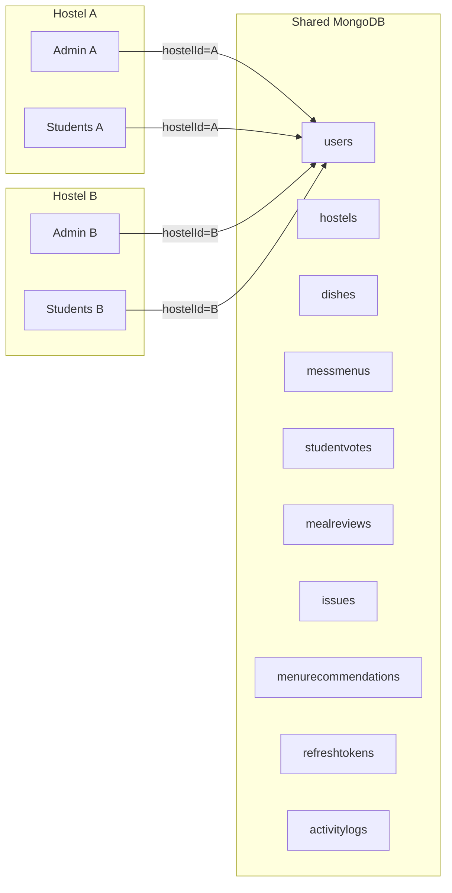
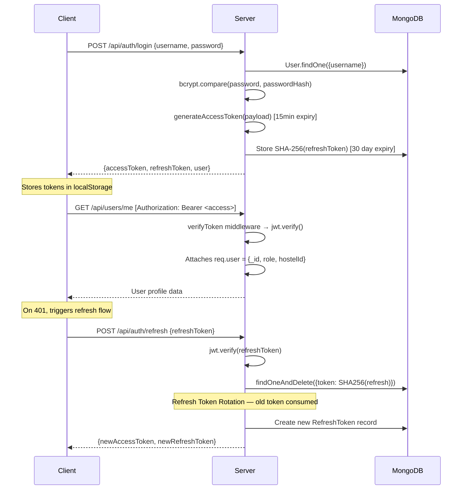
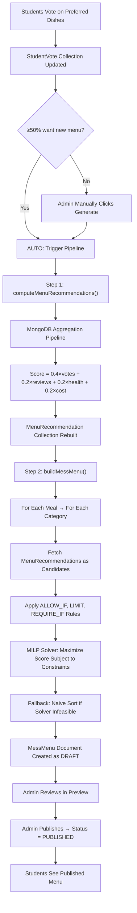
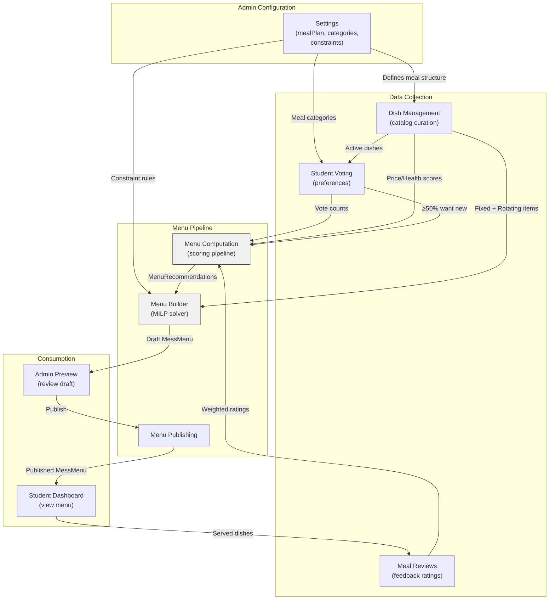

# HostelHub — Complete Codebase Knowledge Document

> **Generated**: 2026-09-22  
> **Scope**: Full backend + frontend analysis from source  
> **Purpose**: Enable any developer or LLM to implement features, fix bugs, and refactor safely without prior context  

---

## Table of Contents

1. [High-Level Overview](#1-high-level-overview)
2. [System Architecture](#2-system-architecture)
3. [Feature-by-Feature Analysis](#3-feature-by-feature-analysis)
4. [Nuances, Subtleties & Gotchas](#4-nuances-subtleties--gotchas)
5. [Technical Reference & Glossary](#5-technical-reference--glossary)
6. [Database Schema Reference](#6-database-schema-reference)
7. [API Reference](#7-api-reference)
8. [Cross-Feature Interaction Map](#8-cross-feature-interaction-map)
9. [Known Issues & TODOs](#9-known-issues--todos)

---

## 1. High-Level Overview

### What It Is

HostelHub is a **multi-tenant hostel management platform** built for Indian student housing facilities. It digitizes three core operational workflows:

1. **Mess Menu Optimization** — algorithmically generating weekly menus using student vote data and a MILP (Mixed-Integer Linear Programming) constraint solver.
2. **Facility Maintenance** — student-initiated issue ticketing with admin resolution tracking and PDF export.
3. **Student Engagement** — voting on preferred dishes, reviewing served meals, and viewing transparent statistics about the mess system.

### Target Users

| Role | Description | Example |
|------|------------|---------|
| **Admin (Primary)** | The hostel owner/warden who registers the hostel. Has all permissions. Cannot be deactivated or deleted. | `admin@hostelname` |
| **Admin (Secondary)** | Additional admin accounts created by the primary admin. Have granular permissions. | `admin2@hostelname` |
| **Student** | Hostel residents. Auto-generated usernames based on room number. | `F12.1@hostelname` |

### Tech Stack

| Layer | Technology |
|-------|-----------|
| **Frontend** | React 19, TypeScript, Vite 7, Tailwind CSS v4, React Router v7, Recharts, Lucide Icons |
| **Backend** | Node.js, Express 5, TypeScript, Mongoose 9 (MongoDB ODM) |
| **Database** | MongoDB (single shared DB, tenant isolation via `hostelId` field) |
| **Auth** | JWT (access + refresh tokens), bcrypt password hashing, SHA-256 token hashing |
| **Menu Solver** | `javascript-lp-solver` (MILP engine), `json-logic-js` (rule evaluation) |
| **AI Integration** | Google Gemini API (`@google/genai`) for natural-language constraint parsing |
| **PDF Generation** | PDFKit for issue report exports |
| **Testing** | Vitest (backend + frontend), Supertest (API), React Testing Library |

### Directory Structure

```
hostelHub/
├── backend/
│   ├── src/
│   │   ├── config/          # Database connection (db.ts)
│   │   ├── controllers/     # 15 controller files — route handlers
│   │   ├── middlewares/      # Auth, RBAC, error handling
│   │   ├── models/           # 10 Mongoose schemas
│   │   ├── routes/           # 12 Express router files
│   │   ├── services/         # 5 menu optimization services
│   │   ├── types/            # Express augmentation, LP solver types
│   │   ├── utils/            # JWT, logger, asyncHandler, formatMeal
│   │   ├── tests/            # 4 test files
│   │   └── server.ts         # Express app entry point
│   ├── seed.ts               # Database seeder
│   └── package.json
├── frontend/
│   ├── src/
│   │   ├── components/
│   │   │   ├── common/       # AppLayout, AppTopbar, ProfileModal, ThemeToggle
│   │   │   └── ui/           # 12 reusable UI primitives (Button, Card, Modal, etc.)
│   │   ├── contexts/         # AuthContext, ThemeContext
│   │   ├── hooks/            # useApi, useAuth, useMessService
│   │   ├── lib/              # constants, types, utils, logger
│   │   ├── pages/
│   │   │   ├── admin/        # 7 admin page components + sub-components
│   │   │   └── student/      # 4 student page components
│   │   ├── routes/           # router.tsx — all route definitions
│   │   ├── services/         # auth.service.ts
│   │   └── App.tsx           # Root component
│   └── package.json
├── docs/
│   ├── design.md             # Design system specification
│   └── menu.md               # Dish catalog JSON for seeding
└── README.md
```

### Main Features at a Glance

| Feature | Business Purpose | Primary Users |
|---------|-----------------|---------------|
| **Auth & Onboarding** | Self-service hostel registration, user provisioning | Admins |
| **Menu Optimization** | Generate balanced weekly menus from student preferences | Admins + Students |
| **Dish Management** | Curate dish catalog with approval workflow | Admins + Students (suggest) |
| **Voting System** | Students express meal preferences influencing menu | Students |
| **Meal Reviews** | Post-meal feedback with ratings | Students |
| **Issue Tracking** | Report and resolve facility maintenance issues | Both |
| **Dashboard & Stats** | Operational overview with analytics | Both |
| **Settings** | Configure meal plans, categories, and AI-powered constraints | Admins |

---

## 2. System Architecture

### Architecture Pattern

**Layered MVC with Service Layer** — the backend follows a strict separation:

```
Route → Middleware (auth/RBAC) → Controller → Service → Model → MongoDB
```

- **Routes** define HTTP endpoints and wire middleware chains.
- **Controllers** handle request/response, validation, and orchestration.
- **Services** contain pure business logic (menu computation, MILP solving, constraint parsing).
- **Models** are Mongoose schemas with indexes and cascade hooks.

### Multi-Tenancy Model

HostelHub uses **shared database, shared schema** multi-tenancy. Every document includes a `hostelId` field that ties it to a specific hostel. There is **no database-level isolation** — all hostels share the same MongoDB database and collections.

**Data isolation is enforced at the application layer:**
1. The JWT token contains `hostelId` — set during login from the user's DB record.
2. Every query filters by `hostelId` from `req.user.hostelId`.
3. There is no global "superadmin" — each hostel's primary admin is the ceiling of authority.



### Authentication & Authorization Flow



**Key security properties:**
- Access tokens expire in **15 minutes**.
- Refresh tokens expire in **30 days** and are **one-time use** (rotation via `findOneAndDelete`).
- Refresh tokens are stored as **SHA-256 hashes** in the database — the plain JWT is never persisted server-side.
- The `RefreshToken` schema has a MongoDB TTL index (`expires: 2592000` seconds = 30 days) for automatic cleanup.

### RBAC System

Two layers of authorization:

1. **Role-based** (`requireRole` middleware): Checks `req.user.role` against allowed roles (`'ADMIN'` or `'STUDENT'`).
2. **Permission-based** (`requirePermission` middleware): For admin-only routes, checks the user's `permissions` array against a required permission string.

| Permission | Grants Access To |
|-----------|-----------------|
| `MANAGE_USERS` | Create, edit, deactivate, delete users |
| `MANAGE_MENU` | Generate, preview, publish, update menus; view voting stats |
| `MANAGE_ISSUES` | View all issues, update status, export PDF |
| `MANAGE_SETTINGS` | Edit meal plans, issue categories, menu constraints |

**Primary admin bypass**: `requirePermission` checks `isPrimaryAdmin` first — if `true`, it skips the permission check entirely. Only the first admin created during hostel registration has `isPrimaryAdmin: true`.

### Data Flow: Menu Generation Pipeline

This is the most complex data flow in the system:



### Cross-Cutting Concerns

| Concern | Implementation | File(s) |
|---------|---------------|---------|
| **Error Handling** | Global Express error handler catches Mongoose `11000` (duplicate key) and `ValidationError` | `backend/src/middlewares/errorHandler.ts` |
| **Async Safety** | `asyncHandler` wrapper catches Promise rejections and forwards to error handler | `backend/src/utils/asyncHandler.ts` |
| **Logging** | Custom `logger` with ISO timestamps, log level, and context tag | `backend/src/utils/logger.ts` |
| **Security Headers** | Helmet middleware for standard HTTP security headers | `backend/src/server.ts` (line 42) |
| **CORS** | Configured for frontend origin(s) with credentials | `backend/src/server.ts` (lines 43-50) |
| **Request Size Limit** | JSON body limited to 10MB | `backend/src/server.ts` (line 51) |
| **Frontend Caching** | `useApi` hook implements 5-minute in-memory cache for GET requests, cleared on any mutation | `frontend/src/hooks/useApi.ts` |
| **Token Auto-Refresh** | `useApi` intercepts 401 responses, attempts refresh, then retries the request. Uses a shared `refreshPromise` to deduplicate concurrent refresh attempts | `frontend/src/hooks/useApi.ts` |
| **Theme System** | CSS custom properties toggled via `[data-theme='dark']` attribute, with transition disabling to prevent flash | `frontend/src/contexts/ThemeContext.tsx`, `frontend/src/index.css` |
| **Code Splitting** | All page components are lazy-loaded with `React.lazy()` | `frontend/src/routes/router.tsx` |
| **Error Boundary** | Catches chunk load failures and auto-reloads the page | `frontend/src/routes/router.tsx` (lines 5-17) |

---

## 3. Feature-by-Feature Analysis

### 3.1 Authentication & Onboarding

**Business Need**: Allow hostel administrators to self-register their facility and provision accounts for students.

**Entry Points**:
- `POST /api/auth/admin/register` — Create hostel + primary admin
- `POST /api/auth/login` — Unified login for all roles
- `POST /api/auth/refresh` — Token rotation
- `POST /api/auth/logout` — Revoke refresh token

**Technical Flow — Admin Registration** (`backend/src/controllers/auth.controller.ts`):
1. Validates all required fields and password length (≥8 chars).
2. Generates a `domain` from the hostel name (lowercased, spaces stripped, max 10 chars).
3. Checks for duplicate hostel name or domain.
4. Uses a **MongoDB transaction** (session) to atomically create both the `Hostel` and `User` documents.
5. If no `mealPlan` is provided, a sensible default is inserted (Breakfast, Lunch, Snack, Dinner with standard Indian meal categories).
6. The primary admin's username is always `admin@{domain}`.
7. Returns both access and refresh tokens immediately.

**Technical Flow — Login** (`backend/src/controllers/auth.controller.ts`):
1. Looks up user by `username` (case-insensitive, lowercased).
2. Checks `isActive` — deactivated users get a 403.
3. Compares password with bcrypt hash.
4. Returns JWT access token + refresh token.

**Frontend Auth** (`frontend/src/contexts/AuthContext.tsx`, `frontend/src/services/auth.service.ts`):
- Tokens stored in `localStorage` (not HttpOnly cookies).
- On app mount, `AuthProvider` checks for existing access token, calls `GET /api/users/me` to restore session.
- If 401, attempts refresh. If refresh fails, clears tokens.
- `AuthService` also integrates with the **Credential Management API** for browser autofill.

**Interactions**: Auth is foundational — every protected route depends on the JWT payload containing `userId`, `role`, and `hostelId`.

---

### 3.2 Dish Management

**Business Need**: Build and maintain a catalog of dishes that can be scheduled in menus. Two entry paths: admin adds directly (active immediately), student suggests (requires admin review).

**Models**: `Dish` (`backend/src/models/Dish.ts`)

**Key Fields**:
- `hostelId` — tenant isolation
- `mealType` — `'Breakfast'` | `'Lunch'` | `'Snack'` | `'Dinner'`
- `category` — matches a category from the hostel's `mealPlan` (e.g., `'Main Course'`, `'Rice'`, `'Lentils'`)
- `itemClass` — `'FIXED'` (served every day, e.g., bread/roti) or `'ROTATING'` (varies daily, assigned by solver)
- `status` — `'UNDER_REVIEW'` → `'ACTIVE'` / `'INACTIVE'`
- `priceScore` / `healthScore` — 1-5 scale, used as inputs to the menu optimization algorithm
- `tags` — free-form string array used for constraint matching (e.g., `['paneer', 'spicy']`)

**Controllers**:
- `dish.controller.ts` — `createAdminDish()` (admin creates and auto-activates), `suggestDish()` (student suggests, status = `UNDER_REVIEW`)
- `adminDish.controller.ts` — `approveDish()`, `rejectDish()`, `updateDish()`, `deleteDish()`, `toggleDishStatus()`
- `studentDish.controller.ts` — `getActiveDishesForVoting()` (groups by mealType)

**Cascade Delete Hook** (`Dish.ts` lines 24-77): When a dish is deleted via `findOneAndDelete`:
1. Removes the dish ID from all `StudentVote.votes[].dishes` arrays.
2. Deletes all `MealReview` records for this dish.
3. Finds all `MenuRecommendation` records referencing this dish, collects their IDs.
4. Deletes those `MenuRecommendation` records.
5. Walks all `MessMenu` documents for this hostel and removes the dish from both `fixedItems` and `rotatingItems` arrays.
6. Removes any `Hostel.menuConstraints` entries that reference this dish by ID.

**Interactions**: Dish is the atomic unit consumed by Voting, Menu Generation, Reviews, and Constraints. The cascade hook is critical — deleting a dish must clean up 5 other collections.

---

### 3.3 Student Voting

**Business Need**: Let students express meal preferences that directly influence which dishes appear in the generated menu.

**Model**: `StudentVote` (`backend/src/models/StudentVote.ts`)
- One document per student per hostel (enforced by `unique: true` on `userId`).
- `votes[]` — array of `{ mealName, categoryName, dishes: [ObjectId] }` — students pick their top dishes per meal/category slot.
- `wantsNewMenu` — boolean flag indicating the student wants a fresh menu generation.

**Controller**: `studentVote.controller.ts`

**GET `/api/student/votes`** — Returns:
1. The hostel's `mealPlan` structure (defines available meals/categories).
2. All `ACTIVE ROTATING` dishes for the hostel.
3. The student's existing saved votes (if any).

**POST `/api/student/votes`** — Upserts the student's vote record:
1. Validates all submitted dish IDs are valid ObjectIds.
2. Verifies all dishes exist in this hostel, are `ACTIVE`, and are `ROTATING`.
3. Uses `findOneAndUpdate` with `upsert: true` to create-or-update.
4. **Auto-generation trigger** (lines 103-114): After saving, checks if ≥50% of total voters have `wantsNewMenu: true`. If so, automatically runs `computeMenuRecommendations()` + `buildMessMenu()` and resets all `wantsNewMenu` flags.

**Interactions**: Voting feeds directly into Menu Computation (`menuComputation.service.ts`) — vote counts are the primary input to dish scoring. The auto-generation trigger creates a democratic feedback loop.

---

### 3.4 Menu Computation (Scoring)

**Business Need**: Rank dishes by a weighted composite score that balances student preference, health, cost, and recent review quality.

**Service**: `menuComputation.service.ts`

**`computeMenuRecommendations(hostelId)`**:

Executes a **6-stage MongoDB aggregation pipeline** on the `Dish` collection:

1. **Match**: Active, rotating dishes for this hostel.
2. **Lookup + Count Votes**: Joins with `StudentVote`, flattens all `votes[].dishes[]`, counts occurrences of each dish across all students.
3. **Normalize**: Finds the max vote count; each dish's `voteScore` = its count / max count.
4. **Lookup + Weight Reviews**: Joins with `MealReview`, computes a **time-decayed weighted average** of ratings (more recent reviews weighted more heavily via `1 / (daysSince + 1)`).
5. **Sub-Scores**:
   - `voteScore` = normalized vote popularity (0–1)
   - `reviewScore` = weighted avg rating / 5 (0–1), defaults to 3/5 if no reviews
   - `costEfficiency` = 1 - (priceScore / 5) — cheaper dishes score higher
   - `healthEfficiency` = healthScore / 5
6. **Final Score** = `0.4 × voteScore + 0.2 × reviewScore + 0.2 × healthEfficiency + 0.2 × costEfficiency`

The result **completely replaces** the `MenuRecommendation` collection for this hostel (delete all → insert many).

**Interactions**: This is the data pipeline that feeds the MILP solver. It must be run before `buildMessMenu()`.

---

### 3.5 Menu Builder (MILP Solver)

**Business Need**: Generate a full 7-day weekly menu that maximizes student satisfaction while respecting custom constraints (e.g., "no rice on weekends", "paneer at most 3 times per week").

**Service**: `menuBuilder.service.ts`

**`buildMessMenu(hostelId, variantLabel, publishMethod)`**:

**Phase 1 — History Compilation** (lines 228-272):
- Fetches the last 60 days of menus.
- Builds a `historyMap: Map<dishId, daysAgo>` tracking when each dish was last served.
- This penalizes repetition across consecutive weeks.

**Phase 2 — Per-Slot MILP Solving** (lines 278-361):
For each active meal in the hostel's meal plan, and for each category within that meal:
1. Fetches `MenuRecommendation` records as candidates.
2. Filters applicable constraint rules.
3. Calls `solveMealAssignment()`.

**`solveMealAssignment()` (lines 92-202)**:
- Creates a **MILP model** with binary decision variables `dish_{dishId}_{day}` ∈ {0, 1}.
- **Objective**: Maximize total score across all days.
- **Constraints**:
  - **Exactly one dish per day per slot**: `slot_{day} = 1` (equality constraint).
  - **ALLOW_IF rules**: Pre-filter candidates using `json-logic-js`. If a dish fails an `ALLOW_IF` condition, its variable is not created (effectively banned from that day).
  - **LIMIT rules**: Cap how many times a tag/dish can appear. Supports `windowSize` for sliding-window constraints (e.g., "at most 1 in any 2-day window" = alternate days).
  - **REQUIRE_IF rules**: Instead of hard constraints (which cause infeasibility), adds a massive score bonus (+10000) to matching candidates, making the solver strongly prefer them.
  - **Slack variables**: Each day has a `slack_{day}` variable with score -100000 to prevent infeasibility when ALLOW_IF eliminates all candidates.
  - **History penalty**: Recently served dishes are penalized by `50 / (daysAgo + 1)`, tripled in "Low Repetition" variant.

**Phase 3 — Fallback** (lines 330-343):
If the solver returns infeasible (empty assignment), falls back to naive sorting by `finalScore` and round-robin assignment. Logs the failure in `solverFailures[]`.

**Phase 4 — Persist** (lines 363-371):
Creates a `MessMenu` document with status `'DRAFT'`.

**Interactions**: Depends on `MenuRecommendation` (must be computed first), `Hostel.menuConstraints` (rules), `Hostel.mealPlan` (structure), and `Dish` (fixed items + candidate metadata).

---

### 3.6 Menu Constraint System (AI-Powered)

**Business Need**: Allow non-technical admins to define menu rules in plain English (e.g., "serve paneer on alternate days"), which are converted to machine-executable constraints.

**Services**:
- `menuConstraintParser.service.ts` — Uses Google Gemini to parse natural language into structured rules.
- `menuConstraintValidator.service.ts` — Validates parsed rules against synthetic test contexts.

**Flow**:
1. Admin types constraints in plain English on the Settings page.
2. Frontend calls `POST /api/admin/settings/menu-constraints/preview` with the text.
3. Backend fetches the active dish catalog, sends both to Gemini with a detailed system prompt.
4. Gemini returns structured rules (each with `action`, `appliesTo`, `condition` as JsonLogic, `sourcePhrase`).
5. `validateConstraints()` dry-runs each rule's JsonLogic against 3 synthetic contexts to catch malformed logic.
6. Frontend shows a preview. Admin confirms.
7. `POST /api/admin/settings/menu-constraints/confirm` saves the rules to `Hostel.menuConstraints`.

**Rule Types**:
| Action | Meaning | Example |
|--------|---------|---------|
| `ALLOW_IF` | Dish may only be placed when condition is true | "No rice on weekends" |
| `REQUIRE_IF` | Dish must be placed when condition is true | "Serve paneer on Mondays" |
| `LIMIT` | Caps appearances per week or within a sliding window | "Dal on alternate days" (max:1, windowSize:2) |
| `CLOSE_SLOT_IF` | Closes an entire meal slot when condition is true | (Not yet consumed by the solver) |

**Interactions**: Parsed constraints are stored on the `Hostel` document and consumed by `buildMessMenu()` during the MILP solving phase.

---

### 3.7 Meal Reviews

**Business Need**: Let students rate served dishes, creating a feedback signal that influences future menu generation.

**Model**: `MealReview` (`backend/src/models/MealReview.ts`)
- Unique composite index: `{ hostelId, studentId, dishId, servedOn }` — one review per student per dish per serving date.
- `rating` — 1-5 scale.
- `mealType` — must match the dish's `mealType`.
- `servedOn` — the date the dish was served (cannot be in the future).

**Controller**: `mealReview.controller.ts`
- `submitMealReview()` — extensive validation: valid ObjectId, valid mealType, rating range, not-future date, dish exists and is active, mealType matches dish, no duplicate review.

**Admin View**: `adminReview.controller.ts`
- `getMealReviews()` — paginated, filterable by mealType/date/dishId.
- `getReviewStats()` — two aggregation pipelines:
  1. Per-dish cumulative stats (avgRating, totalReviews).
  2. Date-wise rating trend broken down by mealType (for charting).
  3. Merges in per-dish vote counts from `StudentVote`.

**Interactions**: Review ratings feed into `computeMenuRecommendations()` as the `reviewScore` component. Recent reviews are weighted more heavily via time decay.

---

### 3.8 Issue Tracking

**Business Need**: Digitize facility maintenance requests so students can report problems and admins can track resolution.

**Model**: `Issue` (`backend/src/models/Issue.ts`)
- `category` — must match an active `issueCategories` entry on the hostel (validated server-side).
- `priority` — `'LOW'` | `'MEDIUM'` | `'HIGH'` | `'URGENT'`
- `status` — `'OPEN'` | `'CLOSED'` (DB schema also allows `'RESOLVED'` in the controller validation but the schema enum only has `OPEN/CLOSED`)
- `raisedByName` / `roomNo` — denormalized from User at creation time for display without joins.

**Controller**: `issue.controller.ts`
- `createIssue()` — validates category against hostel's active issue categories.
- `getAllIssues()` — admin view, all hostel issues sorted by date.
- `getMyIssues()` — student view, only their own issues.
- `updateIssueStatus()` — admin only, updates status and optional `resolverNote`.
- `deleteIssue()` — admin can delete any hostel issue; students can only delete their own.
- `exportIssuesPdf()` — generates a PDF report of all hostel issues using PDFKit.

**Interactions**: Issue categories are configured in Hostel Settings. The feature is self-contained — no other feature depends on issue data.

---

### 3.9 User Management

**Business Need**: Admins need to provision and manage student accounts.

**Controller**: `adminUser.controller.ts`

**Key Operations**:
- **Create User**: Auto-generates username as `{roomNo}.{n}@{domain}` for students (where `n` is the next sequential number for that room). Password can be specified or auto-generated (8-char hex).
- **Bulk Create**: Accepts an array of user objects, processes sequentially, skips duplicates.
- **Deactivate/Reactivate**: Sets `isActive` flag. Deactivated users cannot log in (checked in login flow). The primary admin (`admin@{domain}`) **cannot** be deactivated or deleted.
- **Delete User**: Cascade-deletes associated `StudentVote` and `RefreshToken` records. Does NOT delete `MealReview` or `Issue` records (data preservation choice).
- **Update User**: Allows updating `name`, `roomNo`, and `permissions`.

**Self-Service Profile**: `user.controller.ts`
- `getMe()` — returns current user profile.
- `updateProfile()` — update name, email (with uniqueness check and format validation), password (min 8 chars).

**Interactions**: User provisioning affects Voting (creates potential voters), and username format is tightly coupled to the hostel's `domain` value.

---

### 3.10 Admin Dashboard

**Business Need**: At-a-glance operational overview.

**Controller**: `adminDashboard.controller.ts`
- Returns: `totalStudents`, `activeDishes`, `openIssues`, `totalVotes`, and the 15 most recent `ActivityLog` entries.

**Interactions**: Aggregates data from `User`, `Dish`, `Issue`, `StudentVote`, and `ActivityLog` collections.

---

### 3.11 Settings & Hostel Configuration

**Business Need**: Configure the hostel's operational parameters — meal plans, issue categories, and menu generation constraints.

**Controller**: `adminSettings.controller.ts`

**`getSettings()`**: Returns `mealPlan`, `issueCategories`, `menuConstraints`, and `menuConstraintsText`. Provides default issue categories if none exist.

**`updateSettings()`**: Handles **cascading deletes** when meal categories are removed:
- If a category is removed entirely from the `mealPlan` payload, all dishes with that `mealType + category` combination are deleted.
- If an entire meal type is removed, all dishes for that meal type are deleted.
- NOTE: This triggers `Dish.deleteMany()`, NOT `findOneAndDelete()`, so the cascade hook on the `Dish` model **does not fire** — this is a potential data consistency issue.

**Interactions**: `mealPlan` defines the framework that Voting, Dish creation, and Menu Generation all depend on. Changes here ripple through the entire system.

---

### 3.12 Student Dashboard & Stats

**Business Need**: Give students transparency into the mess system — current menu, today's dishes, and comprehensive dish catalog stats.

**Controller**: `studentMenu.controller.ts` — Retrieves the latest `PUBLISHED` menu, formats today's meals based on day-of-week index.

**Controller**: `studentStats.controller.ts` — Returns:
- Total students, active voters.
- Active menu constraints (as readable phrases).
- Full dish catalog with vote counts, average ratings, and review counts.

**Day Index Mapping**: `menuRetrieve.service.ts` (line 22): JavaScript's `getDay()` returns `0=Sunday`, but the menu slots use `0=Monday`. Conversion: `dayIndex = jsDay === 0 ? 6 : jsDay - 1`.

---

## 4. Nuances, Subtleties & Gotchas

### Things You Must Know Before Changing Code

#### 4.1 The `dishId` Populate Path Error (ACTIVE BUG)

**Error**: `StrictPopulateError: Cannot populate path 'meals.slots.rotatingItems.item.dishId' because it is not in your schema`

**Where**: `adminMenu.controller.ts` line 53-55 — `getMenuPreview()` tries to populate `meals.slots.rotatingItems.item` and then nested-populate `dishId`, but `rotatingItems.item` directly references `Dish` (not `MenuRecommendation`), so there is no `dishId` sub-path to populate.

**Fix**: Remove the nested `populate: { path: 'dishId' }` from the `getMenuPreview()` query. The `item` field already IS a Dish reference.

#### 4.2 Day Index Mapping is Non-Obvious

The `MessMenu.meals[].slots[]` array uses **Monday=0, Sunday=6** ordering. However, JavaScript's `Date.getDay()` returns **Sunday=0, Saturday=6**. The conversion logic lives in `menuRetrieve.service.ts` (line 22) and `menuBuilder.service.ts` (line 294).

**Gotcha**: The `offDays` field on `Hostel.mealPlan` uses the **JavaScript convention** (Sunday=0), not the slots-array convention. The builder handles this via `(i + 1) % 7` at line 294.

#### 4.3 Cascade Delete Inconsistency

- `Dish.findOneAndDelete()` fires the Mongoose `post('findOneAndDelete')` hook, which cascades to 5 collections.
- `Dish.deleteMany()` (used in `updateSettings()` when categories are removed) does **NOT** fire this hook.
- Result: Removing a meal category via Settings can leave orphaned `StudentVote`, `MealReview`, `MenuRecommendation`, `MessMenu`, and `Hostel.menuConstraints` entries.

#### 4.4 `asyncHandler` is Not Used Everywhere

Some controllers use `asyncHandler` (e.g., `updateUser` in `adminUser.controller.ts`), but most do not. Controllers that don't use it may have unhandled Promise rejections that crash the server instead of returning 500.

#### 4.5 Session Handling in Admin Registration

`registerAdmin()` starts a MongoDB session/transaction but **does not have a `catch` block that calls `session.abortTransaction()`**. If the user creation fails after the hostel is created, the session *should* auto-abort on error, but this depends on MongoDB's transaction behavior. The `session.endSession()` call is only in the success path.

#### 4.6 Primary Admin Detection is Domain-Based

The system identifies the primary admin by checking `user.username === 'admin@{hostel.domain}'` (not by the `isPrimaryAdmin` boolean field). This means:
- If the hostel domain changes, the protection check breaks.
- The `isPrimaryAdmin` field exists on the schema but is only set during seeding, not during `registerAdmin()`.

#### 4.7 The `menuConstraints` → `rules` Naming Confusion

- In the database (`Hostel.menuConstraints`), they're called "constraints."
- In the `menuBuilder.service.ts`, they're typed as `Rule[]` and the variable is called `rules`.
- In the Gemini parser, the response schema uses `rules` and the function returns `{ rules, preview }`.
- In the admin settings controller, `confirmMenuConstraints()` receives `constraints` from the frontend.

This naming inconsistency makes it easy to confuse what's being passed where.

#### 4.8 Student Vote Auto-Generation Uses `require()` for Dynamic Import

In `studentVote.controller.ts` (lines 108-109), the auto-generation trigger uses CommonJS `require()` for the computation and builder services. This is a workaround for what appears to be a circular dependency issue. It works because the backend is CommonJS (`"type": "commonjs"` in package.json), but it's fragile.

#### 4.9 `formatMeal.ts` References `dishId` as a Nested Object

The `formatMeal()` utility expects items with `item.dishId._id`, suggesting it was designed for `MenuRecommendation` documents, not directly populated `Dish` documents. This is related to the populate path error in 4.1.

#### 4.10 `weekOf` vs `effectiveFrom` Query Inconsistency

Some controllers query `MessMenu` sorted by `weekOf` (e.g., `adminMenu.controller.ts` line 78, 96), but the `MessMenu` schema doesn't have a `weekOf` field — it has `effectiveFrom` and `effectiveTo`. These queries will always return the first document in default order (or none), which may not be the latest menu.

#### 4.11 Frontend `useApi` Cache Invalidation is Aggressive

Any mutation (`POST`, `PUT`, `PATCH`, `DELETE`) clears the **entire** in-memory cache (`apiCache.clear()`). This means navigating after any action causes all data to be re-fetched. Fine for correctness, suboptimal for performance.

#### 4.12 Stub/Placeholder Endpoints

Several endpoints return hardcoded responses and need real implementation:
- `getMenuHistory()` → always returns `[]`
- `deleteMenu()` → always returns `{ message: 'Menu deleted' }` (doesn't actually delete)
- `getDishReviews()` → always returns `{ reviews: [] }`
- `deleteHostel()` → always returns `{ message: 'Hostel deleted' }` (doesn't actually delete)

#### 4.13 Issue Status Schema vs. Controller Mismatch

The `Issue` model's `status` enum is `['OPEN', 'CLOSED']`, but `updateIssueStatus()` validates against `['OPEN', 'RESOLVED', 'CLOSED']`. Setting status to `'RESOLVED'` will cause a Mongoose validation error on save.

#### 4.14 Missing `hostelId` on Some ActivityLog Entries

In `dish.controller.ts` lines 45-47 (admin dish creation) and 80-82 (student suggestion), `ActivityLog.create()` is called without `hostelId`. This breaks the hostel-scoped query in the dashboard.

#### 4.15 Token Stored in localStorage (XSS Risk)

Both access and refresh tokens are stored in `localStorage`, making them accessible to any JavaScript running on the page. An XSS vulnerability would compromise all authentication tokens.

---

## 5. Technical Reference & Glossary

### Domain Glossary

| Term | Definition |
|------|-----------|
| **Hostel** | A residential facility (dormitory). The top-level tenant entity. |
| **Domain** | A short, URL-safe slug derived from the hostel name. Used in username generation. |
| **Meal Plan** | The hostel's configuration of which meals are served, which days they're off, and which categories each meal contains. |
| **Meal Type** | One of: `Breakfast`, `Lunch`, `Snack`, `Dinner`. |
| **Category** | A sub-section within a meal (e.g., `Main Course`, `Rice`, `Lentils`, `Bread`, `Dessert`). Each category gets one rotating dish per day. |
| **Item Class** | `FIXED` (served every day, e.g., chapati/rice) or `ROTATING` (varies daily, assigned by the solver). |
| **MILP** | Mixed-Integer Linear Programming — the optimization technique used to assign dishes to days. |
| **Solver** | The `javascript-lp-solver` library that solves the MILP model. |
| **MenuRecommendation** | A scored and ranked dish for a specific meal/category slot. Intermediate computation result between voting and menu assembly. |
| **Final Score** | The composite score (0–1) combining vote popularity, review quality, health score, and cost efficiency. |
| **Vote Score** | A dish's vote count normalized against the most-voted dish (0–1). |
| **Refresh Token Rotation** | Security pattern where each refresh token can only be used once; using it returns a new refresh token and invalidates the old one. |
| **Primary Admin** | The admin account created during hostel registration. Has implicit access to all permissions and cannot be deactivated or deleted. |
| **Off Days** | Days of the week when a specific meal is not served. Stored as JS day indices (0=Sunday). Slots for these days are marked `CLOSED` in the menu. |
| **Variant Label** | A named configuration for the menu solver (e.g., `'Standard'`, `'Low Repetition'`). Affects history penalty weights. |
| **JsonLogic** | A JSON-based rules engine used to evaluate constraint conditions at runtime. |

### Key Modules Reference

#### Backend Models

| Model | File | Purpose | Key Index |
|-------|------|---------|-----------|
| `User` | `models/User.ts` | User accounts (admin + student) | `{ hostelId, role, isActive }` |
| `Hostel` | `models/Hostel.ts` | Hostel configuration, meal plans, constraints | `{ domain }` (unique) |
| `Dish` | `models/Dish.ts` | Dish catalog with scores and status | `{ hostelId, status, mealType }` |
| `MessMenu` | `models/MessMenu.ts` | Weekly menu with 7-day slot arrays | `{ hostelId, status }`, `{ hostelId, effectiveFrom }` |
| `StudentVote` | `models/StudentVote.ts` | Per-student dish preferences | `{ hostelId, wantsNewMenu }`, `userId` (unique) |
| `MealReview` | `models/MealReview.ts` | Per-student per-dish per-date rating | `{ hostelId, studentId, dishId, servedOn }` (unique) |
| `MenuRecommendation` | `models/MenuRecommendation.ts` | Scored dish candidates for menu building | `{ hostelId, mealName, categoryName, finalScore }` |
| `ActivityLog` | `models/ActivityLog.ts` | Admin action audit trail | `{ hostelId, createdAt }` |
| `RefreshToken` | `models/RefreshToken.ts` | Hashed refresh tokens for rotation | `{ userId }`, `token` (unique), TTL: 30 days |
| `Issue` | `models/Issue.ts` | Maintenance tickets | `{ hostelId, status, category }` |

#### Backend Services

| Service | File | Purpose |
|---------|------|---------|
| `menuComputation` | `services/menuComputation.service.ts` | MongoDB aggregation pipeline to score dishes |
| `menuBuilder` | `services/menuBuilder.service.ts` | MILP solver orchestrator for weekly menu assembly |
| `menuConstraintParser` | `services/menuConstraintParser.service.ts` | Gemini AI integration for NL→rule parsing |
| `menuConstraintValidator` | `services/menuConstraintValidator.service.ts` | Dry-run validation of parsed JsonLogic rules |
| `menuRetrieve` | `services/menuRetrieve.service.ts` | Fetch current published menu and today's dishes |

#### Backend Middlewares

| Middleware | File | Purpose |
|-----------|------|---------|
| `verifyToken` | `middlewares/verifyToken.middleware.ts` | JWT verification, populates `req.user` |
| `requireRole` | `middlewares/requireRole.middleware.ts` | Role-based access control |
| `requirePermission` | `middlewares/requirePermission.middleware.ts` | Permission-based access control (DB lookup) |
| `errorHandler` | `middlewares/errorHandler.ts` | Global error handler for Mongoose errors |

#### Frontend Infrastructure

| Module | File | Purpose |
|--------|------|---------|
| `AuthContext` | `contexts/AuthContext.tsx` | Auth state provider with login/logout/session restore |
| `ThemeContext` | `contexts/ThemeContext.tsx` | Light/dark theme toggle with localStorage persistence |
| `useApi` | `hooks/useApi.ts` | HTTP client with auto-refresh, caching, and error toasting |
| `useAuth` | `hooks/useAuth.ts` | Convenience hook for AuthContext consumption |
| `authService` | `services/auth.service.ts` | Low-level auth API calls and token management |
| `router` | `routes/router.tsx` | Route definitions with lazy loading and role guards |

#### Frontend Pages

| Page | File | Route | Role |
|------|------|-------|------|
| `Home` | `pages/Home.tsx` | `/` | Public |
| `Login` | `pages/Login.tsx` | `/login` | Public |
| `AdminRegister` | `pages/admin/AdminRegister.tsx` | `/admin/register` | Public |
| `AdminDashboard` | `pages/admin/AdminDashboard.tsx` | `/admin/dashboard` | Admin |
| `AdminUsers` | `pages/admin/AdminUsers.tsx` | `/admin/users` | Admin |
| `AdminMessMenu` | `pages/admin/AdminMessMenu.tsx` | `/admin/menu` | Admin |
| `AdminDishes` | `pages/admin/AdminDishes.tsx` | `/admin/dishes` | Admin |
| `AdminIssues` | `pages/admin/AdminIssues.tsx` | `/admin/issues` | Admin |
| `AdminSettings` | `pages/admin/AdminSettings.tsx` | `/admin/settings` | Admin |
| `StudentDashboard` | `pages/student/StudentDashboard.tsx` | `/student/dashboard` | Student |
| `StudentVoting` | `pages/student/StudentVoting.tsx` | `/student/voting/status` | Student |
| `StudentIssues` | `pages/student/StudentIssues.tsx` | `/student/issues` | Student |
| `StudentStats` | `pages/student/StudentStats.tsx` | `/student/stats` | Student |

---

## 6. Database Schema Reference

### Entity-Relationship Diagram

```mermaid
erDiagram
    HOSTEL ||--o{ USER : "has users"
    HOSTEL ||--o{ DISH : "has dishes"
    HOSTEL ||--o{ MESSMENU : "has menus"
    HOSTEL ||--o{ STUDENTVOTE : "has votes"
    HOSTEL ||--o{ MEALREVIEW : "has reviews"
    HOSTEL ||--o{ MENURECOMMENDATION : "has recommendations"
    HOSTEL ||--o{ ISSUE : "has issues"
    HOSTEL ||--o{ ACTIVITYLOG : "has logs"
    
    USER ||--o{ STUDENTVOTE : "casts votes"
    USER ||--o{ MEALREVIEW : "writes reviews"
    USER ||--o{ ISSUE : "raises issues"
    USER ||--o{ REFRESHTOKEN : "has tokens"
    USER ||--o| DISH : "suggests/approves"
    
    DISH ||--o{ MENURECOMMENDATION : "scored as"
    DISH ||--o{ MEALREVIEW : "reviewed in"
    
    MENURECOMMENDATION }o--|| MESSMENU : "placed in"

    HOSTEL {
        ObjectId _id
        string name
        string domain UK
        array mealPlan
        array issueCategories
        array menuConstraints
        string menuConstraintsText
        date menuConstraintsUpdatedAt
        string defaultPassword
        string defaultResolverNote
    }
    
    USER {
        ObjectId _id
        ObjectId hostelId FK
        string username UK
        string email
        string name
        string passwordHash
        string role ENUM
        boolean isPrimaryAdmin
        array permissions
        string roomNo
        boolean isActive
        date passwordChangedAt
    }
    
    DISH {
        ObjectId _id
        ObjectId hostelId FK
        string name
        string mealType
        string category
        number priceScore
        number healthScore
        string itemClass ENUM
        array tags
        string status ENUM
        ObjectId suggestedBy FK
        ObjectId approvedBy FK
        string rejectionReason
    }
    
    MESSMENU {
        ObjectId _id
        ObjectId hostelId FK
        string status ENUM
        string variantLabel
        date effectiveFrom
        date effectiveTo
        array meals
        string publishMethod ENUM
        array solverFailures
        date generatedAt
        date publishedAt
    }
    
    STUDENTVOTE {
        ObjectId _id
        ObjectId hostelId FK
        ObjectId userId FK_UK
        array votes
        boolean wantsNewMenu
    }
    
    MEALREVIEW {
        ObjectId _id
        ObjectId hostelId FK
        ObjectId studentId FK
        ObjectId dishId FK
        string mealType ENUM
        date servedOn
        number rating
        string comment
    }
    
    MENURECOMMENDATION {
        ObjectId _id
        ObjectId hostelId FK
        string mealName
        string categoryName
        ObjectId dishId FK
        number voteScore
        number healthScore
        number costEfficiency
        number finalScore
        date computedAt
    }
    
    ISSUE {
        ObjectId _id
        ObjectId hostelId FK
        ObjectId raisedBy FK
        string raisedByName
        string roomNo
        string category
        string priority ENUM
        string status ENUM
        string description
        string resolverNote
    }
    
    ACTIVITYLOG {
        ObjectId _id
        ObjectId hostelId FK
        ObjectId userId FK
        string action
    }
    
    REFRESHTOKEN {
        ObjectId _id
        ObjectId userId FK
        string token UK
        date expiresAt
        date createdAt TTL
    }
```

### MessMenu Nested Structure

The `MessMenu` document contains a deeply nested structure:

```
MessMenu
├── hostelId
├── status: DRAFT | PUBLISHED | ARCHIVED
├── meals[] (one per meal type)
│   ├── mealName: "Breakfast" | "Lunch" | "Snack" | "Dinner"
│   └── slots[] (exactly 7 — one per day, Mon=0, Sun=6)
│       ├── status: SCHEDULED | CLOSED
│       ├── fixedItems: [ObjectId → Dish] (served every day)
│       ├── rotatingItems[]
│       │   ├── category: String (e.g., "Main Course")
│       │   └── item: ObjectId → Dish (the chosen dish for this day)
│       ├── timing: { start, end }
│       ├── overriddenBy: ObjectId → User
│       └── overriddenAt: Date
```

---

## 7. API Reference

### Public Routes

| Method | Path | Handler | Description |
|--------|------|---------|-------------|
| GET | `/` | inline | Health check |
| POST | `/api/auth/admin/register` | `registerAdmin` | Create hostel + admin |
| POST | `/api/auth/login` | `login` | Unified login |
| POST | `/api/auth/refresh` | `refresh` | Token rotation |
| POST | `/api/auth/logout` | `logout` | Revoke refresh token |

### Shared Protected Routes (Any Authenticated User)

| Method | Path | Handler | Description |
|--------|------|---------|-------------|
| GET | `/api/users/me` | `getMe` | Current user profile |
| PUT | `/api/users/me` | `updateProfile` | Update own profile |
| POST | `/api/issues/` | `createIssue` | Create maintenance issue |
| GET | `/api/issues/my-issues` | `getMyIssues` | Student's own issues |
| GET | `/api/issues/categories` | `getIssueCategories` | Active issue categories |
| POST | `/api/dishes/` | `suggestDish` | Student suggests a dish |
| POST | `/api/reviews/` | `submitMealReview` | Submit meal rating |

### Student Routes (STUDENT role required)

| Method | Path | Handler | Description |
|--------|------|---------|-------------|
| GET | `/api/student/menu/today` | `getServedDishesToday` | Today's menu |
| GET | `/api/student/menu/current` | `getCurrentMessMenu` | Full published menu |
| GET | `/api/student/dishes/active` | `getActiveDishesForVoting` | Dishes grouped by meal |
| GET | `/api/student/votes` | `getStudentVotes` | Dashboard data + saved votes |
| POST | `/api/student/votes` | `saveStudentVotes` | Save/update preferences |
| GET | `/api/student/stats` | `getStudentStats` | Comprehensive stats |

### Admin Routes (ADMIN role required)

#### Menu Management (MANAGE_MENU permission)

| Method | Path | Handler | Description |
|--------|------|---------|-------------|
| GET | `/api/admin/menu/voting/stats` | `getVotingStats` | Voting participation stats |
| POST | `/api/admin/menu/generate` | `generateFinalMenu` | Trigger menu generation |
| GET | `/api/admin/menu/preview` | `getMenuPreview` | Latest menu preview |
| POST | `/api/admin/menu/publish` | `publishMenu` | Publish draft menu |
| PUT | `/api/admin/menu/update` | `updateMenu` | Save menu edits |
| GET | `/api/admin/menu/history` | `getMenuHistory` | ⚠️ STUB — returns `[]` |
| DELETE | `/api/admin/menu/:menuId` | `deleteMenu` | ⚠️ STUB — no-op |

#### Dish Management (MANAGE_MENU permission)

| Method | Path | Handler | Description |
|--------|------|---------|-------------|
| GET | `/api/admin/dishes/` | `fetchDishes` | All dishes (filterable by status) |
| POST | `/api/admin/dishes/` | `createAdminDish` | Create dish (auto-active) |
| PUT | `/api/admin/dishes/:id/approve` | `approveDish` | Approve suggestion |
| PUT | `/api/admin/dishes/:id/reject` | `rejectDish` | Reject suggestion |
| PUT | `/api/admin/dishes/:id` | `updateDish` | Edit dish |
| DELETE | `/api/admin/dishes/:id` | `deleteDish` | Delete dish (with cascade) |
| PATCH | `/api/admin/dishes/:id/toggle` | `toggleDishStatus` | Toggle active/inactive |

#### User Management (MANAGE_USERS permission)

| Method | Path | Handler | Description |
|--------|------|---------|-------------|
| GET | `/api/admin/users/` | `getUsers` | All users (filterable) |
| GET | `/api/admin/users/:userId` | `getUser` | Single user details |
| POST | `/api/admin/users/` | `createUser` | Create individual user |
| POST | `/api/admin/users/bulk` | `bulkCreateUsers` | Bulk create users |
| PATCH | `/api/admin/users/:userId/deactivate` | `deactivateUser` | Soft-deactivate |
| PATCH | `/api/admin/users/:userId/reactivate` | `reactivateUser` | Re-enable |
| DELETE | `/api/admin/users/:userId` | `deleteUser` | Hard delete + cascade |
| PUT | `/api/admin/users/:id` | `updateUser` | Update name/permissions |

#### Issue Management (MANAGE_ISSUES permission)

| Method | Path | Handler | Description |
|--------|------|---------|-------------|
| GET | `/api/issues/admin/all` | `getAllIssues` | All hostel issues |
| GET | `/api/issues/admin/export.pdf` | `exportIssuesPdf` | PDF export |
| PATCH | `/api/issues/:issueId/status` | `updateIssueStatus` | Update issue status |
| DELETE | `/api/issues/:issueId` | `deleteIssue` | Delete issue |

#### Reviews (No specific permission)

| Method | Path | Handler | Description |
|--------|------|---------|-------------|
| GET | `/api/admin/reviews/` | `getMealReviews` | Paginated reviews |
| GET | `/api/admin/reviews/stats` | `getReviewStats` | Aggregate stats + trends |

#### Settings (MANAGE_SETTINGS permission)

| Method | Path | Handler | Description |
|--------|------|---------|-------------|
| GET | `/api/admin/settings/` | `getSettings` | Current settings |
| PUT | `/api/admin/settings/` | `updateSettings` | Update meal plan + categories |
| POST | `/api/admin/settings/menu-constraints/preview` | `previewMenuConstraints` | AI parse + validate |
| POST | `/api/admin/settings/menu-constraints/confirm` | `confirmMenuConstraints` | Save parsed rules |
| DELETE | `/api/admin/settings/hostel` | `deleteHostel` | ⚠️ STUB — no-op |

#### Dashboard

| Method | Path | Handler | Description |
|--------|------|---------|-------------|
| GET | `/api/admin/dashboard/` | `getDashboardStats` | Summary stats + activity |

---

## 8. Cross-Feature Interaction Map



### Dependency Chain for Menu Generation

To generate a valid menu, the following must be in place:

1. `Hostel.mealPlan` must have active meals with categories.
2. `Dish` collection must have `ACTIVE` dishes matching the mealPlan's mealType + category combinations.
3. At least some dishes must be `ROTATING` (otherwise the solver has no candidates).
4. `computeMenuRecommendations()` must be called first to populate `MenuRecommendation`.
5. `buildMessMenu()` reads from `MenuRecommendation`, `Hostel.menuConstraints`, and `Dish` (for fixed items).
6. The generated menu is saved as `DRAFT` — it must be explicitly published.

---

## 9. Known Issues & TODOs

### Active Bugs

| ID | Severity | Description | File(s) |
|----|----------|-------------|---------|
| BUG-001 | **HIGH** | `StrictPopulateError` on menu preview — nested populate path `meals.slots.rotatingItems.item.dishId` doesn't exist in schema | `adminMenu.controller.ts:53-55` |
| BUG-002 | MEDIUM | `updateSettings()` uses `Dish.deleteMany()` which bypasses cascade hooks, leaving orphaned data | `adminSettings.controller.ts:54,59` |
| BUG-003 | MEDIUM | `weekOf` sort key doesn't exist on `MessMenu` schema; queries in `updateMenu()` and `publishMenu()` may not find the correct menu | `adminMenu.controller.ts:78,96` |
| BUG-004 | LOW | Issue model allows only `OPEN`/`CLOSED` but controller validates against `OPEN`/`RESOLVED`/`CLOSED` | `Issue.ts:11`, `issue.controller.ts:98` |
| BUG-005 | LOW | Some `ActivityLog.create()` calls missing `hostelId` | `dish.controller.ts:45-47,80-82` |
| BUG-006 | LOW | `isPrimaryAdmin` not set during `registerAdmin()`, only in seed script | `auth.controller.ts:60-68` |

### Stub Endpoints (Need Implementation)

| Endpoint | Current Behavior |
|----------|-----------------|
| `GET /api/admin/menu/history` | Returns `[]` |
| `DELETE /api/admin/menu/:menuId` | Returns static success, doesn't delete |
| `GET /api/reviews/:dishId` | Returns `{ reviews: [] }` |
| `DELETE /api/admin/settings/hostel` | Returns static success, doesn't delete |

### Architecture Improvements

| Area | Description |
|------|-------------|
| **Error Handling** | Apply `asyncHandler` wrapper consistently to all async controller functions |
| **Transaction Safety** | Add `try/catch/finally` with `session.abortTransaction()` to `registerAdmin()` |
| **Token Storage** | Consider migrating from `localStorage` to HttpOnly cookies for refresh tokens |
| **Cascade Deletes** | Refactor `updateSettings()` to use `findOneAndDelete` in a loop, or manually replicate cascade logic |
| **Type Safety** | The `express.d.ts` augmentation uses `string | Types.ObjectId` for `hostelId`, causing inconsistent typing across controllers |
| **Test Coverage** | Only 4 backend test files and 3 frontend test files exist — most features have zero test coverage |

---

## Design System Summary

The frontend follows a **monochrome, data-dense design system** documented in `docs/design.md`:

- **Philosophy**: "Scan speed and trust" over visual delight. Optimized for a tool 500 students check daily.
- **Colors**: Pure black/white with three semantic colors (success/warning/error). No accent colors.
- **Typography**: Inter + Noto Sans Devanagari for UI text. JetBrains Mono for all trustworthy numeric data (scores, room numbers, dates, tokens).
- **Borders**: Hairline borders for all separation. No shadows anywhere.
- **Radius**: 6px (`rounded-md`) everywhere. No pills. Circular only for icon buttons and the FAB.
- **Dark Mode**: CSS custom properties toggled via `[data-theme='dark']` attribute.
- **Component Library**: 12 reusable UI primitives in `frontend/src/components/ui/`.

---

*End of document. This analysis covers every source file in the repository as of the generation date.*
