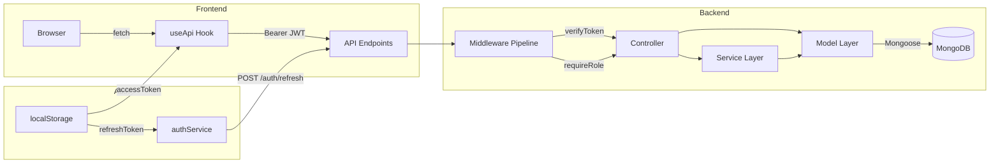
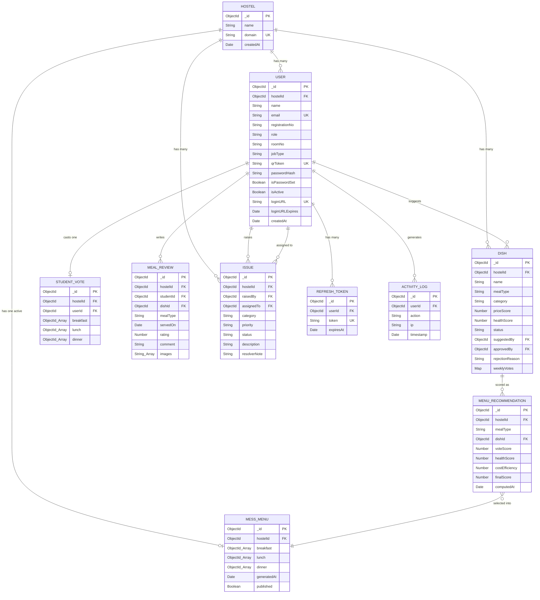
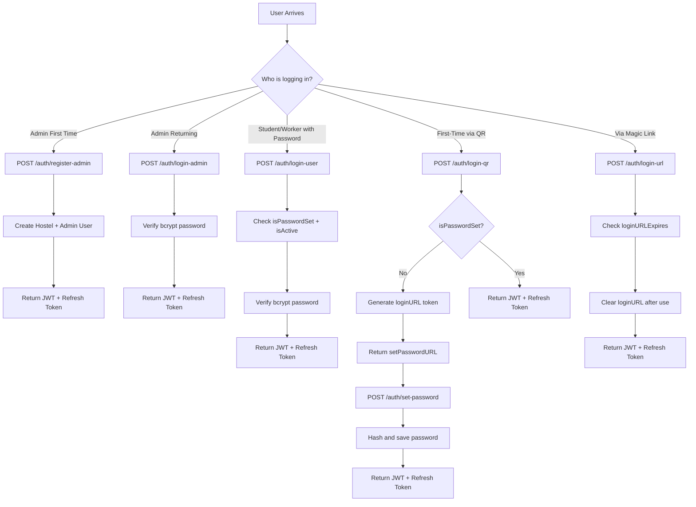
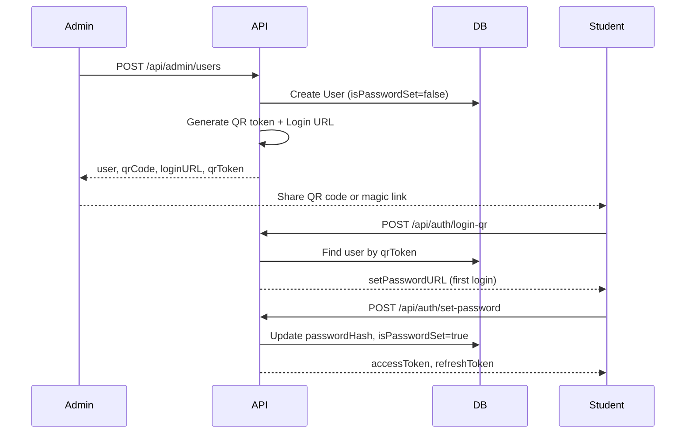
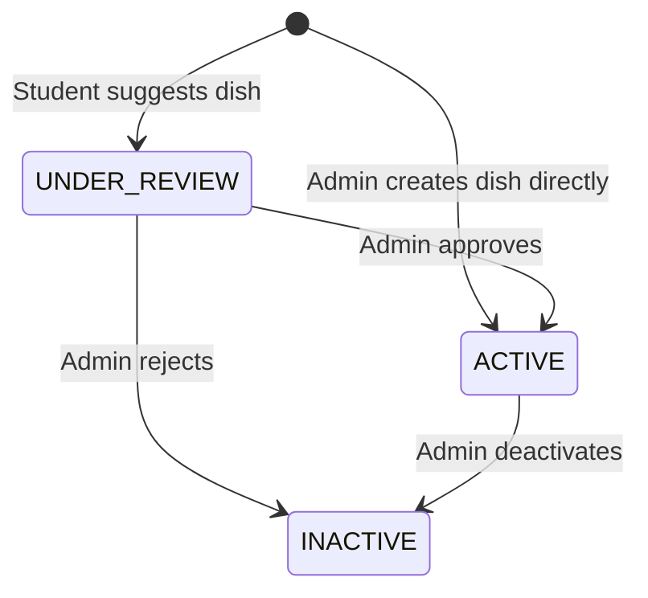
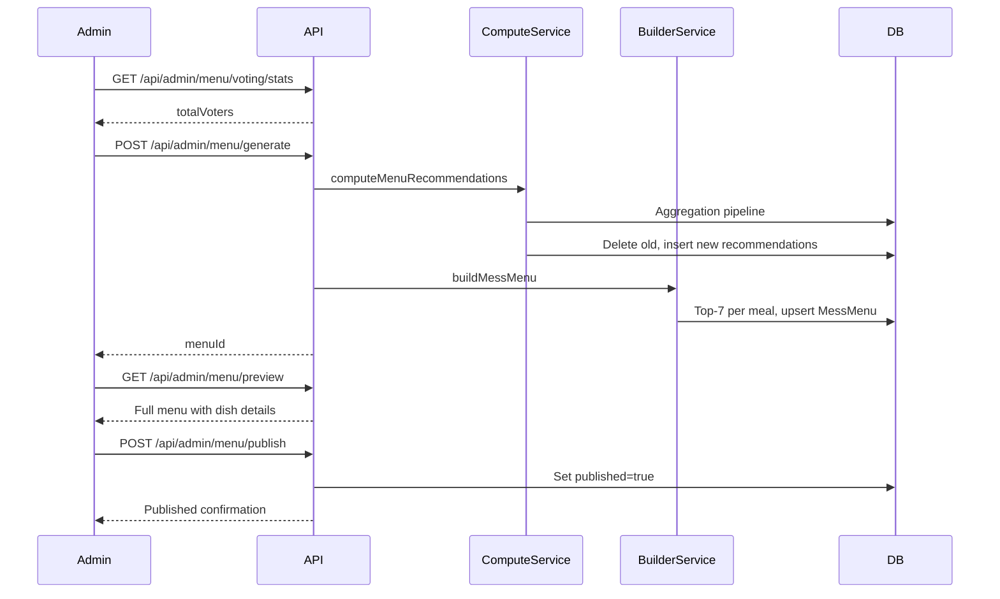
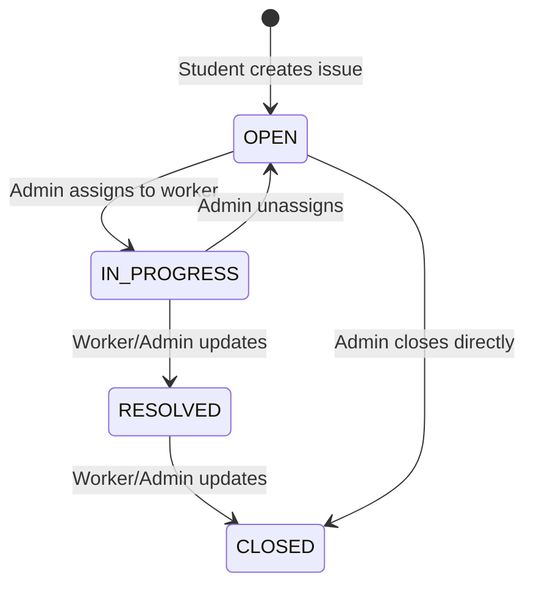
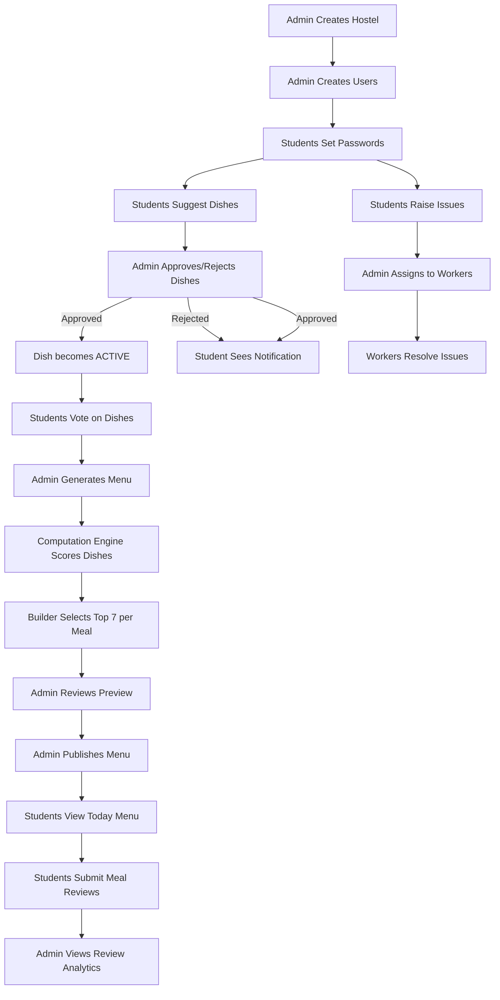

# HostelHub — Complete Codebase Knowledge Document

> **Generated**: 2026-08-16  
> **Scope**: Full-stack analysis (backend + frontend)  
> **Repository Root**: `hostelHub/`

---

## Table of Contents

1. [High-Level Overview](#1-high-level-overview)
2. [Tech Stack & Dependencies](#2-tech-stack--dependencies)
3. [Architecture & Directory Structure](#3-architecture--directory-structure)
4. [Database Schema & Entity Relationships](#4-database-schema--entity-relationships)
5. [Authentication & Security](#5-authentication--security)
6. [Feature-by-Feature Analysis](#6-feature-by-feature-analysis)
   - 6.1 [Multi-Tenant Hostel Management](#61-multi-tenant-hostel-management)
   - 6.2 [User Lifecycle Management](#62-user-lifecycle-management)
   - 6.3 [Dish Management & Suggestion Pipeline](#63-dish-management--suggestion-pipeline)
   - 6.4 [Student Voting System](#64-student-voting-system)
   - 6.5 [Menu Computation Engine](#65-menu-computation-engine)
   - 6.6 [Mess Menu Management](#66-mess-menu-management)
   - 6.7 [Meal Review & Satisfaction Analytics](#67-meal-review--satisfaction-analytics)
   - 6.8 [Issue Tracking & Resolution](#68-issue-tracking--resolution)
   - 6.9 [Admin Dashboard & Telemetry](#69-admin-dashboard--telemetry)
   - 6.10 [Student Notifications](#610-student-notifications)
7. [Cross-Feature Interaction Map](#7-cross-feature-interaction-map)
8. [Frontend Architecture](#8-frontend-architecture)
9. [API Reference](#9-api-reference)
10. [Things You Must Know Before Changing Code](#10-things-you-must-know-before-changing-code)
11. [Glossary](#11-glossary)

---

## 1. High-Level Overview

### What Is HostelHub?

HostelHub is a **multi-tenant hostel management platform** that digitizes and streamlines the administrative and operational workflows of student housing facilities. It integrates three user personas — **Admins**, **Students**, and **Workers** — into a unified ecosystem.

### Business Purpose

- **For Hostel Administrators**: Manage residents, staff, mess menus, and maintenance operations through a centralized dashboard.
- **For Students**: Vote on meal preferences, suggest new dishes, review served meals, and raise maintenance issues.
- **For Workers (Maintenance Staff)**: View and resolve assigned maintenance tickets.

### Core Business Workflows

1. **Admin Provisioning** → Admin registers hostel → System creates isolated tenant workspace
2. **User Onboarding** → Admin creates student/worker → Distributes QR code / magic link → User sets password on first login
3. **Menu Optimization** → Students vote on preferred dishes → Admin triggers algorithmic generation → Menu published system-wide
4. **Maintenance Resolution** → Student raises issue → Admin assigns to worker → Worker resolves and closes

### What It Is NOT

- It is **not** a booking/reservation system for hostel rooms.
- It does **not** handle financial transactions, fee collection, or billing.
- There is **no** real-time chat or messaging between users (despite Socket.io being listed as a dependency, WebSocket integration is referenced in the README but not actively implemented in the current codebase).

---

## 2. Tech Stack & Dependencies

### Backend

| Category | Technology | Version | Purpose |
|---|---|---|---|
| Runtime | Node.js | v18+ | Server runtime |
| Framework | Express.js | ^5.2.1 | REST API framework |
| Language | TypeScript | ^5.9.3 | Type-safe development |
| Database | MongoDB + Mongoose | ^9.0.1 | Document store + ODM |
| Auth | JWT (jsonwebtoken) | ^9.0.3 | Token-based authentication |
| Hashing | bcrypt | ^6.0.0 | Password hashing |
| QR Codes | qrcode | ^1.5.4 | QR code generation |
| Security | helmet | ^8.1.0 | HTTP header protection |
| CORS | cors | ^2.8.5 | Cross-origin policy |
| Email | nodemailer | ^9.0.3 | Email sending (declared but not actively used in controllers) |
| Cache | redis | ^5.10.0 | Declared dependency but not used in current code |
| Real-Time | socket.io | ^4.8.3 | Declared dependency but not actively integrated |
| Dev Tools | nodemon, ts-node | — | Hot-reload development |

### Frontend

| Category | Technology | Version | Purpose |
|---|---|---|---|
| Framework | React | ^19.2.3 | UI component library |
| Build | Vite | ^7.2.4 | Module bundler |
| Language | TypeScript | ~5.9.3 | Type safety |
| Styling | Tailwind CSS | ^4.1.18 | Utility-first CSS |
| Routing | react-router-dom | ^7.10.1 | Client-side routing |
| Charts | recharts | ^3.10.1 | Data visualization |
| Icons | lucide-react | ^0.562.0 | Icon library |
| Toasts | react-hot-toast | ^2.6.0 | Notification toasts |
| WebSocket | socket.io-client | ^4.8.3 | Declared but not actively used |
| Utils | clsx, tailwind-merge, date-fns | — | Classname utils, date formatting |

### Key Observations

> **WARNING**: `redis`, `socket.io`, `socket.io-client`, and `nodemailer` are declared in `package.json` but have no active integration points in the source code. These appear to be planned for future features (WebSocket broadcast for menu publication, Redis caching, email notifications).

---

## 3. Architecture & Directory Structure

### Architecture Type

**Monorepo (split frontend/backend)** with a classic **MVC-ish** layered architecture on the backend and **component-based** architecture on the frontend.

```
hostelHub/
├── backend/                          # Express.js API server
│   ├── src/
│   │   ├── config/
│   │   │   └── db.ts                 # MongoDB connection setup
│   │   ├── constants/
│   │   │   └── roles.js              # ADMIN, STUDENT, WORKER enum
│   │   ├── controllers/              # Request handlers (14 files)
│   │   │   ├── auth.controller.ts           # 460 lines — all auth flows
│   │   │   ├── adminUser.controller.ts      # 382 lines — CRUD + QR/link mgmt
│   │   │   ├── adminDish.controller.ts      # 135 lines — dish CRUD & approval
│   │   │   ├── adminMenu.controller.ts      # 92 lines — menu generation/publish
│   │   │   ├── adminReview.controller.ts    # 142 lines — review stats
│   │   │   ├── adminDashboard.controller.ts # 50 lines — dashboard stats
│   │   │   ├── issue.controller.ts          # 277 lines — issue CRUD & lifecycle
│   │   │   ├── dish.controller.ts           # 96 lines — admin + student dish creation
│   │   │   ├── studentVote.controller.ts    # 130 lines — voting upsert
│   │   │   ├── studentMenu.controller.ts    # 58 lines — menu retrieval
│   │   │   ├── studentDish.controller.ts    # 32 lines — active dishes grouped
│   │   │   ├── studentNotification.controller.ts # 53 lines
│   │   │   ├── mealReview.controller.ts     # 132 lines — submit review
│   │   │   └── user.controller.ts           # 18 lines — getMe
│   │   ├── middlewares/
│   │   │   ├── verifyToken.middleware.ts     # JWT verification
│   │   │   ├── requireRole.middleware.ts     # RBAC enforcement
│   │   │   ├── dishRateLimit.middleware.ts   # 3 suggestions/week limit
│   │   │   └── errorHandler.ts              # Global error handler
│   │   ├── models/                   # Mongoose schemas (10 files)
│   │   │   ├── User.ts, Hostel.ts, Dish.ts, Issue.ts
│   │   │   ├── MessMenu.ts, MenuRecommendation.ts
│   │   │   ├── StudentVote.ts, MealReview.ts
│   │   │   ├── RefreshToken.ts, ActivityLog.ts
│   │   ├── routes/                   # Express routers (12 files)
│   │   ├── services/                 # Business logic services (3 files)
│   │   │   ├── menuComputation.service.ts   # Aggregation pipeline scoring
│   │   │   ├── menuBuilder.service.ts       # Top-7 selection per meal
│   │   │   └── menuCache.service.ts         # Published menu retrieval
│   │   ├── types/
│   │   │   └── express.d.ts          # Express Request augmentation
│   │   ├── utils/
│   │   │   ├── jwt.ts                # Token generation/verification/refresh
│   │   │   └── formatMeal.ts         # Meal data transformation
│   │   └── server.ts                 # Application bootstrap
│   ├── package.json
│   ├── tsconfig.json
│   └── nodemon.json
│
├── frontend/                         # React + Vite SPA
│   ├── src/
│   │   ├── components/
│   │   │   ├── admin/    — AdminSidebar.tsx, AdminTopbar.tsx
│   │   │   ├── student/  — StudentSidebar.tsx, StudentTopbar.tsx
│   │   │   ├── worker/   — WorkerTopbar.tsx
│   │   │   ├── common/   — RaiseIssueForm.tsx
│   │   │   └── ui/       — button.tsx, card.tsx, input.tsx, label.tsx, tabs.tsx
│   │   ├── contexts/
│   │   │   ├── AuthContext.tsx        # Auth provider
│   │   │   └── AuthContextType.ts     # TypeScript interface
│   │   ├── hooks/
│   │   │   ├── useApi.ts              # Authenticated fetch wrapper + token refresh
│   │   │   ├── useAuth.ts             # Context consumer hook
│   │   │   └── useMessService.ts      # Menu operation hooks
│   │   ├── lib/
│   │   │   └── utils.ts               # cn() classname merge utility
│   │   ├── pages/
│   │   │   ├── login/    — login.tsx, QRLogin.tsx, LoginLink.tsx, SetPassword.tsx
│   │   │   ├── admin/    — 10 pages
│   │   │   ├── student/  — 8 pages
│   │   │   └── worker/   — Dashboard.tsx, WorkerLayout.tsx
│   │   ├── routes/
│   │   │   ├── router.tsx             # Root route configuration
│   │   │   ├── AdminRoutes.tsx        # Admin nested routes
│   │   │   └── StudentRoutes.tsx      # Student nested routes
│   │   ├── services/
│   │   │   └── authService.ts         # Auth API client + credential management
│   │   ├── types/
│   │   │   └── auth.ts                # Auth TypeScript interfaces
│   │   ├── App.tsx                    # Root component
│   │   ├── main.tsx                   # DOM entry
│   │   └── index.css                  # Global styles
│   ├── package.json
│   ├── vite.config.ts                 # Vite config with @ alias
│   ├── tailwind.config.js
│   └── vercel.json                    # SPA rewrite rules for Vercel
│
└── README.md
```

### Data Flow Architecture



---

## 4. Database Schema & Entity Relationships

### Entity-Relationship Diagram



### Key Schema Constraints

| Model | Constraint | File Reference |
|---|---|---|
| `User.email` | Unique globally | `backend/src/models/User.ts` |
| `User.qrToken` | Unique + sparse | `backend/src/models/User.ts` |
| `User.loginURL` | Unique + sparse | `backend/src/models/User.ts` |
| `StudentVote.userId` | Unique (one vote record per student) | `backend/src/models/StudentVote.ts` |
| `MessMenu.hostelId` | Unique index (one menu per hostel) | `backend/src/models/MessMenu.ts` |
| `MessMenu.breakfast/lunch/dinner` | Exactly 7 items each | `backend/src/models/MessMenu.ts` |
| `MealReview` | Compound unique: `{hostelId, studentId, dishId, servedOn}` | `backend/src/models/MealReview.ts` |
| `RefreshToken.createdAt` | TTL index: auto-delete after 604800s (7 days) | `backend/src/models/RefreshToken.ts` |

---

## 5. Authentication & Security

### Authentication Flows

The system supports **5 distinct authentication methods**:



### JWT Token Architecture

| Token | Expiry | Storage (Frontend) | File |
|---|---|---|---|
| Access Token | 15 minutes | `localStorage.accessToken` | `backend/src/utils/jwt.ts` |
| Refresh Token | 7 days | `localStorage.refreshToken` + MongoDB `RefreshToken` collection | `backend/src/utils/jwt.ts` |

**JWT Payload Structure** (access token):
```json
{
  "userId": "ObjectId string",
  "email": "user@domain.com",
  "role": "ADMIN|STUDENT|WORKER",
  "hostelId": "ObjectId string"
}
```

### Token Refresh Flow

Implemented in `frontend/src/hooks/useApi.ts`:

1. API call returns `401`
2. `useApi` hook reads `refreshToken` from `localStorage`
3. Calls `POST /auth/refresh` with the refresh token
4. On success: stores new token pair, retries original request
5. On failure: clears tokens, redirects to `/login`

> **IMPORTANT**: The refresh flow does **not** revoke the old refresh token before issuing a new one. This means multiple valid refresh tokens can coexist for the same user.

### Middleware Pipeline

Every protected request passes through this sequence:

```
Request → helmet() → cors() → express.json() → verifyToken → requireRole → Controller
```

| Middleware | File | Function |
|---|---|---|
| `verifyToken` | `backend/src/middlewares/verifyToken.middleware.ts` | Extracts JWT from `Authorization: Bearer <token>`, decodes payload, sets `req.user` |
| `requireRole` | `backend/src/middlewares/requireRole.middleware.ts` | Checks `req.user.role` against allowed roles array |
| `dishSuggestionRateLimit` | `backend/src/middlewares/dishRateLimit.middleware.ts` | Counts Dish documents by `suggestedBy` in last 7 days; blocks if >= 3 |
| `errorHandler` | `backend/src/middlewares/errorHandler.ts` | Catches uncaught errors, returns 500 |

### Multi-Tenancy Enforcement

Data isolation is enforced at the **application layer**, not the database layer:

- Every model (except `Hostel` and `RefreshToken`) has a `hostelId` field.
- Controllers read `req.user.hostelId` (from JWT) and filter all queries by it.
- The `adminUser.controller.ts` performs an **additional** check: it fetches the admin's user record from DB and verifies `admin.hostelId` matches the target record's `hostelId`.

> **CAUTION**: The `issue.routes.ts` file applies `verifyToken` globally but does NOT apply `requireRole` on `POST /`, `GET /my-issues`, or `PATCH /:issueId/status`. The controller logic handles authorization internally, but the route-level protection is inconsistent with other admin routes.

### Security Hardening

- **Helmet.js**: Enabled globally (`backend/src/server.ts:40`)
- **CORS**: Restricted to single `FRONTEND_URL` origin with credentials
- **bcrypt salt rounds**: 10 (hardcoded in `auth.controller.ts:54`)
- **JSON body limit**: 10MB (`server.ts:49`)
- **Password minimum length**: 8 characters (checked in controller, not model)
- **QR tokens**: 32 random bytes, hex-encoded
- **Credential Management API**: Frontend uses browser's `navigator.credentials` for autofill

---

## 6. Feature-by-Feature Analysis

### 6.1 Multi-Tenant Hostel Management

**Business Purpose**: Allow multiple independent hostels to operate on a single deployment, with complete data isolation.

**How It Works**:

1. Admin registers via `POST /api/auth/register-admin`
2. A `Hostel` document is created with a generated `domain` (hostel name → lowercase, strip spaces, truncate to 10 chars, append `.com`)
3. Admin email **must** end with `@{domain}` — enforced in `auth.controller.ts:37`
4. All subsequent user emails are auto-generated using `{name}_{roomNo}@{domain}` pattern

**Key Files**:
- `backend/src/models/Hostel.ts` — Schema: `{ name, domain, createdAt }`
- `backend/src/controllers/auth.controller.ts` — `registerAdmin()` (lines 18–90)
- `backend/src/controllers/adminUser.controller.ts` — `createUser()` uses admin's `hostelId`

**Domain Generation Logic** (`auth.controller.ts:10-15`):
```typescript
const generateDomain = (hostelName: string): string => {
  return hostelName.toLowerCase().replace(/\s+/g, '').substring(0, 10) + '.com';
};
```

> **WARNING**: Two hostels with names starting with the same 10 characters would generate the same domain. The Hostel model enforces `unique: true` on `domain`, so the second registration would fail with a MongoDB duplicate key error — but the error message would be unhelpful.

---

### 6.2 User Lifecycle Management

**Business Purpose**: Admin creates and manages student/worker accounts with passwordless initial authentication.

**Technical Flow**:



**User States**:
- `isPasswordSet: false` → First-time user, cannot use email/password login
- `isActive: true` → Normal state
- `isActive: false` → Deactivated, blocked from login
- Deleted → Permanently removed from DB

**Key Files**:
- `backend/src/controllers/adminUser.controller.ts` — Full CRUD: `createUser`, `getUsers`, `getUser`, `deactivateUser`, `reactivateUser`, `deleteUser`, `regenerateQRCode`, `regenerateLoginToken`

**Auto-generated Email Pattern**:
- Students: `{name}_{roomNo}@{hostel.domain}`
- Workers: `{name}@{hostel.domain}`

**Activity Logging**: Every admin action (create, deactivate, reactivate, delete, QR regenerate, login token regenerate) is logged to `ActivityLog`.

---

### 6.3 Dish Management & Suggestion Pipeline

**Business Purpose**: Build a catalog of dishes that students vote on. Students can suggest new dishes; admins curate the catalog.

**Dish Lifecycle**:



**Two Creation Paths**:

| Path | Endpoint | Initial Status | Scores Set? |
|---|---|---|---|
| Student suggestion | `POST /api/dishes` | `UNDER_REVIEW` | No (null) |
| Admin direct creation | `POST /api/admin/dishes` | `ACTIVE` | Yes (defaults to 3) |

**Rate Limiting**: Students are limited to **3 dish suggestions per 7-day rolling window**. Enforced by `dishSuggestionRateLimit` middleware.

**Duplicate Prevention**: Both paths check for existing dishes with the same name (case-insensitive regex).

**Key Files**:
- `backend/src/controllers/dish.controller.ts` — `suggestDish()`, `createAdminDish()`
- `backend/src/controllers/adminDish.controller.ts` — `fetchDishes()`, `approveDish()`, `rejectDish()`, `updateDish()`, `deleteDish()`
- `backend/src/models/Dish.ts`

---

### 6.4 Student Voting System

**Business Purpose**: Allow students to express meal preferences that drive the algorithmic menu generation.

**How Voting Works**:

1. Student fetches active dishes via `GET /api/menu-votes/votes`
2. Student selects **exactly 7 dishes** for each meal type (breakfast, lunch, dinner)
3. Student submits via `POST /api/menu-votes/votes`
4. System validates: all IDs must be valid ObjectIds, exist in DB, be ACTIVE, belong to the student's hostel
5. Stored as a single `StudentVote` document per student (upserted)

**Validation Rules** (`backend/src/controllers/studentVote.controller.ts`):
- Exactly 7 dishes per meal type — hardcoded requirement
- All dish IDs must be valid MongoDB ObjectIds
- All dishes must be `ACTIVE` and belong to the student's hostel
- Duplicate IDs within a meal are allowed

**Key Files**:
- `backend/src/controllers/studentVote.controller.ts` — `getStudentVotes()`, `saveStudentVotes()`
- `backend/src/models/StudentVote.ts`

> **NOTE**: The `weeklyVotes` field on the `Dish` model is a Map but is **not directly updated by the voting controller**. The `weeklyVotes` Map is used during the aggregation pipeline in `menuComputation.service.ts`.

---

### 6.5 Menu Computation Engine

**Business Purpose**: Algorithmically determine the optimal weekly menu based on student preferences, health scores, and cost efficiency.

**This is the most complex subsystem in the codebase.** It involves three service files working in sequence:

#### Step 1: Compute Recommendations (`menuComputation.service.ts`)

Runs a **MongoDB aggregation pipeline** on the `Dish` collection:

1. **$match**: Active dishes for the hostel
2. **$addFields**: Calculate `weeklyVoteCount` by reducing the `weeklyVotes` Map
3. **$group**: Find the maximum vote count across all dishes (for normalization)
4. **$addFields**: Calculate three scoring dimensions:
   - `voteScore` = `weeklyVoteCount / maxVotes` (0 to 1, normalized)
   - `costEfficiency` = `1 / priceScore` (inverse — lower price = higher efficiency)
5. **$addFields**: Calculate **weighted final score**:
   ```
   finalScore = (0.5 * voteScore) + (0.3 * healthScore) + (0.2 * costEfficiency)
   ```
6. Results are saved to `MenuRecommendation` collection (old records deleted first)

**Scoring Weights**:
| Factor | Weight | Description |
|---|---|---|
| Vote Score | 50% | Student popularity |
| Health Score | 30% | Nutritional value |
| Cost Efficiency | 20% | Budget friendliness |

#### Step 2: Build Menu (`menuBuilder.service.ts`)

For each meal type (Breakfast, Lunch, Dinner):
1. Query `MenuRecommendation` sorted by `finalScore` descending
2. Take top 7 dishes
3. **Throws error** if fewer than 7 dishes exist for any meal type
4. Upsert into `MessMenu` (one per hostel) with `published: false`

#### Step 3: Cache / Retrieve (`menuCache.service.ts`)

- `getCachedCurrentMenu()`: Fetches published `MessMenu` with full population of `Dish` data
- `getCachedTodayMenu()`: Determines today's day index (Monday=0 through Sunday=6) and returns only that day's dishes

> **IMPORTANT**: Despite the file name `menuCache.service.ts`, there is **no actual caching** (no Redis, no in-memory cache). Every call hits MongoDB directly.

**Key Files**:
- `backend/src/services/menuComputation.service.ts` — Aggregation pipeline
- `backend/src/services/menuBuilder.service.ts` — Top-7 selection
- `backend/src/services/menuCache.service.ts` — DB-direct retrieval
- `backend/src/utils/formatMeal.ts` — Transforms populated meal data

---

### 6.6 Mess Menu Management

**Business Purpose**: Admin workflow to generate, preview, and publish weekly menus.

**Admin Workflow**:



**Key Files**:
- `backend/src/controllers/adminMenu.controller.ts`
- `backend/src/controllers/studentMenu.controller.ts`

---

### 6.7 Meal Review & Satisfaction Analytics

**Business Purpose**: Collect student feedback on served meals to inform future menu decisions.

**How Reviews Work**:

1. Student submits review via `POST /api/reviews/submit` with `{ dishId, mealType, rating (1-5), comment, images[], servedOn }`
2. Validations:
   - Dish must exist, be ACTIVE, belong to student's hostel
   - `mealType` must match the dish's `mealType`
   - `servedOn` cannot be in the future
   - Maximum 3 images per review
   - One review per student per dish per day (compound unique index)

**Admin Analytics** (`GET /api/admin/reviews/stats`):
- **Per-dish stats**: Average rating + total reviews (via `$group` + `$lookup`)
- **Date-wise trends**: Average rating + total reviews per day

**Key Files**:
- `backend/src/controllers/mealReview.controller.ts`
- `backend/src/controllers/adminReview.controller.ts`
- `backend/src/models/MealReview.ts`

---

### 6.8 Issue Tracking & Resolution

**Business Purpose**: Enable students to report hostel maintenance issues and track their resolution.

**Issue Lifecycle**:



**Priority Levels**: `LOW`, `MEDIUM`, `HIGH`, `URGENT`

**Authorization Matrix**:

| Action | Student | Worker | Admin |
|---|---|---|---|
| Create Issue | Yes | Yes | Yes |
| View Own Issues | Yes | — | — |
| View Assigned Issues | — | Yes | — |
| View All Issues | — | — | Yes (same hostel) |
| Assign/Unassign | — | — | Yes (same hostel) |
| Update Status | — | Yes (if assigned) | Yes (same hostel) |
| Delete Issue | Yes (if creator) | — | Yes (same hostel) |

**Unassign Mechanism**: Sending `workerId: "UNASSIGN"` to `PATCH /issues/:issueId/assign` clears the assignment and resets status to `OPEN`. This is a magic string.

**Key Files**:
- `backend/src/controllers/issue.controller.ts`
- `backend/src/models/Issue.ts`
- `backend/src/routes/issue.routes.ts`

---

### 6.9 Admin Dashboard & Telemetry

**Business Purpose**: Provide a quick overview of hostel operations.

**Endpoint**: `GET /api/admin/dashboard`

**Response Shape**:
```json
{
  "totalStudents": 150,
  "activeDishes": 42,
  "openIssues": 7,
  "totalVotes": 85,
  "recentActivity": [...]
}
```

Uses `Promise.all()` for parallel query execution across 4 collections.

**Key File**: `backend/src/controllers/adminDashboard.controller.ts`

---

### 6.10 Student Notifications

**Business Purpose**: Inform students about the outcome of their dish suggestions.

**Endpoint**: `GET /api/student/notifications`

Queries `Dish` collection for dishes where `suggestedBy` matches the student and status is `ACTIVE` (approved) or `INACTIVE` (rejected).

> **NOTE**: These are not push notifications. They are polled via REST API. Derived from dish status changes, not from a dedicated notification model.

**Key File**: `backend/src/controllers/studentNotification.controller.ts`

---

## 7. Cross-Feature Interaction Map



### Feature Dependencies

| Feature | Depends On | Feeds Into |
|---|---|---|
| User Management | Hostel exists | All other features |
| Dish Suggestions | Active user | Dish Catalog |
| Dish Approvals | Pending suggestions | Voting, Menu |
| Student Voting | Active dishes (min 7 per meal) | Menu Computation |
| Menu Computation | Active dishes with votes | Menu Builder |
| Menu Builder | Computed recommendations (min 7 per meal) | Mess Menu |
| Menu Publishing | Generated (unpublished) menu | Student Menu View, Reviews |
| Meal Reviews | Published menu + served dishes | Admin Analytics |
| Issue Tracking | Active users | Worker Dashboard |
| Dashboard Stats | All features | Admin Dashboard |

---

## 8. Frontend Architecture

### Application Shell

```
main.tsx → StrictMode → AuthProvider → App.tsx → Router → Toaster + AppRoutes
```

### Routing Structure

| Path | Component | Role |
|---|---|---|
| `/login` | `Login` | Public |
| `/qr-login` | `QRLogin` | Public |
| `/login-link` | `LoginLink` | Public |
| `/set-password/:userId` | `SetPassword` | Public |
| `/admin/register` | `AdminRegister` | Public |
| `/admin/dashboard` | `AdminDashboard` | ADMIN |
| `/admin/users` | `AdminUsers` | ADMIN |
| `/admin/create-user` | `AdminCreateUser` | ADMIN |
| `/admin/voting` | `AdminVoting` | ADMIN |
| `/admin/menu` | `AdminMessMenu` | ADMIN |
| `/admin/reviews` | `AdminReviews` | ADMIN |
| `/admin/issues` | `AdminIssues` | ADMIN |
| `/admin/dishes` | `AdminDishApprovals` | ADMIN |
| `/student/dashboard` | `StudentDashboard` | STUDENT |
| `/student/voting/status` | `StudentVoting` | STUDENT |
| `/student/menu` | `StudentMessMenu` | STUDENT |
| `/student/reviews` | `StudentReview` | STUDENT |
| `/student/suggest-dishes` | `StudentSuggestDish` | STUDENT |
| `/student/issues` | `StudentIssues` | STUDENT |
| `/worker/dashboard` | `WorkerDashboard` | WORKER |
| `/` | Redirects to `/login` | — |

### State Management

- **Global State**: `AuthContext` (user data, loading, error states)
- **Local State**: Each page manages its own state via `useState`/`useEffect`
- **No global store**: No Redux, Zustand, or similar

### API Communication Pattern

All authenticated requests go through the `useApi()` hook (`frontend/src/hooks/useApi.ts`):

```typescript
const { request } = useApi();
const data = await request('/admin/dashboard', 'GET');
const result = await request('/issues', 'POST', { category, priority, description });
```

The `request()` function:
1. Attaches `Bearer` token from `localStorage`
2. Handles `401` → attempts token refresh → retries original request
3. On refresh failure → clears tokens, redirects to `/login`

### Layout System

- **Admin**: `AdminLayout` → `AdminSidebar` + `AdminTopbar` + `<Outlet />`
- **Student**: `StudentLayout` → `StudentSidebar` + `StudentTopbar` + `<Outlet />`
- **Worker**: `WorkerLayout` → `WorkerTopbar` + `<Outlet />`

### UI Component Library

Custom component library in `frontend/src/components/ui/`:
- `button.tsx` — Variant-based button (default, destructive, outline, secondary, ghost, link)
- `card.tsx` — Card + CardHeader + CardTitle + CardDescription + CardContent + CardFooter
- `input.tsx` — Styled input wrapper
- `label.tsx` — Form label
- `tabs.tsx` — Tab navigation

All use `cn()` utility from `lib/utils.ts` (clsx + tailwind-merge).

> **NOTE**: Frontend routing does not enforce authentication or role-based access. Any user can navigate to `/admin/dashboard` by URL — the backend will reject unauthorized API calls, but the page will still render (with errors).

---

## 9. API Reference

### Authentication (`/api/auth`)

| Method | Path | Auth | Body | Response |
|---|---|---|---|---|
| `POST` | `/register-admin` | None | `{ hostelName, adminName, adminEmail, adminPassword }` | `{ hostel, user, accessToken, refreshToken }` |
| `POST` | `/login-admin` | None | `{ email, password }` | `{ user, accessToken, refreshToken }` |
| `POST` | `/login-user` | None | `{ email, password, role }` | `{ user, accessToken, refreshToken }` |
| `POST` | `/login-qr` | None | `{ qrToken }` | `{ user, tokens }` or `{ setPasswordURL, userId }` |
| `POST` | `/login-url` | None | `{ loginURL }` | `{ user, accessToken, refreshToken }` |
| `POST` | `/set-password` | None | `{ loginURL, password }` | `{ user, accessToken, refreshToken }` |
| `POST` | `/refresh` | None | `{ refreshToken }` | `{ tokens: { accessToken, refreshToken } }` |
| `POST` | `/logout` | JWT | `{ refreshToken }` | `{ message }` |
| `GET` | `/qr/:userId` | JWT | — | `{ qrCode, qrToken }` |

### Admin - User Management (`/api/admin/users`)

| Method | Path | Body | Response |
|---|---|---|---|
| `POST` | `/` | `{ name, email?, role, roomNo?, jobType?, registrationNo? }` | `{ user, qrCode, loginURL, qrToken }` |
| `GET` | `/` | Query: `?role=&status=` | `{ users: [...] }` |
| `GET` | `/:userId` | — | `{ user }` |
| `PATCH` | `/:userId/deactivate` | — | `{ message }` |
| `PATCH` | `/:userId/reactivate` | — | `{ message }` |
| `DELETE` | `/:userId` | — | `{ message }` |
| `POST` | `/:userId/qr-code` | — | `{ qrCode, qrToken }` |
| `POST` | `/:userId/login-token` | — | `{ loginURL, expiresIn }` |

### Admin - Dish Management (`/api/admin/dishes`)

| Method | Path | Body | Response |
|---|---|---|---|
| `GET` | `/` | Query: `?status=` | `[...dishes]` |
| `POST` | `/` | `{ name, mealType, category, tags?, priceScore?, healthScore? }` | `{ dish }` |
| `POST` | `/:id/approve` | `{ priceScore, healthScore }` | `{ dish }` |
| `POST` | `/:id/reject` | `{ reason }` | `{ message }` |
| `PUT` | `/:id` | `{ name, mealType, category, tags, priceScore, healthScore }` | `{ dish }` |
| `DELETE` | `/:id` | — | `{ message }` |

### Admin - Menu (`/api/admin/menu`)

| Method | Path | Response |
|---|---|---|
| `GET` | `/voting/stats` | `{ totalVoters }` |
| `POST` | `/generate` | `{ message, menuId }` |
| `GET` | `/preview` | Full menu object or `null` |
| `POST` | `/publish` | `{ message, menuId }` |

### Admin - Reviews (`/api/admin/reviews`)

| Method | Path | Response |
|---|---|---|
| `GET` | `/` | `{ reviews, pagination }` — Query: `?mealType=&date=&dishId=&page=&limit=` |
| `GET` | `/stats` | `{ dishStats, trendStats }` |

### Admin - Dashboard (`/api/admin/dashboard`)

| Method | Path | Response |
|---|---|---|
| `GET` | `/` | `{ totalStudents, activeDishes, openIssues, totalVotes, recentActivity }` |

### Shared - Issues (`/api/issues`)

| Method | Path | Auth | Body |
|---|---|---|---|
| `POST` | `/` | JWT | `{ category, priority, description }` |
| `GET` | `/my-issues` | JWT | — |
| `GET` | `/assigned` | JWT | — |
| `GET` | `/admin/all` | JWT+ADMIN | — |
| `PATCH` | `/:issueId/assign` | JWT+ADMIN | `{ workerId }` or `{ workerId: "UNASSIGN" }` |
| `PATCH` | `/:issueId/status` | JWT | `{ status, resolverNote? }` |
| `DELETE` | `/:issueId` | JWT | — |

### Shared - Dishes (`/api/dishes`)

| Method | Path | Auth | Middleware | Body |
|---|---|---|---|---|
| `POST` | `/` | JWT | `dishSuggestionRateLimit` | `{ name, mealType, category, tags? }` |

### Shared - Reviews (`/api/reviews`)

| Method | Path | Auth | Body |
|---|---|---|---|
| `POST` | `/submit` | JWT | `{ dishId, mealType, rating, comment?, images?, servedOn }` |

### Student (`/api/student`)

| Method | Path | Response |
|---|---|---|
| `GET` | `/menu/today` | Today's dishes |
| `GET` | `/menu/current` | Full weekly published menu |
| `GET` | `/dishes/active` | Grouped active dishes |
| `GET` | `/notifications` | Dish approval/rejection notifications |

### Student - Voting (`/api/menu-votes`)

| Method | Path | Body | Response |
|---|---|---|---|
| `GET` | `/votes` | — | `{ availableDishes, votes }` |
| `POST` | `/votes` | `{ votes: { breakfast: [7], lunch: [7], dinner: [7] } }` | `{ votes }` |

### User (`/api/users`)

| Method | Path | Response |
|---|---|---|
| `GET` | `/me` | `{ id, role, hostelId, name, email }` |

---

## 10. Things You Must Know Before Changing Code

### Critical Gotchas

#### 1. The "7 Dishes" Constraint is Everywhere
The number **7** (representing 7 days of the week) is hardcoded across multiple layers:
- `MessMenu` model validator: `arr.length === 7`
- `StudentVote` controller: `votes[meal].length !== 7`
- `menuBuilder.service.ts`: `.limit(7)` and `if (dishes.length < 7) throw`
- `menuCache.service.ts`: Array index `[dayIndex]` to pick today's dish

**If you change the week structure, you must update ALL of these locations.**

#### 2. `weeklyVotes` on Dish Model is Misleading
The `Dish.weeklyVotes` field is a `Map<string, number>` but its keys/values are not well-documented. The aggregation pipeline reduces it to a single sum. It is unclear how/when these values are populated — the `studentVote.controller.ts` does NOT update this field when saving votes.

#### 3. MessMenu Unique Index Allows Only ONE Menu Per Hostel
`MessMenu` has a unique index on `hostelId`. This means a hostel can only have **one menu document** — the current one. Historical menus are **overwritten** on each generation cycle. There is no menu history.

#### 4. Login URL vs. QR Token Confusion
- `loginURL` in the `User` model stores a **token** (hex string), not a full URL
- The full URL is constructed in `adminUser.controller.ts` as `${FRONTEND_URL}/login-link/${token}`
- But in `auth.controller.ts`, `loginViaQR` constructs it as `${APP_URL}/set-password/${token}`
- These use **different env vars** (`FRONTEND_URL` vs `APP_URL`) and **different paths** (`/login-link/` vs `/set-password/`)

#### 5. Duplicate Route Definitions
`studentMenu.routes.ts` and `student.routes.ts` both define routes for `/menu/today`, `/menu/current`, `/dishes/active`, and `/notifications`. Both files are imported in `server.ts` and mounted on different base paths (`/api/menu-votes` and `/api/student`), creating duplicate endpoints.

#### 6. No Input Sanitization Beyond Trim
Controllers check for empty/missing fields but do not sanitize against XSS. The `$regex` patterns in dish name checks use unescaped user input — a **potential ReDoS vector**.

#### 7. Error Handler is Minimal
The global `errorHandler` logs the error and returns `500` with a generic message. It does not differentiate between Mongoose validation errors and application errors or strip stack traces in production.

#### 8. The `roles.js` File is Unused
`backend/src/constants/roles.js` exports a `ROLES` object, but it is **never imported** anywhere. Roles are hardcoded as string literals throughout the codebase.

#### 9. No Cascade Deletes
Deleting a `User` does not clean up their `StudentVote`, `MealReview`, `Issue`, `RefreshToken`, `ActivityLog`, or `Dish` records.

#### 10. Frontend Auth Context Only Handles Admin Login
`AuthContext.tsx` hardcodes `authService.loginAdmin()` in its `login` method. Student and worker logins use `authService.loginUser()` directly from the login page, bypassing the context.

### Performance Considerations

- **Dashboard Stats**: Makes 5 sequential/parallel DB queries on every load. No caching.
- **Menu Computation**: Runs a heavy aggregation pipeline synchronously in the request handler.
- **Review Stats**: Uses two separate aggregation pipelines. No materialized views.
- **User List in Dashboard**: Fetches ALL user IDs in hostel just to filter ActivityLogs.

### Security Considerations

- **Token storage in localStorage**: Vulnerable to XSS. HttpOnly cookies would be more secure.
- **No rate limiting on login endpoints**: Susceptible to brute-force attacks.
- **No CSRF protection**.
- **Password policy**: Only checks minimum length (8). No complexity requirements.
- **Refresh token rotation**: Old tokens are not revoked when new ones are issued during refresh.

---

## 11. Glossary

| Term | Definition |
|---|---|
| **Hostel** | A tenant in the multi-tenant system. Maps to one MongoDB `Hostel` document. |
| **Domain** | Auto-generated string derived from hostel name. Used for email addresses. |
| **ADMIN** | Role that manages a single hostel. |
| **STUDENT** | Role representing a hostel resident. |
| **WORKER** | Role representing maintenance staff. |
| **QR Token** | A 64-character hex string for passwordless first-time login. |
| **Login URL / Magic Link** | A tokenized URL for first-time password setup. Expires in 24 hours. |
| **Dish** | A food item in the catalog with a status lifecycle. |
| **priceScore** | Admin-assigned cost metric (1–5). Used inversely in menu computation. |
| **healthScore** | Admin-assigned nutrition metric (1–5). Used directly in scoring. |
| **StudentVote** | A single document per student with 7 preferred dishes per meal type. |
| **MenuRecommendation** | A computed scoring record output by the aggregation pipeline. |
| **MessMenu** | The published weekly menu with 7 items per meal type (21 total). |
| **MealReview** | A student's rating and comment on a dish served on a specific date. |
| **Issue** | A maintenance request with priority and status lifecycle. |
| **ActivityLog** | An audit trail entry for admin actions. |
| **finalScore** | Weighted composite: `0.5*voteScore + 0.3*healthScore + 0.2*costEfficiency`. |

---

## Appendix A: Environment Variables

### Backend (`backend/.env`)

| Variable | Required | Default | Purpose |
|---|---|---|---|
| `MONGODB_URI` | Yes | `mongodb://localhost:27017/hostelHub` | MongoDB connection string |
| `JWT_SECRET` | Yes | — | JWT signing key |
| `PORT` | No | `5000` | Server port |
| `NODE_ENV` | No | `development` | Environment mode |
| `FRONTEND_URL` | No | `http://localhost:5173` | CORS allowed origin |
| `APP_URL` | No | `http://localhost:3000` | Used in QR code URL generation |

> **WARNING**: `server.ts` defaults to port `5000`, but `.env.example` specifies `PORT=8000`. The frontend `.env.example` references `VITE_API_URL=http://localhost:8000/api` and `VITE_WS_URL=http://localhost:5000`. Ensure consistency.

### Frontend (`frontend/.env`)

| Variable | Required | Default | Purpose |
|---|---|---|---|
| `VITE_API_URL` | Yes | `http://localhost:8000/api` | Backend API base URL |
| `VITE_WS_URL` | No | `http://localhost:5000` | WebSocket server URL (unused) |
| `VITE_APP_NAME` | No | — | Application display name |
| `VITE_APP_ENVIRONMENT` | No | — | Environment label |
| `VITE_ENABLE_DEBUG` | No | — | Debug mode flag |

---

## Appendix B: File Index (Prioritized)

| Priority | Path | Type | Lines | Notes |
|---|---|---|---|---|
| ★★★ | `backend/src/server.ts` | Entry | 88 | Application bootstrap, all route mounts |
| ★★★ | `backend/src/controllers/auth.controller.ts` | Controller | 460 | All 8 auth flows |
| ★★★ | `backend/src/controllers/adminUser.controller.ts` | Controller | 382 | User CRUD + QR/Link management |
| ★★★ | `backend/src/services/menuComputation.service.ts` | Service | 104 | Core scoring algorithm |
| ★★★ | `backend/src/utils/jwt.ts` | Utility | 100 | All token operations |
| ★★☆ | `backend/src/controllers/issue.controller.ts` | Controller | 277 | Issue lifecycle |
| ★★☆ | `backend/src/controllers/studentVote.controller.ts` | Controller | 130 | Voting logic |
| ★★☆ | `backend/src/controllers/adminDish.controller.ts` | Controller | 135 | Dish approval workflow |
| ★★☆ | `backend/src/middlewares/verifyToken.middleware.ts` | Middleware | 41 | JWT verification |
| ★★☆ | `backend/src/models/*.ts` | Models | ~210 | All 10 Mongoose schemas |
| ★★☆ | `frontend/src/services/authService.ts` | Service | 312 | Frontend auth + credential mgmt |
| ★★☆ | `frontend/src/hooks/useApi.ts` | Hook | 90 | Authenticated fetch + token refresh |
| ★☆☆ | `backend/src/services/menuBuilder.service.ts` | Service | 39 | Top-7 dish selection |
| ★☆☆ | `backend/src/services/menuCache.service.ts` | Service | 38 | Menu retrieval |
| ★☆☆ | `backend/src/controllers/adminMenu.controller.ts` | Controller | 92 | Menu generation/publish |
| ★☆☆ | `backend/src/controllers/mealReview.controller.ts` | Controller | 132 | Review submission |
| ★☆☆ | `backend/src/controllers/adminReview.controller.ts` | Controller | 142 | Review aggregation stats |
| ★☆☆ | `frontend/src/routes/router.tsx` | Routes | 43 | All frontend routes |
| ★☆☆ | `frontend/src/contexts/AuthContext.tsx` | Context | 55 | Auth state management |

---

*End of document. This knowledge base covers every file, function, model, route, and business rule in the HostelHub codebase as of the analysis date.*
