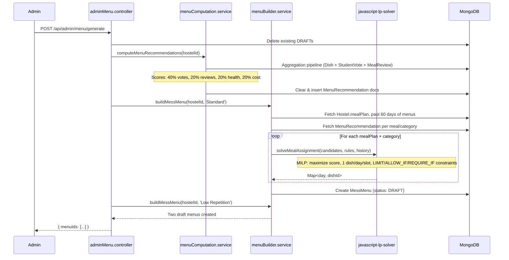
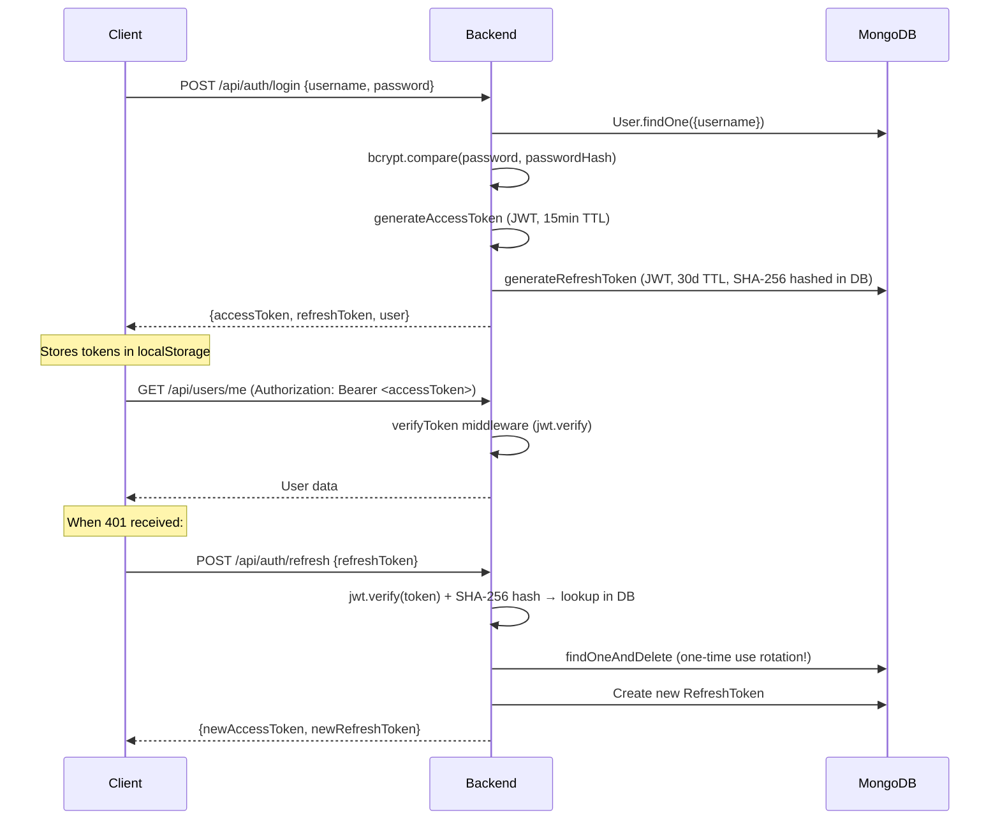

# HostelHub — Codebase Knowledge Document

> **Purpose**: This document is a self-contained brain dump of the HostelHub codebase. Another developer or LLM reading this should be able to implement new features, fix bugs, and refactor safely without guessing.
>
> **Generated**: 2026-09-23 | **Repo**: `github.com/fo56/hostelHub`

---

## Table of Contents

1. [High-Level Overview](#1-high-level-overview)
2. [System Architecture](#2-system-architecture)
3. [Data Model & Database Schema](#3-data-model--database-schema)
4. [Authentication & Security](#4-authentication--security)
5. [Feature-by-Feature Analysis](#5-feature-by-feature-analysis)
6. [Cross-Cutting Concerns](#6-cross-cutting-concerns)
7. [Frontend Architecture](#7-frontend-architecture)
8. [Nuances, Subtleties & Gotchas](#8-nuances-subtleties--gotchas)
9. [Technical Reference & Glossary](#9-technical-reference--glossary)
10. [API Reference](#10-api-reference)
11. [Testing & CI](#11-testing--ci)

---

## 1. High-Level Overview

### What It Is

HostelHub is a **multi-tenant hostel management platform** designed for student housing institutions. It digitizes three core operational pillars:

1. **Mess Menu Management** — Algorithmic weekly menu generation using a Mixed-Integer Linear Programming (MILP) solver that weighs student votes, health scores, cost efficiency, and admin-defined constraints.
2. **Facility Issue Tracking** — Students report maintenance issues; admins resolve and track them.
3. **Student Engagement** — Democratic dish voting, meal reviews, dish suggestions, and transparency stats.

### Target Users

| Role | Description |
|------|-------------|
| **Admin (Primary)** | Created during hostel registration. Has all permissions. Cannot be deactivated/deleted. |
| **Admin (Secondary)** | Created by primary admin with selective permissions (`MANAGE_USERS`, `MANAGE_MENU`, `MANAGE_ISSUES`, `MANAGE_SETTINGS`). |
| **Student** | Assigned to a hostel by admin. Can vote on dishes, submit issues, suggest dishes, review meals. |

### Tech Stack

| Layer | Technology |
|-------|-----------|
| Frontend | React 19, TypeScript, Vite 7, Tailwind CSS v4, React Router v7, Lucide React, Recharts, React Hot Toast |
| Backend | Node.js, Express 5, TypeScript, Mongoose 9 |
| Database | MongoDB (single DB, multi-tenant via `hostelId` field on every document) |
| Algorithms | `javascript-lp-solver` (MILP), `json-logic-js` (constraint evaluation) |
| AI | Google Gemini 3.6 Flash (natural-language menu constraint parsing) |
| PDF | PDFKit (issue report export) |
| Auth | JWT (access + refresh tokens), bcrypt (password hashing) |
| CI/CD | GitHub Actions (type-check → test → build for both frontend and backend) |

### Directory Structure

```
hostelHub/
├── backend/
│   ├── src/
│   │   ├── config/          # db.ts (MongoDB connection)
│   │   ├── controllers/     # 15 controller files
│   │   ├── middlewares/      # verifyToken, requireRole, requirePermission, errorHandler
│   │   ├── models/           # 10 Mongoose models
│   │   ├── routes/           # 12 route files
│   │   ├── scripts/          # benchmarkSolver.ts, seedDatabase.ts
│   │   ├── services/         # 5 menu-related services (the algorithmic core)
│   │   ├── types/            # express.d.ts, javascript-lp-solver.d.ts
│   │   ├── utils/            # jwt.ts, logger.ts, asyncHandler.ts, formatMeal.ts
│   │   ├── tests/            # 5 test files (vitest)
│   │   └── server.ts         # Entry point
│   ├── seed.ts               # Database seeder (100 students, dishes, votes, reviews, issues)
│   └── package.json
├── frontend/
│   ├── src/
│   │   ├── components/
│   │   │   ├── common/       # AppLayout, AppTopbar, ProfileModal, ThemeToggle
│   │   │   └── ui/           # 12 reusable UI components (button, card, modal, table, etc.)
│   │   ├── contexts/         # AuthContext, ThemeContext
│   │   ├── hooks/            # useApi, useAuth, useMessService
│   │   ├── lib/              # constants, logger, types, utils
│   │   ├── pages/
│   │   │   ├── admin/        # Dashboard, Dishes, Issues, MessMenu, Register, Settings, Users
│   │   │   │   └── components/  # DishModals, MenuGenerator, MenuSlotsTable, UserModals
│   │   │   └── student/      # Dashboard, Issues, Stats, Voting
│   │   ├── routes/           # router.tsx
│   │   └── services/         # auth.service.ts
│   └── package.json
├── docs/
│   ├── design.md             # Complete design system (colors, typography, spacing, components)
│   ├── menu.md               # Dish catalog JSON (used by seed script)
│   ├── rules.md              # Domain rules
│   └── notes.md
└── .github/workflows/ci.yml
```

---

## 2. System Architecture

### Architecture Pattern

**Layered Monolith** with clear separation:

```
Routes → Middleware → Controllers → Services → Models → MongoDB
```

- **Routes**: Define HTTP endpoints, apply middleware stacks (auth, role, permission).
- **Middleware**: Cross-cutting guards (`verifyToken` → `requireRole` → `requirePermission`).
- **Controllers**: Request/response handling, input validation, orchestration.
- **Services**: Pure business logic (menu computation, MILP solving, constraint parsing). Only the `services/` directory contains algorithmic logic.
- **Models**: Mongoose schemas with hooks (notably, `Dish` has a `findOneAndDelete` post-hook that cascades deletes to 6 related collections).

### Multi-Tenancy Model

Every document in every collection carries a `hostelId` field. Data isolation is enforced at the **application layer** — every query filters by `hostelId` extracted from the JWT token. There are **no database-level tenant isolation mechanisms** (no separate databases or schemas per hostel).

```
┌─────────────────────────────────────────────────┐
│                  MongoDB (Single DB)             │
│ ┌────────┬────────┬────────┬────────┬─────────┐ │
│ │ Hostel │ User   │ Dish   │ Menu   │ Vote    │ │
│ │        │ +hId   │ +hId   │ +hId   │ +hId    │ │
│ ├────────┼────────┼────────┼────────┼─────────┤ │
│ │ Issue  │MealRev │MenuRec │ActLog  │RefToken │ │
│ │ +hId   │ +hId   │ +hId   │ +hId   │ (userId)│ │
│ └────────┴────────┴────────┴────────┴─────────┘ │
└─────────────────────────────────────────────────┘
```

### Data Flow: Menu Generation Pipeline

This is the most complex flow in the system:



### Data Flow: Authentication



---

## 3. Data Model & Database Schema

### Entity Relationship Diagram

```mermaid
erDiagram
    HOSTEL {
        ObjectId _id PK
        String name
        String domain UK
        Array mealPlan
        Array issueCategories
        Array menuConstraints
        String menuConstraintsText
    }

    USER {
        ObjectId _id PK
        ObjectId hostelId FK
        String username UK
        String email
        String name
        String passwordHash
        String role "ADMIN | STUDENT"
        Boolean isPrimaryAdmin
        Array permissions
        String roomNo
        Boolean isActive
    }

    DISH {
        ObjectId _id PK
        ObjectId hostelId FK
        String name
        String mealType
        String category
        Number priceScore "1-5"
        Number healthScore "1-5"
        String itemClass "FIXED | ROTATING"
        Array tags
        String status "UNDER_REVIEW | ACTIVE | INACTIVE"
        ObjectId suggestedBy FK
        ObjectId approvedBy FK
    }

    MESSMENU {
        ObjectId _id PK
        ObjectId hostelId FK
        String status "DRAFT | PUBLISHED | ARCHIVED"
        String variantLabel
        Date effectiveFrom
        Date effectiveTo
        Array meals
        String publishMethod "AUTO | MANUAL"
        Array solverFailures
    }

    STUDENTVOTE {
        ObjectId _id PK
        ObjectId hostelId FK
        ObjectId userId FK UK
        Array votes
        Boolean wantsNewMenu
    }

    MEALREVIEW {
        ObjectId _id PK
        ObjectId hostelId FK
        ObjectId studentId FK
        ObjectId dishId FK
        String mealType
        Date servedOn
        Number rating "1-5"
        String comment
    }

    MENURECOMMENDATION {
        ObjectId _id PK
        ObjectId hostelId FK
        String mealName
        String categoryName
        ObjectId dishId FK
        Number voteScore
        Number healthScore
        Number costEfficiency
        Number finalScore
    }

    ISSUE {
        ObjectId _id PK
        ObjectId hostelId FK
        ObjectId raisedBy FK
        String raisedByName
        String roomNo
        String category
        String priority "LOW | MEDIUM | HIGH | URGENT"
        String status "OPEN | RESOLVED | CLOSED"
        String description
        String resolverNote
    }

    ACTIVITYLOG {
        ObjectId _id PK
        ObjectId hostelId FK
        ObjectId userId FK
        String action
    }

    REFRESHTOKEN {
        ObjectId _id PK
        ObjectId userId FK
        String token "SHA-256 hash"
        Date expiresAt
        Date createdAt "TTL: 30 days auto-expire"
    }

    HOSTEL ||--o{ USER : "has"
    HOSTEL ||--o{ DISH : "has"
    HOSTEL ||--o{ MESSMENU : "has"
    HOSTEL ||--o{ ISSUE : "has"
    USER ||--o| STUDENTVOTE : "has one"
    USER ||--o{ MEALREVIEW : "writes"
    USER ||--o{ ISSUE : "raises"
    DISH ||--o{ MENURECOMMENDATION : "scored in"
    DISH ||--o{ MEALREVIEW : "reviewed"
```

### Key Schema Details

#### Hostel — The Tenant Root (`backend/src/models/Hostel.ts`)
- **`mealPlan`**: Array of meal definitions. Each meal has `mealName`, `isActive`, `offDays` (0-6 day indices), and `categories` (each with `categoryName` and `isActive`).
- **`menuConstraints`**: Structured constraint rules (ALLOW_IF / REQUIRE_IF / LIMIT) stored as objects with `condition` (JsonLogic expression), `appliesTo`, and `sourcePhrase`.
- **`menuConstraintsText`**: The raw natural-language text entered by admin (used for re-parsing).
- **`issueCategories`**: Configurable issue categories per hostel.
- **`domain`**: Auto-generated from hostel name, used for username suffixes (e.g., `admin@home`).

#### Dish — The Core Content Entity (`backend/src/models/Dish.ts`)
- **`itemClass`**: `FIXED` (appears every day) vs `ROTATING` (assigned by solver).
- **`status`**: `UNDER_REVIEW` → `ACTIVE` (approved) or `INACTIVE` (rejected/deactivated).
- **Cascade delete hook**: `findOneAndDelete` post-hook cleans up StudentVote, MealReview, MenuRecommendation, MessMenu slots, and Hostel menuConstraints referencing the deleted dish. **Critical**: This means you must use `findOneAndDelete()` not `deleteOne()` to trigger cleanup.

#### MessMenu — The Weekly Schedule (`backend/src/models/MessMenu.ts`)
- **`meals`**: Array of `{ mealName, slots: DaySlot[7] }`. Each slot has `status` (SCHEDULED/CLOSED), `fixedItems` (Dish refs), `rotatingItems` (array of `{category, item: Dish ref}`).
- **`variantLabel`**: Identifies the generation strategy (e.g., "Standard", "Low Repetition").
- **Lifecycle**: DRAFT → PUBLISHED → ARCHIVED. Only one PUBLISHED menu per hostel at a time.

#### StudentVote — One Record Per Student (`backend/src/models/StudentVote.ts`)
- **`userId` is unique**: Each student gets exactly one vote document (upserted on save).
- **`votes`**: Array of `{ mealName, categoryName, dishes: ObjectId[] }` — students pick multiple preferred dishes per meal/category combination.
- **`wantsNewMenu`**: Boolean flag. When ≥50% of voters set this to true, auto-generation triggers.

#### MealReview (`backend/src/models/MealReview.ts`)
- **Unique constraint**: `(hostelId, studentId, dishId, servedOn)` — one review per dish per student per day.
- Reviews use **time-weighted averaging** in the computation pipeline: recent reviews have more weight.

---

## 4. Authentication & Security

### JWT Architecture

| Token | TTL | Storage (Client) | Storage (Server) |
|-------|-----|-------------------|-------------------|
| Access Token | 15 minutes | `localStorage` | Not stored (stateless JWT) |
| Refresh Token | 30 days | `localStorage` | SHA-256 hash in `RefreshToken` collection |

**File**: `backend/src/utils/jwt.ts`

#### Key Security Properties
1. **Refresh Token Rotation**: Each refresh token is single-use. `verifyRefreshToken()` uses `findOneAndDelete` — the token is consumed on verification, and a new one is issued.
2. **Hash-before-store**: Refresh tokens are SHA-256 hashed before database storage. The raw JWT is returned to the client.
3. **TTL auto-cleanup**: `RefreshToken.createdAt` has a MongoDB `expires: 2592000` (30 days) — documents auto-delete after expiry.
4. **Password hashing**: bcrypt with salt rounds = 10.

### Middleware Chain

```
verifyToken → requireRole → requirePermission
```

| Middleware | File | Purpose |
|-----------|------|---------|
| `verifyToken` | `middlewares/verifyToken.middleware.ts` | Decodes JWT, sets `req.user` with `{_id, role, hostelId}` |
| `requireRole` | `middlewares/requireRole.middleware.ts` | Checks `req.user.role` against allowed roles |
| `requirePermission` | `middlewares/requirePermission.middleware.ts` | Fetches full User doc from DB, checks `isPrimaryAdmin` (bypass) or `permissions` array |

### Permission Model

```
Permissions: MANAGE_USERS | MANAGE_MENU | MANAGE_ISSUES | MANAGE_SETTINGS
```

- **Primary admin** (`isPrimaryAdmin: true`) bypasses all permission checks.
- **Secondary admins** must have the exact permission string in their `permissions` array.
- **Students** never have permissions — they're filtered at the `requireRole('ADMIN')` layer.

### Security Headers
- `helmet()` middleware enabled globally.
- CORS restricted to `FRONTEND_URL` + localhost variants.
- Request body limited to 10MB (`express.json({ limit: '10mb' })`).

---

## 5. Feature-by-Feature Analysis

### 5.1 — Menu Optimization Engine

**Business Purpose**: Automates weekly mess menu generation to optimize student satisfaction, nutritional balance, and cost efficiency while respecting dietary constraints.

#### How It Works (Technical)

**Phase 1: Scoring** (`backend/src/services/menuComputation.service.ts`)

A single MongoDB aggregation pipeline runs across the entire `Dish` collection for a hostel:

1. **Vote counting**: Joins with `StudentVote`, flattens nested dish arrays, counts per-dish occurrences.
2. **Review scoring**: Joins with `MealReview`, computes a **time-decayed weighted average** (weight = 1 / (daysSince + 1)). Default rating = 3/5 if no reviews.
3. **Score normalization**:
   - `voteScore` = dish votes / max votes across all dishes (0–1)
   - `reviewScore` = avgRating / 5 (0–1)
   - `costEfficiency` = 1 - (priceScore / 5) (cheaper = better)
   - `healthEfficiency` = healthScore / 5 (0–1)
4. **Final score**: `0.4 * voteScore + 0.2 * reviewScore + 0.2 * healthEfficiency + 0.2 * costEfficiency`

Results are bulk-written to `MenuRecommendation`.

**Phase 2: MILP Solving** (`backend/src/services/menuBuilder.service.ts`)

For each meal × category slot:

1. Fetches ranked candidates from `MenuRecommendation`.
2. Builds a MILP model where:
   - **Variables**: Binary `dish_{dishId}_{day}` (assign dish X to day Y)
   - **Objective**: Maximize total score (scaled to 0–200 range)
   - **Hard constraints**:
     - Exactly 1 dish per day per slot (`equal: 1`)
     - LIMIT rules (e.g., "max 2 rice dishes per week", sliding window support)
     - REQUIRE_IF rules (at least 1 dish from group must appear on qualifying days)
   - **Soft constraints**:
     - ALLOW_IF (filtered before model construction — non-qualifying candidates excluded)
     - Cross-week repetition penalty: `50 / (daysSinceLastServed + 1)`, tripled for "Low Repetition" variant
     - Default variety limit: prevents same dish appearing every day
   - **Slack variables**: `slack_{day}` with extreme negative score (-100,000) prevents infeasibility if ALLOW_IF eliminates all candidates for a day.
3. Falls back to naive score-sorted assignment if solver returns infeasible.
4. Records `solverFailures` on the menu document.

**Phase 3: Constraint Authoring** (`backend/src/services/menuConstraintParser.service.ts`)

Admins write constraints in natural language. The system uses **Google Gemini 3.6 Flash** with structured JSON output to parse them into `{action, appliesTo, condition, max?, windowSize?, sourcePhrase}` objects.

- The condition field is a **JsonLogic** expression.
- A **validator** (`menuConstraintValidator.service.ts`) dry-runs each rule against synthetic test contexts before persisting.
- Constraints are stored on the `Hostel` document and used during menu generation.

**Interaction Points**:
- Dish deletion cascades remove related `MenuRecommendation` entries and menu slot references.
- Student votes directly influence `voteScore` in the computation pipeline.
- Meal reviews affect `reviewScore` with time decay.
- Admin settings changes (meal plan structure, categories) trigger cascading dish deletes if categories are removed.

#### Entry Points

| Route | Controller | Purpose |
|-------|-----------|---------|
| `POST /api/admin/menu/generate` | `adminMenu.controller.generateFinalMenu` | Triggers full compute + build pipeline, generates 2 variants |
| `GET /api/admin/menu/preview` | `adminMenu.controller.getMenuPreview` | Returns draft menus (or latest if no drafts) |
| `POST /api/admin/menu/publish` | `adminMenu.controller.publishMenu` | Promotes one draft to PUBLISHED, archives others, resets `wantsNewMenu` flags |
| `GET /api/admin/menu/voting/stats` | `adminMenu.controller.getVotingStats` | Live voter counts |
| `GET /api/admin/menu/history` | `adminMenu.controller.getMenuHistory` | Past PUBLISHED/ARCHIVED menus |
| `DELETE /api/admin/menu/:menuId` | `adminMenu.controller.deleteMenu` | Delete a specific menu |

---

### 5.2 — Student Voting System

**Business Purpose**: Democratic dish preference collection that directly feeds the menu optimization algorithm.

#### How It Works

- **Data model**: Each student has exactly one `StudentVote` document (upserted).
- **Vote structure**: Organized by `mealName × categoryName`, each containing an array of preferred `dishId`s.
- **Vote dashboard** (`GET /api/student/votes`): Returns the hostel's `mealPlan` structure, all available `ACTIVE ROTATING` dishes, and the student's existing votes.
- **Save** (`POST /api/student/votes`): Validates all dish IDs exist, are ACTIVE, ROTATING, and belong to the student's hostel. Upserts the vote record.
- **Auto-generation trigger**: After saving, if ≥50% of voters have `wantsNewMenu: true`, the system auto-generates a new menu (`publishMethod: 'AUTO'`).

#### Entry Points

| Route | Controller | Purpose |
|-------|-----------|---------|
| `GET /api/student/votes` | `studentVote.controller.getStudentVotes` | Dashboard: dishes, votes, meal plan |
| `POST /api/student/votes` | `studentVote.controller.saveStudentVotes` | Save/update preferences |

---

### 5.3 — Dish Management

**Business Purpose**: Centralized dish catalog with approval workflow. Students can suggest; admins curate.

#### Workflows

**Admin-created dish** (`POST /api/dishes` via `dish.controller.createAdminDish`):
- Automatically set to `ACTIVE` status.
- Duplicate name check (case-insensitive regex).
- Defaults: `priceScore` and `healthScore` default to 3 if invalid.

**Student-suggested dish** (`POST /api/dishes` via `dish.controller.suggestDish`):
- Created with `UNDER_REVIEW` status.
- No scores assigned yet (admin sets them on approval).

**Admin approval** (`POST /api/admin/dishes/:id/approve` via `adminDish.controller.approveDish`):
- Changes status to `ACTIVE`, sets `priceScore` and `healthScore`.

**Admin rejection** (`POST /api/admin/dishes/:id/reject` via `adminDish.controller.rejectDish`):
- Changes status to `INACTIVE`, stores `rejectionReason`.

**Dish deletion** (`DELETE /api/admin/dishes/:id` via `adminDish.controller.deleteDish`):
- Uses `findOneAndDelete` which triggers the **cascade delete hook** on the Dish model.
- Cleans up: `StudentVote` (removes dish from vote arrays), `MealReview` (deletes all reviews), `MenuRecommendation` (deletes all), `MessMenu` (removes from fixed/rotating slots), `Hostel.menuConstraints` (removes constraint rules referencing the dish).

#### Entry Points

| Route | Controller | Purpose |
|-------|-----------|---------|
| `POST /api/dishes` | `dish.controller.createAdminDish` or `suggestDish` | Create dish (role determines status) |
| `GET /api/admin/dishes?status=` | `adminDish.controller.fetchDishes` | List dishes with optional status filter |
| `POST /api/admin/dishes/:id/approve` | `adminDish.controller.approveDish` | Approve + set scores |
| `POST /api/admin/dishes/:id/reject` | `adminDish.controller.rejectDish` | Reject with reason |
| `PUT /api/admin/dishes/:id` | `adminDish.controller.updateDish` | Edit dish details |
| `PATCH /api/admin/dishes/:id/toggle-status` | `adminDish.controller.toggleDishStatus` | Toggle ACTIVE/INACTIVE |
| `DELETE /api/admin/dishes/:id` | `adminDish.controller.deleteDish` | Delete + cascade |

---

### 5.4 — Issue / Maintenance Tracking

**Business Purpose**: Students report facility issues (electrical, plumbing, etc.). Admins track and resolve them.

#### Workflow

1. Student creates issue → validates category against hostel's `issueCategories`.
2. Issue created with `OPEN` status.
3. Admin views all issues, updates status to `RESOLVED` or `CLOSED`, optionally adds `resolverNote`.
4. Admins can export all issues as PDF (`GET /api/issues/admin/export.pdf`).
5. Students can view only their own issues.
6. Issue categories are configurable per hostel via admin settings.

#### Entry Points

| Route | Controller | Purpose |
|-------|-----------|---------|
| `POST /api/issues` | `issue.controller.createIssue` | Student creates issue |
| `GET /api/issues/my-issues` | `issue.controller.getMyIssues` | Student's own issues |
| `GET /api/issues/categories` | `issue.controller.getIssueCategories` | Active categories for the hostel |
| `GET /api/issues/admin/all` | `issue.controller.getAllIssues` | Admin: all hostel issues |
| `GET /api/issues/admin/export.pdf` | `issue.controller.exportIssuesPdf` | PDF export |
| `PATCH /api/issues/:issueId/status` | `issue.controller.updateIssueStatus` | Admin: resolve/close |
| `DELETE /api/issues/:issueId` | `issue.controller.deleteIssue` | Admin: delete |

---

### 5.5 — Meal Reviews

**Business Purpose**: Post-meal quality feedback that feeds back into the menu scoring algorithm.

#### How It Works

- Students review a specific `dishId` for a specific `mealType` on a specific `servedOn` date.
- Validates: dish exists and is ACTIVE, mealType matches dish's mealType, servedOn is not in the future.
- **Unique constraint**: One review per (hostelId, studentId, dishId, servedOn) combination.
- Reviews influence menu scoring via **time-decayed weighted averaging** in `menuComputation.service.ts`.

#### Admin Review Analytics (`GET /api/admin/reviews`)

- Paginated review listing with mealType/date/dish filters.
- **Stats endpoint**: Per-dish aggregate stats (avg rating, total reviews, total votes), date-wise trend data broken by meal type.

---

### 5.6 — User Management

**Business Purpose**: Admin creates and manages student accounts. Supports bulk creation.

#### Username Convention

Usernames follow the pattern: `{identifier}@{hostel.domain}`

- **Admin**: `admin@{domain}` (primary), `admin2@{domain}`, `admin3@{domain}` ...
- **Student**: `{roomNo}.{sequentialId}@{domain}` (e.g., `F1-1.1@home`)
- Domain suffix is **auto-appended** if not provided.

#### Operations

| Route | Controller | Purpose |
|-------|-----------|---------|
| `POST /api/admin/users` | `adminUser.controller.createUser` | Create single user |
| `POST /api/admin/users/bulk` | `adminUser.controller.bulkCreateUsers` | Bulk create |
| `GET /api/admin/users` | `adminUser.controller.getUsers` | List with role/status filters |
| `GET /api/admin/users/:userId` | `adminUser.controller.getUser` | Single user details |
| `PATCH /api/admin/users/:userId/deactivate` | `adminUser.controller.deactivateUser` | Soft-disable |
| `PATCH /api/admin/users/:userId/reactivate` | `adminUser.controller.reactivateUser` | Re-enable |
| `DELETE /api/admin/users/:userId` | `adminUser.controller.deleteUser` | Hard-delete (+ StudentVote, RefreshToken cleanup) |
| `PUT /api/admin/users/:id` | `adminUser.controller.updateUser` | Edit name, roomNo, permissions |

#### Protections
- Primary admin (`admin@{domain}`) cannot be deactivated or deleted.
- Deactivated users cannot log in (checked in `auth.controller.login`).
- Raw passwords are returned on creation for admin to distribute.

---

### 5.7 — Admin Dashboard

**Business Purpose**: At-a-glance operational overview.

Returns aggregated counts: active students, active dishes, open issues, total votes, and the 15 most recent activity log entries.

**Endpoint**: `GET /api/admin/dashboard` → `adminDashboard.controller.getDashboardStats`

---

### 5.8 — Hostel Settings

**Business Purpose**: Configure the hostel's meal plan structure, issue categories, and menu generation constraints.

#### Meal Plan Settings

- Add/remove meals (Breakfast, Lunch, Snack, Dinner).
- Add/remove categories within meals (Main Course, Lentils, etc.).
- Set off-days per meal.
- **Cascading delete**: If a category is removed from the meal plan, all dishes in that category are deleted via `findOneAndDelete` (triggering the cascade hook).

#### Menu Constraints

Two-step AI-assisted workflow:
1. **Preview** (`POST /api/admin/settings/menu-constraints/preview`): Sends admin's natural-language rules + dish catalog to Gemini, returns parsed rules + human-readable preview.
2. **Confirm** (`POST /api/admin/settings/menu-constraints/confirm`): Saves validated rules to `Hostel.menuConstraints`.

---

### 5.9 — Student Stats & Transparency

**Business Purpose**: Gives students visibility into the dish catalog, vote distribution, ratings, and active menu constraints.

**Endpoint**: `GET /api/student/stats` → `studentStats.controller.getStudentStats`

Returns: total students, active voters, current constraints (sourcePhrase + action), and a full dish catalog with per-dish vote counts and average ratings.

---

### 5.10 — Profile Management

**Endpoint**: `PUT /api/users/profile` → `user.controller.updateProfile`

- Users can update: `name`, `email`, `password`.
- Email uniqueness validated manually for cleaner 409 responses.
- Password minimum: 8 characters.

---

## 6. Cross-Cutting Concerns

### Error Handling

**Global error handler** (`backend/src/middlewares/errorHandler.ts`):
- MongoDB duplicate key errors (code 11000) → 409 with field name.
- Mongoose validation errors → 400 with joined messages.
- All other errors → 500 with generic message.

Most controllers do **not** wrap in try/catch — they rely on Express 5's automatic async error propagation or the `asyncHandler` utility for routes that need explicit forwarding.

### Logging

**Backend** (`backend/src/utils/logger.ts`): Structured console logging with format `[ISO timestamp] [LEVEL] [CONTEXT] message`. Levels: INFO, WARN, ERROR, DEBUG.

**Frontend** (`frontend/src/lib/logger.ts`): Similar structured logger for client-side debugging.

### Caching

**Frontend only**: `useApi.ts` implements a simple in-memory cache (`Map`) with 5-minute TTL for GET requests. Any mutation (POST/PUT/PATCH/DELETE) clears the entire cache.

### Activity Logging

The `ActivityLog` model records admin actions with a free-text `action` field. Created in: dish approval/rejection/creation/deletion, user creation/deactivation/reactivation/deletion, bulk user creation, constraint updates. **Not a complete audit trail** — many controller actions don't log (e.g., issue status changes, menu publish).

---

## 7. Frontend Architecture

### Routing Structure

**File**: `frontend/src/routes/router.tsx`

```
/                        → Home (public, redirects if authenticated)
/login                   → Login (public)
/admin/register          → AdminRegister (public)

/admin/dashboard         → AdminDashboard    (ADMIN only)
/admin/users             → AdminUsers        (ADMIN only)
/admin/menu              → AdminMessMenu     (ADMIN only)
/admin/issues            → AdminIssues       (ADMIN only)
/admin/dishes            → AdminDishes       (ADMIN only)
/admin/settings          → AdminSettings     (ADMIN only)

/student/dashboard       → StudentDashboard  (STUDENT only)
/student/voting/status   → StudentVoting     (STUDENT only)
/student/issues          → StudentIssues     (STUDENT only)
/student/stats           → StudentStats      (STUDENT only)
```

### Auth Flow (Frontend)

1. `AuthProvider` on mount: checks `localStorage` for access token → calls `/api/users/me`.
2. If 401: attempts refresh via `/api/auth/refresh` → retries `/api/users/me`.
3. If refresh fails: clears tokens, shows login.
4. `useApi` hook: intercepts 401 on any request → transparent token refresh → retry original request.
5. **Concurrency guard**: `refreshPromise` singleton prevents multiple simultaneous refresh calls.

### Design System

**File**: `docs/design.md`

- **Monochromatic**: Black, white, grays. No color blocks or pastels.
- **Typography**: Inter + Noto Sans Devanagari (for Hindi dish names), JetBrains Mono for data values.
- **Dark mode**: Full theme with CSS custom properties, toggled via `ThemeContext`.
- **Icons**: Lucide React exclusively (no emojis, per project rules).
- **Toast**: `react-hot-toast`, bottom-center, dark background.
- **Components**: 12 reusable UI primitives (button, card, modal, table, tabs, select, pagination, badge, input, label, textarea).

### State Management

No external state library. Architecture:
- **AuthContext**: User session, login/logout.
- **ThemeContext**: Dark/light mode toggle.
- **Per-page local state**: Each page component manages its own state via `useState` + `useApi` calls.
- **No global data cache** beyond the 5-min TTL cache in `useApi`.

---

## 8. Nuances, Subtleties & Gotchas

### Things You Must Know Before Changing Code

#### 1. Dish Deletion Cascade — The Most Dangerous Operation

**File**: `backend/src/models/Dish.ts`, lines 24-77

When a dish is deleted via `findOneAndDelete`, a post-hook cascades to **6 collections**: StudentVote, MealReview, MenuRecommendation, MessMenu, and Hostel. If you delete a dish using `deleteOne()` or `deleteMany()` instead, **none of this cleanup happens**, causing orphaned references throughout the database.

> **Rule**: Always use `Dish.findOneAndDelete()` for dish removal. Never `deleteOne()`.

The cascade in `adminSettings.controller.ts` (lines 54-66) correctly uses `findOneAndDelete` in a loop for category removals.

#### 2. Day Index Convention Mismatch

The system uses **two different day indexing schemes**:

| Context | Convention | Monday | Sunday |
|---------|-----------|--------|--------|
| `MessMenu.meals[].slots[]` array index | 0-indexed, Monday-first | 0 | 6 |
| JavaScript `Date.getDay()` | 0-indexed, Sunday-first | 1 | 0 |
| `Hostel.mealPlan[].offDays[]` | JavaScript convention (0=Sunday) | 1 | 0 |
| MILP solver `day` variable | 0=Monday | 0 | 6 |

The conversion is done in `menuRetrieve.service.ts`:
```typescript
const dayIndex = jsDay === 0 ? 6 : jsDay - 1
```

And in `menuBuilder.service.ts`:
```typescript
const jsDayIndex = (i + 1) % 7;  // Convert 0-based Mon to JS day
```

> **Risk**: Off-by-one errors when adding date-related features. Always verify which convention is in use.

#### 3. Auto-Generation Trigger in Student Vote Save

**File**: `backend/src/controllers/studentVote.controller.ts`, lines 112-123

After saving a student's votes, the controller checks if ≥50% of voters want a new menu. If yes, it **synchronously** runs `computeMenuRecommendations` + `buildMessMenu` in the request handler. This is an expensive operation (aggregation pipeline + MILP solving) that blocks the HTTP response.

> **Bug**: Line 121 passes `true` (boolean) as `variantLabel` instead of a string like `'Standard'`. This may cause the menu to have `variantLabel: true` in the database.

#### 4. Refresh Token is Single-Use (Rotation)

`verifyRefreshToken()` in `backend/src/utils/jwt.ts` uses `findOneAndDelete`. The token is consumed on verification. If the client retries a refresh with the same token, it will fail.

The frontend handles this with a `refreshPromise` singleton in `useApi.ts` to prevent concurrent refresh attempts.

#### 5. `requirePermission` Middleware Hits the Database

Unlike `requireRole` (which reads from JWT claims), `requirePermission` fetches the full `User` document from MongoDB on every request to check `isPrimaryAdmin` and `permissions`. This is an extra DB query per admin request to permission-protected routes.

#### 6. Menu Generation Always Creates 2 Variants

`adminMenu.controller.generateFinalMenu` always generates exactly 2 variants: "Standard" and "Low Repetition". Both are saved as DRAFTs. The admin selects one to publish.

The "Low Repetition" variant triples the cross-week repetition penalty in the MILP solver.

#### 7. Existing DRAFTs Are Deleted Before Regeneration

Line 32 of `adminMenu.controller.ts`: `await MessMenu.deleteMany({ hostelId, status: 'DRAFT' })` runs before generating new menus. Any unsaved edits to draft menus are lost.

#### 8. The `getDishReviews` Endpoint is a Stub

**File**: `backend/src/controllers/mealReview.controller.ts`, line 117-119

```typescript
export const getDishReviews = async (req: Request, res: Response) => {
    return res.status(200).json({ reviews: [] });
};
```

This is a placeholder that always returns an empty array.

#### 9. The `deleteHostel` Endpoint is a Stub

**File**: `backend/src/controllers/adminSettings.controller.ts`, lines 125-127

Returns `200 OK` with "Hostel deleted" but **does nothing**. No actual deletion logic.

#### 10. Inconsistent Error Handling Patterns

Some controllers use `asyncHandler` wrapper, most don't. Some catch errors manually, some rely on Express 5 async error propagation. The `studentStats.controller.ts` is the only controller with its own try/catch that returns 500.

#### 11. `bcrypt` Import Inconsistency

`adminUser.controller.ts` uses `require('bcrypt')` inline (lines 67, 120) instead of a top-level import. Works but inconsistent with the rest of the codebase.

#### 12. Frontend Cache Invalidation is Aggressive

`useApi.ts` clears the **entire** cache on any mutation. This means navigating back to a previously cached page after any POST/PUT/DELETE will always trigger a fresh API call.

#### 13. Credential Management API Integration

`frontend/src/services/auth.service.ts` integrates with the browser's Credential Management API for auto-fill. The `isCredentialRequestPending` flag prevents concurrent credential storage attempts that could cause browser popups.

#### 14. Admin Menu Route Has Truncated Function

Lines 72-75 of `adminMenu.controller.ts` show a truncated `publishMenu` function with its closing brace appearing inside a JSDoc comment. The actual `publishMenu` is implemented at line 109. The truncated version is dead code in a comment.

#### 15. Express Type Augmentation

**File**: `backend/src/types/express.d.ts`

The `req.user` type includes `hostelId: string | Types.ObjectId` — meaning comparisons must handle both types. Some controllers use `.toString()` for comparison, others rely on Mongoose's internal handling.

---

## 9. Technical Reference & Glossary

### Domain Glossary

| Term | Definition |
|------|-----------|
| **Meal Plan** | The hostel's meal schedule structure: which meals (Breakfast, Lunch, etc.) are served, their categories, and off-days. |
| **Category** | A subdivision within a meal (e.g., Lunch → Main Course, Rice, Lentils, Sides). |
| **FIXED dish** | A dish that appears on the menu every day (e.g., Roti, Rice). Not assigned by the solver. |
| **ROTATING dish** | A dish that the solver assigns to specific days based on scores and constraints. |
| **Menu Constraint** | A rule expressed in JsonLogic that the MILP solver enforces (ALLOW_IF, REQUIRE_IF, LIMIT). |
| **MILP** | Mixed-Integer Linear Programming — the optimization technique used to assign dishes to days. |
| **Variant** | A menu generation configuration. Currently two: "Standard" and "Low Repetition". |
| **Slot** | A day-specific assignment within a meal (e.g., Monday's Lunch Main Course slot). |
| **Recommendation** | A scored dish candidate stored in `MenuRecommendation`, input to the solver. |
| **Off-day** | A day when a specific meal is not served (e.g., no Snack on Sundays). |
| **Primary Admin** | The first admin created during hostel registration. Has all permissions, cannot be deleted. |
| **Domain** | A short identifier derived from hostel name, used as username suffix. |

### Key Classes and Functions

#### Services

| Function | File | Purpose |
|----------|------|---------|
| `computeMenuRecommendations(hostelId)` | `menuComputation.service.ts` | Aggregation pipeline: scores all ROTATING dishes, writes `MenuRecommendation` |
| `buildMessMenu(hostelId, variant, publishMethod)` | `menuBuilder.service.ts` | Orchestrates MILP solving for all meal/category slots, creates `MessMenu` |
| `solveMealAssignment(candidates, openDays, mealType, rules, historyMap, variant)` | `menuBuilder.service.ts` | Core MILP solver: builds model, runs `solver.Solve()`, extracts assignment |
| `parseMenuConstraints(text, dishCatalog)` | `menuConstraintParser.service.ts` | Gemini AI: natural language → JsonLogic rules |
| `validateConstraints(rules, validDishIds)` | `menuConstraintValidator.service.ts` | Dry-runs rules against synthetic contexts |
| `getCurrentMenu(hostelId)` | `menuRetrieve.service.ts` | Fetches PUBLISHED menu with populated dish refs |
| `getTodayMenu(hostelId)` | `menuRetrieve.service.ts` | Extracts today's slots from published menu |

#### Utilities

| Function | File | Purpose |
|----------|------|---------|
| `generateAccessToken(payload)` | `utils/jwt.ts` | Creates signed JWT with 15min expiry |
| `generateRefreshToken(userId)` | `utils/jwt.ts` | Creates JWT, SHA-256 hashes it, stores in DB |
| `verifyRefreshToken(token)` | `utils/jwt.ts` | Verifies + deletes (rotation), returns userId |
| `refreshAccessToken(userId)` | `utils/jwt.ts` | Issues new access + refresh token pair |
| `asyncHandler(fn)` | `utils/asyncHandler.ts` | Wraps async route handlers to forward errors to Express error middleware |
| `formatMeal(mealDishes)` | `utils/formatMeal.ts` | Transforms populated menu dish data into a clean response shape |
| `logger.*` | `utils/logger.ts` | Structured console logging |

#### Frontend Hooks

| Hook | File | Purpose |
|------|------|---------|
| `useApi()` | `hooks/useApi.ts` | Returns `request(endpoint, method, body, options)` with auth, caching, and auto-refresh |
| `useAuth()` | `hooks/useAuth.ts` | Shortcut to `AuthContext` |
| `useMessService()` | `hooks/useMessService.ts` | Thin wrapper around `useApi` for student menu endpoints |

### Database Indexes

| Collection | Index | Purpose |
|-----------|-------|---------|
| `User` | `{ hostelId: 1, role: 1, isActive: 1 }` | Filter users by hostel/role/status |
| `Dish` | `{ hostelId: 1, status: 1, mealType: 1 }` | Filter active dishes by meal type |
| `Dish` | `{ hostelId: 1, name: 1 }` | Duplicate name checks |
| `MessMenu` | `{ hostelId: 1, status: 1 }` | Find published/draft menus |
| `MessMenu` | `{ hostelId: 1, effectiveFrom: -1 }` | History queries |
| `StudentVote` | `{ hostelId: 1, wantsNewMenu: 1 }` | Auto-generation threshold check |
| `MealReview` | `{ hostelId: 1, studentId: 1, dishId: 1, servedOn: 1 }` (unique) | Prevent duplicate reviews |
| `MealReview` | `{ hostelId: 1, dishId: 1 }` | Per-dish review lookups |
| `MenuRecommendation` | `{ hostelId: 1, mealName: 1, categoryName: 1, finalScore: -1 }` | Ranked candidate retrieval |
| `ActivityLog` | `{ hostelId: 1, createdAt: -1 }` | Recent activity dashboard |
| `RefreshToken` | `{ userId: 1 }` | Token lookup |

---

## 10. API Reference

### Public Endpoints

| Method | Path | Purpose |
|--------|------|---------|
| `POST` | `/api/auth/admin/register` | Register new hostel + admin |
| `POST` | `/api/auth/login` | Login (returns tokens + user) |
| `POST` | `/api/auth/refresh` | Refresh access token |
| `POST` | `/api/auth/logout` | Revoke refresh token |

### Shared Protected Endpoints (Any Authenticated User)

| Method | Path | Purpose |
|--------|------|---------|
| `GET` | `/api/users/me` | Current user profile |
| `PUT` | `/api/users/profile` | Update profile (name, email, password) |
| `POST` | `/api/issues` | Create issue |
| `GET` | `/api/issues/my-issues` | Student's own issues |
| `GET` | `/api/issues/categories` | Active issue categories |
| `POST` | `/api/dishes` | Create/suggest dish (role determines status) |
| `GET` | `/api/dishes` | List active dishes |
| `POST` | `/api/reviews` | Submit meal review |
| `GET` | `/api/reviews/:dishId` | Get dish reviews (stub) |

### Student-Only Endpoints (`/api/student/*`)

| Method | Path | Purpose |
|--------|------|---------|
| `GET` | `/api/student/menu/today` | Today's served dishes |
| `GET` | `/api/student/menu/current` | Full published menu |
| `GET` | `/api/student/dishes/active` | Active dishes grouped by meal |
| `GET` | `/api/student/votes` | Voting dashboard data |
| `POST` | `/api/student/votes` | Save vote preferences |
| `GET` | `/api/student/stats` | Transparency stats |

### Admin-Only Endpoints (`/api/admin/*`)

| Method | Path | Permission | Purpose |
|--------|------|-----------|---------|
| `GET` | `/api/admin/dashboard` | — | Dashboard stats |
| `GET` | `/api/admin/menu/voting/stats` | MANAGE_MENU | Voting statistics |
| `POST` | `/api/admin/menu/generate` | MANAGE_MENU | Generate menu variants |
| `GET` | `/api/admin/menu/preview` | MANAGE_MENU | Preview draft menus |
| `POST` | `/api/admin/menu/publish` | MANAGE_MENU | Publish a draft |
| `PUT` | `/api/admin/menu/update` | MANAGE_MENU | Edit menu |
| `GET` | `/api/admin/menu/history` | MANAGE_MENU | Past menus |
| `DELETE` | `/api/admin/menu/:menuId` | MANAGE_MENU | Delete menu |
| `GET` | `/api/admin/dishes` | MANAGE_MENU | List dishes |
| `POST` | `/api/admin/dishes` | MANAGE_MENU | Create dish |
| `POST` | `/api/admin/dishes/:id/approve` | MANAGE_MENU | Approve |
| `POST` | `/api/admin/dishes/:id/reject` | MANAGE_MENU | Reject |
| `PUT` | `/api/admin/dishes/:id` | MANAGE_MENU | Edit |
| `PATCH` | `/api/admin/dishes/:id/toggle-status` | MANAGE_MENU | Toggle status |
| `DELETE` | `/api/admin/dishes/:id` | MANAGE_MENU | Delete + cascade |
| `GET` | `/api/admin/users` | MANAGE_USERS | List users |
| `POST` | `/api/admin/users` | MANAGE_USERS | Create user |
| `POST` | `/api/admin/users/bulk` | MANAGE_USERS | Bulk create |
| `GET` | `/api/admin/users/:userId` | MANAGE_USERS | Get user |
| `PUT` | `/api/admin/users/:id` | MANAGE_USERS | Update user |
| `PATCH` | `/api/admin/users/:userId/deactivate` | MANAGE_USERS | Deactivate |
| `PATCH` | `/api/admin/users/:userId/reactivate` | MANAGE_USERS | Reactivate |
| `DELETE` | `/api/admin/users/:userId` | MANAGE_USERS | Delete + cleanup |
| `GET` | `/api/admin/reviews` | — | Paginated reviews |
| `GET` | `/api/admin/reviews/stats` | — | Review analytics |
| `GET` | `/api/issues/admin/all` | MANAGE_ISSUES | All hostel issues |
| `GET` | `/api/issues/admin/export.pdf` | MANAGE_ISSUES | PDF export |
| `PATCH` | `/api/issues/:issueId/status` | MANAGE_ISSUES | Update status |
| `DELETE` | `/api/issues/:issueId` | MANAGE_ISSUES | Delete issue |
| `GET` | `/api/admin/settings` | MANAGE_SETTINGS | Get settings |
| `PUT` | `/api/admin/settings` | MANAGE_SETTINGS | Update settings |
| `POST` | `/api/admin/settings/menu-constraints/preview` | MANAGE_SETTINGS | AI parse constraints |
| `POST` | `/api/admin/settings/menu-constraints/confirm` | MANAGE_SETTINGS | Save constraints |
| `DELETE` | `/api/admin/settings/hostel` | MANAGE_SETTINGS | Delete hostel (stub) |

---

## 11. Testing & CI

### Test Files

**Backend** (`backend/src/tests/`, vitest):
- `auth.controller.test.ts` — Login/register tests
- `issue.test.ts` — Issue creation/listing
- `menuBuilder.test.ts` — MILP solver unit tests
- `studentStats.controller.test.ts` — Stats endpoint
- `verifyToken.middleware.test.ts` — JWT verification

**Frontend** (`frontend/src/`, vitest + testing-library):
- `contexts/AuthContext.test.tsx` — Auth provider tests
- `hooks/useApi.test.ts` — API hook tests
- `components/ui/Pagination.test.tsx` — Pagination component
- `lib/utils.test.ts` — Utility function tests
- `test/setup.ts` — Test setup

### CI Pipeline (`.github/workflows/ci.yml`)

```
Trigger: push/PR to main/master
Node: 22.x

Steps:
  Frontend:
    1. npm ci
    2. tsc --noEmit (type check)
    3. npm run test (vitest)
    4. npm run build (vite build)
  Backend:
    1. npm ci
    2. tsc --noEmit (type check)
    3. npm run test (vitest)
    4. npm run build (tsc)
```

### Seed Script

**File**: `backend/seed.ts`

Creates a complete demo environment:
- 1 hostel ("Home")
- 1 admin (`admin@home` / `password123`)
- 100 students (floors 1-50, 2 per floor)
- Full dish catalog (from `docs/menu.md`)
- 4 weeks of archived menus
- ~80 student vote records
- 200 meal reviews (random, skewed positive)
- 40 issues (mix of open/closed)
- 50 activity log entries
- Computed recommendations + 1 draft menu

Run: `cd backend && npm run seed`

---

## Appendix: File Index (Priority-Ordered)

| Priority | Path | Type | Notes |
|----------|------|------|-------|
| **P0** | `backend/src/server.ts` | Entry | Route registration, middleware setup |
| **P0** | `backend/src/services/menuBuilder.service.ts` | Core | MILP solver orchestration (386 lines) |
| **P0** | `backend/src/services/menuComputation.service.ts` | Core | Scoring aggregation pipeline (242 lines) |
| **P0** | `backend/src/models/Dish.ts` | Model | Cascade delete hook (79 lines) |
| **P0** | `backend/src/models/Hostel.ts` | Model | Tenant root, mealPlan, constraints |
| **P0** | `backend/src/utils/jwt.ts` | Auth | Token generation, rotation, hashing (121 lines) |
| **P1** | `backend/src/controllers/adminMenu.controller.ts` | Controller | Menu gen/publish/history |
| **P1** | `backend/src/controllers/studentVote.controller.ts` | Controller | Voting + auto-gen trigger |
| **P1** | `backend/src/controllers/adminSettings.controller.ts` | Controller | Settings + AI constraints |
| **P1** | `backend/src/controllers/adminUser.controller.ts` | Controller | User CRUD (327 lines) |
| **P1** | `backend/src/controllers/auth.controller.ts` | Controller | Login, register, refresh |
| **P1** | `backend/src/services/menuConstraintParser.service.ts` | Service | Gemini AI integration |
| **P2** | `backend/src/controllers/issue.controller.ts` | Controller | Issues + PDF export |
| **P2** | `backend/src/controllers/adminDish.controller.ts` | Controller | Dish approval workflow |
| **P2** | `backend/src/controllers/mealReview.controller.ts` | Controller | Review submission |
| **P2** | `backend/src/controllers/adminReview.controller.ts` | Controller | Review analytics |
| **P2** | `frontend/src/routes/router.tsx` | Routing | All frontend routes |
| **P2** | `frontend/src/hooks/useApi.ts` | Hook | API client with auth + cache |
| **P2** | `frontend/src/contexts/AuthContext.tsx` | Context | Session management |
| **P2** | `frontend/src/services/auth.service.ts` | Service | Token storage, login/logout |
| **P3** | `backend/src/middlewares/*.ts` | Middleware | Auth chain |
| **P3** | `backend/src/models/*.ts` | Models | All 10 schemas |
| **P3** | `docs/design.md` | Design | Full design system reference |
| **P3** | `backend/seed.ts` | Script | Demo data generator |
