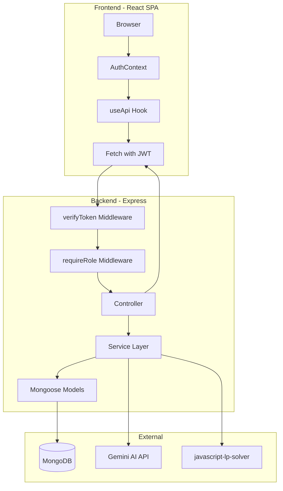
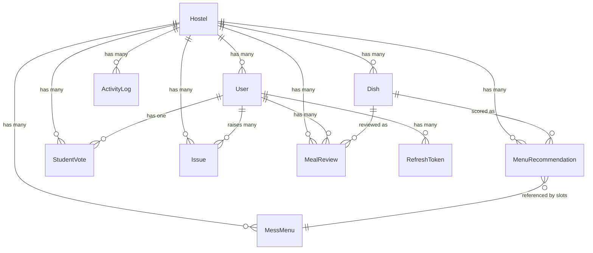
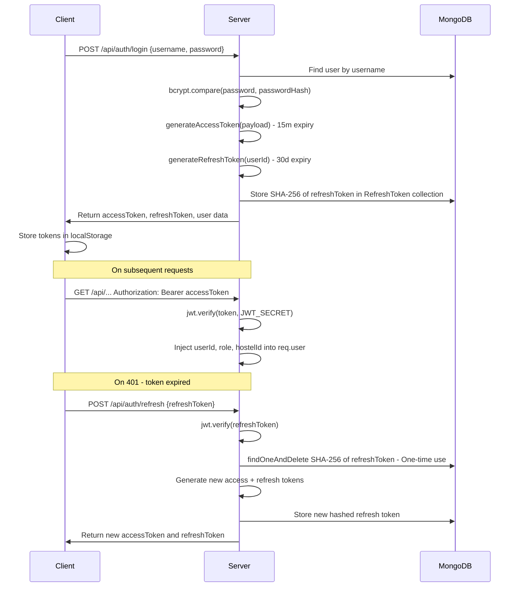
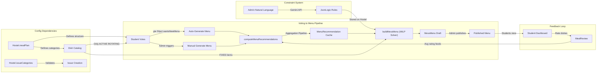

# HostelHub — Complete Codebase Knowledge Document

> **Generated**: 2026-09-15  
> **Repository**: `fo56/hostelHub`  
> **Purpose**: Self-contained brain dump for any LLM or developer to implement features, fix bugs, or refactor safely.

---

## Table of Contents

1. [High-Level Overview](#1-high-level-overview)
2. [Tech Stack & Dependencies](#2-tech-stack--dependencies)
3. [Directory Structure](#3-directory-structure)
4. [System Architecture](#4-system-architecture)
5. [Database Schema & Models](#5-database-schema--models)
6. [Authentication & Security](#6-authentication--security)
7. [Feature-by-Feature Analysis](#7-feature-by-feature-analysis)
8. [Cross-Feature Interaction Map](#8-cross-feature-interaction-map)
9. [Frontend Architecture](#9-frontend-architecture)
10. [API Reference](#10-api-reference)
11. [Design System](#11-design-system)
12. [Things You Must Know Before Changing Code](#12-things-you-must-know-before-changing-code)
13. [Technical Glossary](#13-technical-glossary)

---

## 1. High-Level Overview

### What HostelHub Is

HostelHub is a **multi-tenant hostel management platform** designed for Indian college/university student housing. It digitizes three core operational workflows:

1. **Mess menu management** — algorithmic weekly menu generation driven by student votes and MILP optimization
2. **Facility issue tracking** — students submit categorized maintenance tickets, admins resolve them
3. **User lifecycle management** — admin-controlled student onboarding, passwordless-style credential distribution, activity auditing

### Target Users

| Role | Description | Primary Actions |
|------|-------------|-----------------|
| **ADMIN** | Hostel warden/mess manager | Create users, manage dishes, generate/publish menus, configure settings, resolve issues |
| **STUDENT** | Hostel resident | Vote on dish preferences, view weekly menu, submit/track issues, review meals |

### Business Model

Each hostel is a **fully isolated tenant**. An admin registers a new hostel, which creates a `Hostel` document and the primary admin user. All subsequent data (users, dishes, menus, issues, votes) is scoped to that hostel via the `hostelId` foreign key. There is no super-admin or cross-tenant visibility.

---

## 2. Tech Stack & Dependencies

### Backend

| Layer | Technology | Version | File |
|-------|-----------|---------|------|
| Runtime | Node.js | >=18.x | — |
| Framework | Express.js | 5.2.1 | `backend/package.json` |
| Language | TypeScript | 5.9.3 | `backend/tsconfig.json` |
| Database | MongoDB + Mongoose ODM | Mongoose 9.0.1 | `backend/src/config/db.ts` |
| Auth | jsonwebtoken + bcrypt | jwt 9.0.3, bcrypt 6.0.0 | `backend/src/utils/jwt.ts` |
| MILP Solver | javascript-lp-solver | 1.0.3 | `backend/src/services/menuBuilder.service.ts` |
| Rule Engine | json-logic-js | 2.0.5 | `backend/src/services/menuBuilder.service.ts` |
| AI / NLP | @google/genai (Gemini) | 2.22.0 | `backend/src/services/menuConstraintParser.service.ts` |
| Security | helmet | 8.1.0 | `backend/src/server.ts` |
| Dev Server | nodemon | 3.1.11 | `backend/nodemon.json` |

### Frontend

| Layer | Technology | Version | File |
|-------|-----------|---------|------|
| Framework | React | 19.2.3 | `frontend/package.json` |
| Build | Vite | 7.2.4 | `frontend/vite.config.ts` |
| Language | TypeScript | ~5.9.3 | `frontend/tsconfig.json` |
| Styling | Tailwind CSS v4 | 4.1.18 | `frontend/src/index.css` |
| Routing | react-router-dom | 7.10.1 | `frontend/src/routes/router.tsx` |
| Charts | Recharts | 3.10.1 | Used in admin review stats |
| Icons | lucide-react | 0.562.0 | Throughout components |
| Toasts | react-hot-toast | 2.6.0 | `frontend/src/App.tsx` |
| Date Utils | date-fns | 4.1.0 | Used in pages |
| Deployment | Vercel | — | `frontend/vercel.json` |

### Environment Variables

Defined in `backend/.env.example`:

```
MONGODB_URI=mongodb://localhost:27017/hostelHub
JWT_SECRET=your_super_secret_jwt_key_here
PORT=8000
NODE_ENV=development
FRONTEND_URL=http://localhost:5173
REDIS_URL=redis://localhost:16379      # Optional, currently unused in active code
GEMINI_API_KEY=enter_your_gemini_key   # Required for NLP constraint parsing
```

Frontend (`frontend/.env`):
```
VITE_API_URL=http://localhost:8000/api
```

---

## 3. Directory Structure

```
hostelHub/
  backend/
    src/
      config/
        db.ts                           # MongoDB connection
      controllers/
        auth.controller.ts              # Registration, login, token refresh, logout
        adminUser.controller.ts         # CRUD users, bulk create, activate/deactivate
        adminMenu.controller.ts         # Generate, preview, publish, update menus
        adminDish.controller.ts         # Approve/reject/update/delete dishes
        adminSettings.controller.ts     # Hostel config: meal plans, issue categories, constraints
        adminDashboard.controller.ts    # Aggregate stats for admin dashboard
        adminReview.controller.ts       # Paginated review list + aggregate stats
        dish.controller.ts              # Create dish (admin direct) + student suggestions
        issue.controller.ts             # CRUD issues (shared, role-gated)
        mealReview.controller.ts        # Submit meal reviews (students)
        studentMenu.controller.ts       # Get current/today menu
        studentDish.controller.ts       # Get active dishes grouped by meal
        studentVote.controller.ts       # Get/save student voting preferences
        user.controller.ts              # Profile: getMe, updateProfile
      middlewares/
        verifyToken.middleware.ts        # JWT Bearer extraction + req.user injection
        requireRole.middleware.ts        # Role-based access guard
        errorHandler.ts                 # Global error handler (11000, ValidationError, etc.)
      models/
        Hostel.ts                       # Tenant root: mealPlan, issueCategories, menuConstraints
        User.ts                         # Admin/Student accounts
        Dish.ts                         # Dish catalog (FIXED/ROTATING, status lifecycle)
        MessMenu.ts                     # Weekly menu with nested meal->day->slot structure
        MenuRecommendation.ts           # Computed dish rankings (ephemeral scoring cache)
        StudentVote.ts                  # Per-student dish preferences
        MealReview.ts                   # Student ratings per dish+date
        Issue.ts                        # Maintenance tickets
        ActivityLog.ts                  # Audit trail
        RefreshToken.ts                 # Hashed refresh tokens with TTL
      routes/
        auth.routes.ts
        user.routes.ts
        student.routes.ts
        dish.routes.ts
        mealReview.routes.ts
        issue.routes.ts
        adminMenu.routes.ts
        adminUser.routes.ts
        adminDish.routes.ts
        adminReview.routes.ts
        adminDashboard.routes.ts
        adminSettings.routes.ts
      services/
        menuComputation.service.ts      # MongoDB aggregation pipeline for dish scoring
        menuBuilder.service.ts          # MILP solver for weekly menu assignment
        menuConstraintParser.service.ts # Gemini AI NLP -> JsonLogic constraint rules
        menuConstraintValidator.service.ts # Validates parsed constraints with synthetic contexts
        menuRetrieve.service.ts         # Query helpers for published/today menus
      types/
        express.d.ts                    # Express Request augmentation (req.user)
        javascript-lp-solver.d.ts       # Type declaration for LP solver
      utils/
        jwt.ts                          # Token generation, verification, rotation, revocation
        logger.ts                       # Structured console logger with context tags
        formatMeal.ts                   # Reshape populated meal objects for API response
      server.ts                         # Express app setup, route mounting, startup
    seed.ts                             # Full database seeder
    package.json
    tsconfig.json
  frontend/
    src/
      App.tsx                           # Root: ThemeProvider -> Router -> Toaster -> AppRoutes
      main.tsx                          # Entry: AuthProvider -> App
      index.css                         # Tailwind v4 + design tokens + component classes
      contexts/
        AuthContext.tsx                  # Auth state, login/logout, session restoration
        ThemeContext.tsx                 # Light/dark toggle, localStorage persistence
      hooks/
        useApi.ts                       # Authenticated fetch wrapper with auto-refresh
        useAuth.ts                      # Context accessor hook
        useMessService.ts               # Admin menu operation shortcuts
      services/
        auth.service.ts                 # Auth API client, token management, credential storage
      routes/
        router.tsx                      # All route definitions with route guards
      pages/
        Home.tsx                        # Landing page
        Login.tsx                       # Login form with credential autofill
        admin/
          AdminRegister.tsx             # Hostel + admin registration
          AdminDashboard.tsx            # Stats overview + activity log
          AdminUsers.tsx                # User management table
          AdminMessMenu.tsx             # Menu generation/preview/publish
          AdminDishes.tsx               # Dish catalog management
          AdminIssues.tsx               # Issue resolution dashboard
          AdminSettings.tsx             # Meal plan + issue category + constraint config
        student/
          StudentDashboard.tsx          # Today menu + quick actions
          StudentVoting.tsx             # Dish preference voting
          StudentIssues.tsx             # Issue submission and tracking
      components/
        common/                         # AppLayout, AppTopbar, ProfileModal, ThemeToggle
        ui/                             # Reusable primitives: badge, button, card, input, etc.
      lib/
        types.ts                        # Shared TypeScript interfaces
        constants.ts                    # MEAL_TYPES, ROLES arrays
        utils.ts                        # Utility functions
        logger.ts                       # Frontend console logger
    vercel.json                         # SPA rewrite rules
    vite.config.ts
    package.json
  docs/
    design.md                           # Complete design system specification
    schema.md                           # Reference schema (partially outdated)
    menu.md                             # JSON dish catalog used by seed.ts
    notes.md                            # Developer TODO/bug list
  README.md
```

---

## 4. System Architecture

### Architecture Pattern

**Monolithic REST API** with a **React SPA** frontend. No microservices, no message queues, no WebSocket layer in the active codebase.

### Data Flow Diagram



### Request Lifecycle

1. **Frontend** makes fetch request via `useApi` hook with Bearer token
2. **CORS** validates origin against `FRONTEND_URL`
3. **Helmet** applies security headers
4. **verifyToken** extracts JWT, decodes `{userId, role, hostelId}`, injects into `req.user`
5. **requireRole** (optional) checks `req.user.role` against allowed roles
6. **Controller** handles business logic, queries models
7. **Service** (for complex operations like menu generation) encapsulates algorithmic logic
8. **Global errorHandler** catches unhandled errors, formats MongoDB duplicate key (11000) and validation errors

### Multi-Tenancy Model

**Row-level isolation** via `hostelId` foreign key on every model. Every query filters by `hostelId` derived from `req.user.hostelId` (set at JWT creation time). There is no database-per-tenant separation.

> **CRITICAL**: Tenant isolation is enforced at the **application layer**, not the database layer. Every new query or endpoint MUST include `hostelId` filtering or it will leak data across hostels.

---

## 5. Database Schema & Models

### Entity Relationship Diagram



### Model Details

#### Hostel (`backend/src/models/Hostel.ts`)

The **tenant root**. Stores all hostel-level configuration including the meal plan structure, issue categories, and menu generation constraints.

| Field | Type | Notes |
|-------|------|-------|
| `name` | String | Hostel display name |
| `domain` | String (unique) | Used as username suffix (e.g., `admin@kngh26`). Auto-generated from first 10 chars of hostel name |
| `mealPlan` | Array of `{mealName, isActive, offDays, categories[]}` | **Configurable meal structure**. Each meal has named categories (e.g., Lunch -> Main Course, Rice, Lentils). `offDays` are JS day indices (0=Sunday..6=Saturday) |
| `issueCategories` | Array of `{name, isActive}` | Configurable issue categories per hostel |
| `menuConstraints` | Array of Rule objects | Parsed JsonLogic rules from NLP input |
| `menuConstraintsText` | String | Raw natural-language constraint text entered by admin |
| `defaultResolverNote` | String | Default note when resolving issues |

> **GOTCHA**: `mealPlan` is the source of truth for what meals exist and their categories. The `Dish.mealType` field must match a `mealPlan[].mealName`, and `Dish.category` must match a `mealPlan[].categories[].categoryName`. These are enforced at the application level, not via DB constraints.

#### User (`backend/src/models/User.ts`)

| Field | Type | Notes |
|-------|------|-------|
| `hostelId` | ObjectId -> Hostel | **Required**. Tenant scope |
| `username` | String (unique, lowercase) | Admin-assigned login ID. Format: `<roomNo>.<sequence>@<domain>` for students, `admin@<domain>` for admins. **Not** an email — do not send mail to it |
| `email` | String (optional) | Real email, self-added by user via profile. Has `sparse: true` unique index |
| `name` | String (optional) | Display name |
| `passwordHash` | String (required) | bcrypt hash, salt rounds = 10 |
| `passwordChangedAt` | Date | Defaults to `Date.now` |
| `role` | Enum: `ADMIN`, `STUDENT` | **No WORKER role** in active code (was removed) |
| `roomNo` | String | Only for STUDENT role |
| `isActive` | Boolean | Soft-delete mechanism. Deactivated users cannot log in |

**Index**: `{hostelId: 1, role: 1, isActive: 1}`

> **IMPORTANT**: The primary admin (whose username is `admin@<domain>`) cannot be deactivated or deleted. This is checked in `adminUser.controller.ts` via string matching against the hostel's domain.

#### Dish (`backend/src/models/Dish.ts`)

| Field | Type | Notes |
|-------|------|-------|
| `hostelId` | ObjectId -> Hostel | Tenant scope |
| `name` | String | Dish name (supports Hindi via Noto Sans Devanagari font fallback) |
| `mealType` | String | Must match a `Hostel.mealPlan[].mealName` (typically: Breakfast, Lunch, Snack, Dinner) |
| `category` | String | Must match a category name within the meal's categories in the hostel's meal plan |
| `priceScore` | Number (1-5) | Cost metric. Set by admin on approval. **Inverse relationship**: higher = more expensive |
| `healthScore` | Number (1-5) | Nutrition metric. Set by admin on approval |
| `itemClass` | Enum: `FIXED`, `ROTATING` | **FIXED** = staple served every day (e.g., bread, rice), auto-attached to all slots. **ROTATING** = enters the voting/scoring/MILP pipeline |
| `tags` | String[] | Flexible tags (e.g., "paneer", "spicy") used by constraint rules |
| `status` | Enum: `UNDER_REVIEW`, `ACTIVE`, `INACTIVE` | Lifecycle: UNDER_REVIEW -> ACTIVE (approved) or INACTIVE (rejected) |
| `suggestedBy` | ObjectId -> User | Who created/suggested the dish |
| `approvedBy` | ObjectId -> User | Admin who approved (null if still under review) |
| `rejectionReason` | String | Set when dish is rejected |

**Indexes**: `{hostelId, status, mealType}`, `{hostelId, name}`

#### StudentVote (`backend/src/models/StudentVote.ts`)

| Field | Type | Notes |
|-------|------|-------|
| `hostelId` | ObjectId -> Hostel | Tenant scope |
| `userId` | ObjectId -> User (**unique**) | **One vote record per student**. Upserted, not appended |
| `votes` | Array of `{mealName, categoryName, dishes[ObjectId]}` | Per-meal, per-category list of preferred dish IDs |
| `wantsNewMenu` | Boolean | When >=50% of voters have this set to `true`, triggers auto menu regeneration |

> **KEY DESIGN**: Votes are **persistent preferences**, not one-time poll responses. Students can edit anytime. The system treats the current vote snapshot as the input when menu generation is triggered.

#### MenuRecommendation (`backend/src/models/MenuRecommendation.ts`)

**Ephemeral scoring cache**. Fully wiped and rebuilt each time `computeMenuRecommendations()` is called.

| Field | Type | Notes |
|-------|------|-------|
| `hostelId` | ObjectId | Tenant scope |
| `mealName` | String | Meal type |
| `categoryName` | String | Category within meal |
| `dishId` | ObjectId -> Dish | The scored dish |
| `voteScore` | Number | Normalized (0-1) vote popularity |
| `healthScore` | Number | From Dish model |
| `costEfficiency` | Number | `1 / priceScore` |
| `finalScore` | Number | Weighted: 40% vote + 20% review + 20% health + 20% cost |

**Index**: `{hostelId, mealName, categoryName, finalScore: -1}`

#### MessMenu (`backend/src/models/MessMenu.ts`)

The **final weekly menu output**.

| Field | Type | Notes |
|-------|------|-------|
| `hostelId` | ObjectId | Tenant scope |
| `weekOf` | Date (unique with hostelId) | Monday of the week. Calculated at generation time |
| `meals` | Array of `{mealName, slots[7]}` | Each meal has 7 day slots (Mon=0..Sun=6) |
| `published` | Boolean | Students only see published menus |
| `publishMethod` | Enum: `AUTO`, `MANUAL` | How the menu was published |
| `solverFailures` | String[] | Warnings from the MILP solver |
| `generatedAt` / `publishedAt` | Date | Timestamps |

**Day Slot Schema** (embedded, no `_id`):

| Field | Type | Notes |
|-------|------|-------|
| `status` | Enum: `SCHEDULED`, `CLOSED` | CLOSED for off-days or rule-closed slots |
| `fixedItems` | ObjectId[] -> Dish | Dishes with `itemClass: FIXED` |
| `rotatingItems` | Array of `{category, item: ObjectId -> MenuRecommendation}` | MILP-assigned rotating dishes, one per category |
| `timing` | `{start, end}` | Optional meal timing |
| `overriddenBy` / `overriddenAt` | ObjectId, Date | For manual admin overrides |

**Indexes**: `{hostelId, weekOf}` (unique), `{hostelId, published}`

#### MealReview (`backend/src/models/MealReview.ts`)

| Field | Type | Notes |
|-------|------|-------|
| `hostelId` | ObjectId | Tenant scope |
| `studentId` | ObjectId -> User | Reviewer |
| `dishId` | ObjectId -> Dish | Must be ACTIVE |
| `mealType` | Enum: Breakfast, Lunch, Snack, Dinner | Must match dish's mealType |
| `servedOn` | Date | Cannot be in the future |
| `rating` | Number (1-5) | Required |
| `comment` | String (max 500) | Optional |
| `images` | String[] (max 3) | Optional image URLs |

**Unique Index**: `{hostelId, studentId, dishId, servedOn}` — prevents duplicate reviews for the same dish on the same day.

#### Issue (`backend/src/models/Issue.ts`)

| Field | Type | Notes |
|-------|------|-------|
| `hostelId` | ObjectId | Tenant scope |
| `raisedBy` | ObjectId -> User | Creator |
| `raisedByName` | String | **Denormalized** — survives user account deletion |
| `roomNo` | String | **Denormalized** |
| `category` | String | Must be an active category from `Hostel.issueCategories` |
| `priority` | Enum: LOW, MEDIUM, HIGH, URGENT | Set by student at creation |
| `status` | Enum: OPEN, CLOSED | Only admin can change status |
| `description` | String | Issue details |
| `resolverNote` | String | Admin's resolution note |

> **NOTE**: The active model only has `OPEN` and `CLOSED`. However, `issue.controller.ts` accepts `RESOLVED` in `updateIssueStatus` — there is an **inconsistency** between the model enum and the controller validation.

#### ActivityLog (`backend/src/models/ActivityLog.ts`)

| Field | Type | Notes |
|-------|------|-------|
| `hostelId` | ObjectId | **Denormalized** for efficient dashboard queries |
| `userId` | ObjectId -> User | Who performed the action |
| `action` | String | Free-form action description |
| `ip` | String | Request IP |

#### RefreshToken (`backend/src/models/RefreshToken.ts`)

| Field | Type | Notes |
|-------|------|-------|
| `userId` | ObjectId -> User | Token owner |
| `token` | String (unique) | **SHA-256 hash** of the actual JWT, never the plain token |
| `expiresAt` | Date | 30-day expiry |
| `createdAt` | Date | Has MongoDB TTL index (`expires: 2592000` = 30 days) |

---

## 6. Authentication & Security

### Authentication Flow



### Key Security Properties

1. **Refresh Token Rotation**: Each refresh token is single-use. `verifyRefreshToken()` uses `findOneAndDelete` — the old token is destroyed before the new one is issued (`backend/src/utils/jwt.ts:73`).

2. **Token Hashing**: Refresh tokens are stored as SHA-256 hashes in MongoDB. The plain JWT is returned to the client but never stored server-side (`backend/src/utils/jwt.ts:18-20`).

3. **TTL Auto-Cleanup**: RefreshToken documents have a MongoDB TTL index (`expires: 2592000`) that auto-deletes expired records.

4. **Access Token Payload**: `{userId, username, role, hostelId}` — the `hostelId` is **baked into the JWT** at login time, meaning a user cannot change their hostel affiliation without re-authenticating.

5. **CORS**: Strict origin checking — only `FRONTEND_URL` is allowed (`backend/src/server.ts:43-50`).

6. **Helmet**: Applied globally for standard HTTP security headers.

7. **Password Hashing**: bcrypt with 10 salt rounds.

### Frontend Auth

- Tokens stored in `localStorage` (not cookies) — see `frontend/src/services/auth.service.ts:210-226`
- `useApi` hook automatically attempts token refresh on 401 responses and retries the failed request — see `frontend/src/hooks/useApi.ts:48-68`
- `AuthContext` restores session on mount by calling `/api/users/me` with the stored access token, falling back to refresh if that fails — see `frontend/src/contexts/AuthContext.tsx:29-60`
- Browser Credential Management API is used for username/password autofill — see `frontend/src/services/auth.service.ts:17-66`

### RBAC Model

Two roles enforced at the route level:

| Route Group | Required Role | Middleware Chain |
|-------------|---------------|------------------|
| `/api/auth/*` | None (public) | — |
| `/api/users/*` | Any authenticated | `verifyToken` |
| `/api/issues/*` | Any authenticated (with sub-route role checks) | `verifyToken` + inline role checks |
| `/api/dishes/*` | Any authenticated | `verifyToken` |
| `/api/reviews/*` | Any authenticated | `verifyToken` |
| `/api/student/*` | STUDENT | `verifyToken` then `requireRole('STUDENT')` |
| `/api/admin/*` | ADMIN | `verifyToken` then `requireRole('ADMIN')` |

---

## 7. Feature-by-Feature Analysis

### 7.1 Admin Registration & Hostel Creation

**Business Purpose**: Onboard a new hostel into the platform. Creates the hostel tenant and its primary admin in one atomic operation.

**Entry Point**: `POST /api/auth/admin/register`
**Controller**: `backend/src/controllers/auth.controller.ts` -> `registerAdmin`

**Technical Flow**:
1. Validates all required fields (hostelName, adminName, adminEmail, adminPassword)
2. Auto-generates `domain` from hostel name (first 10 chars, lowercased, spaces removed)
3. Checks for existing hostel with same name or domain
4. **MongoDB Transaction**: Creates Hostel + User atomically
5. If no `mealPlan` provided, uses hardcoded defaults: Breakfast (Main Course, Beverage, Bread, Condiment), Lunch (Main Course, Lentils, Rice, Sides, Condiment, Bread), Snack (Snacks), Dinner (Main Course, Lentils, Rice, Sides, Dessert, Bread)
6. Returns JWT tokens immediately (user is logged in after registration)

**Key Detail**: Username is auto-generated as `admin@<domain>`. This is the **primary admin** identity — hardcoded checks in deactivation/deletion reference this pattern.

---

### 7.2 User Management

**Business Purpose**: Admin creates and manages student accounts. Students don't self-register — they receive credentials from their admin.

**Entry Points**:
- `POST /api/admin/users` — create single user
- `POST /api/admin/users/bulk` — bulk create users
- `GET /api/admin/users` — list users (with `?role=` and `?status=` filters)
- `GET /api/admin/users/:userId` — get single user
- `PATCH /api/admin/users/:userId/deactivate` — soft deactivate
- `PATCH /api/admin/users/:userId/reactivate` — reactivate
- `DELETE /api/admin/users/:userId` — hard delete (cascades to votes and tokens)

**Controller**: `backend/src/controllers/adminUser.controller.ts`

**Username Generation**:
- Students: `<roomNo>.<sequence>@<domain>` (e.g., `F12.1@kngh26`)
- Admins: `admin@<domain>` (first), `admin2@<domain>` (subsequent)
- If `username` is provided in the request, `@<domain>` suffix is auto-appended if missing

**Password Handling**:
- If no password provided, generates 8-char hex string via `crypto.randomBytes(4)`
- Raw password returned in API response for admin to distribute to student
- Hashed via bcrypt before storage

**Deletion Cascade**: `deleteUser` removes `StudentVote` and `RefreshToken` documents for the user, but **does NOT delete** `MealReview`, `Issue`, or `Dish` records associated with the user. Issues survive deletion because `raisedByName` is denormalized.

---

### 7.3 Intelligent Menu Generation (Core Feature)

**Business Purpose**: Automatically generate an optimized weekly mess menu that balances student preferences, nutrition, cost, and variety constraints.

This is a **three-stage pipeline**:

#### Stage 1: Preference Collection (Voting)

**Entry Points**:
- `GET /api/student/votes` — returns meal plan, available dishes, student's current votes
- `POST /api/student/votes` — saves/updates vote preferences

**Controller**: `backend/src/controllers/studentVote.controller.ts`

**How It Works**:
- Students see all `ACTIVE` + `ROTATING` dishes grouped by meal and category
- They select preferred dishes per (meal, category) pair
- Votes are upserted (one record per student, edited freely)
- `wantsNewMenu` flag — when >=50% of all voters have this set, auto-generation triggers:
  1. Computes recommendations
  2. Builds menu with `published = true`
  3. Resets all `wantsNewMenu` flags to false

#### Stage 2: Recommendation Computation

**Service**: `backend/src/services/menuComputation.service.ts` -> `computeMenuRecommendations()`

**Algorithm** (MongoDB aggregation pipeline):
1. **Match** all `ACTIVE` + `ROTATING` dishes for the hostel
2. **Lookup** StudentVote collection — flattens all votes across students, counts how many times each dish was voted for
3. **Normalize** vote counts: `voteScore = dishVotes / maxVotes` (0-1 scale)
4. **Lookup** MealReview collection — calculates average rating per dish (defaults to 3 if no reviews)
5. **Calculate sub-scores**:
   - `voteScore`: normalized popularity (0-1)
   - `reviewScore`: `avgRating / 5` (0-1)
   - `healthScore`: from Dish model (1-5)
   - `costEfficiency`: `1 / priceScore` (inverse — cheaper = higher score)
6. **Final weighted score**: `0.4 * vote + 0.2 * review + 0.2 * health + 0.2 * cost`
7. **Wipe** all existing MenuRecommendation documents for the hostel
8. **Insert** new recommendations

#### Stage 3: MILP Menu Building

**Service**: `backend/src/services/menuBuilder.service.ts` -> `buildMessMenu()`

**Algorithm** (using `javascript-lp-solver`):

For each active meal in the hostel's meal plan, and for each category within that meal:

1. **Determine open days**: Exclude `offDays` (from mealPlan config) and days closed by `CLOSE_SLOT_IF` rules
2. **Build history map**: Look at past 2 weeks' menus to calculate `daysSinceLastServed` for variety enforcement
3. **Construct MILP model** per (meal, category):
   - **Objective**: Maximize total score across the week
   - **Constraint**: Exactly 1 dish per open day per category (`equal: 1`)
   - **Variables**: For each (dish, day, occurrence) triple, a binary variable with score = `finalScore - historyPenalty - reusePenalty`
   - **Penalties**:
     - History penalty: `50 / (daysSinceLastServed + 1)` — recently served dishes score lower
     - Reuse penalty: `occ * 40` — each additional use in the same week is penalized
   - **Slack variables**: Score of -100000 to prevent infeasibility when ALLOW_IF rules eliminate all candidates
4. **Apply constraint rules** (from `hostel.menuConstraints`):
   - `ALLOW_IF`: Filters candidates via JsonLogic condition evaluation — dishes that fail are excluded from the MILP
   - `REQUIRE_IF`: Adds massive score boost (+10000) to matching dishes to effectively force inclusion
   - `LIMIT`: Adds per-dish weekly caps or sliding-window caps (e.g., "max 1 per 2 days" = `windowSize: 2, max: 1`)
   - `CLOSE_SLOT_IF`: Marks entire meal slots as CLOSED
5. **Solve** the MILP model, extract day->dish assignment
6. **Assemble** the final MessMenu document with fixedItems + rotatingItems per slot
7. **Upsert** into MessMenu collection (keyed on `hostelId + weekOf`)

#### Constraint System (AI-Powered)

**Service**: `backend/src/services/menuConstraintParser.service.ts`

Admin writes constraints in natural language (English/Hindi), e.g.:
- "Paneer should be served on Monday for dinner"
- "Dal on alternate days"
- "No rice on weekends"

**Flow**:
1. Admin enters text -> `POST /api/admin/settings/constraints/preview`
2. Backend sends text + dish catalog to **Gemini 3.6 Flash** with a structured output schema
3. Gemini returns parsed rules as JsonLogic + human-readable preview
4. `menuConstraintValidator.service.ts` runs each rule against synthetic test contexts to catch malformed conditions
5. Preview shown to admin -> admin confirms -> `POST /api/admin/settings/constraints/confirm`
6. Rules saved to `Hostel.menuConstraints`, text saved to `Hostel.menuConstraintsText`

**Rule Types**:
| Action | Meaning | Example |
|--------|---------|---------|
| `ALLOW_IF` | Dish only placed when condition is true | "No rice on weekends" -> blocks rice when `isWeekend === true` |
| `REQUIRE_IF` | Dish must appear when condition is true | "Paneer every Monday dinner" |
| `LIMIT` | Cap frequency over time window | "Dal on alternate days" -> `max: 1, windowSize: 2` |
| `CLOSE_SLOT_IF` | Entire meal slot closed | "No snack on Sundays" |

---

### 7.4 Menu Publishing & Viewing

**Admin Side**:
- `POST /api/admin/menu/generate` — runs Stage 2 + Stage 3, saves as draft (`published: false`)
- `GET /api/admin/menu/preview` — returns latest menu (published or draft)
- `PATCH /api/admin/menu/publish` — sets `published: true`, resets `wantsNewMenu` flags
- `PUT /api/admin/menu/update` — admin can manually edit meal slots

**Student Side**:
- `GET /api/student/menu/current` — returns latest published menu (full week)
- `GET /api/student/menu/today` — returns today's meals only (computed via day index)

**Day Indexing**:
- Backend uses `Monday = 0 ... Sunday = 6` internally for array positions
- JS `Date.getDay()` returns `0 = Sunday`, so conversion: `dayIndex = jsDay === 0 ? 6 : jsDay - 1`
- `offDays` in mealPlan use JS convention (0 = Sunday)

---

### 7.5 Dish Management

**Business Purpose**: Manage the catalog of dishes available for menu generation.

**Admin Operations** (`backend/src/controllers/adminDish.controller.ts`):
- `GET /api/admin/dishes?status=` — list dishes with optional status filter
- `PUT /api/admin/dishes/:id/approve` — approve + set priceScore/healthScore
- `PUT /api/admin/dishes/:id/reject` — reject with reason
- `PUT /api/admin/dishes/:id` — update dish properties
- `DELETE /api/admin/dishes/:id` — hard delete

**Dish Creation** (`backend/src/controllers/dish.controller.ts`):
- Admin direct creation: `POST /api/dishes/admin` — status set to `ACTIVE` immediately
- Student suggestion: `POST /api/dishes/suggest` — status set to `UNDER_REVIEW`

**Duplicate Check**: Case-insensitive regex match on dish name within the hostel (`$regex: ^name$, $options: 'i'`).

**Dish Lifecycle**:
```
Student suggests -> UNDER_REVIEW -> Admin approves -> ACTIVE
                                 -> Admin rejects -> INACTIVE

Admin creates directly -> ACTIVE (bypasses review)
```

Only `ACTIVE` + `ROTATING` dishes enter the voting and menu generation pipeline.

---

### 7.6 Meal Review System

**Business Purpose**: Students rate dishes they've been served. Ratings feed back into the menu recommendation algorithm via `reviewScore`.

**Entry Point**: `POST /api/reviews` — submit review
**Controller**: `backend/src/controllers/mealReview.controller.ts`

**Validations**:
- Dish must be ACTIVE in the student's hostel
- mealType must match the dish's mealType
- servedOn date cannot be in the future
- Unique constraint: one review per (student, dish, servedOn date)
- Max 3 images per review
- Rating 1-5

**Admin Review Dashboard** (`backend/src/controllers/adminReview.controller.ts`):
- `GET /api/admin/reviews` — paginated list with filters (mealType, date, dishId)
- `GET /api/admin/reviews/stats` — two aggregations:
  1. Per-dish stats: average rating + total review count
  2. Date-wise trend: daily average rating broken down by mealType (used for Recharts line chart)

---

### 7.7 Issue Tracking

**Business Purpose**: Students report facility maintenance issues; admins track and resolve them.

**Entry Points**:
- `POST /api/issues` — student creates issue
- `GET /api/issues/my-issues` — student's own issues
- `GET /api/issues/categories` — get active categories for the hostel
- `GET /api/issues/admin/all` — admin gets all hostel issues
- `PATCH /api/issues/:issueId/status` — admin updates status + resolver note
- `DELETE /api/issues/:issueId` — admin deletes issue

**Controller**: `backend/src/controllers/issue.controller.ts`

**Category Validation**: When creating an issue, the category is validated against `Hostel.issueCategories` — must be an active category. If no categories configured, "Other" is the fallback.

**Denormalization**: `raisedByName` and `roomNo` are copied from the User at creation time, not looked up via join. This means issue records survive user deletion but won't reflect name changes.

---

### 7.8 Admin Settings

**Business Purpose**: Configure hostel-level settings — meal plans, issue categories, menu constraints.

**Entry Points**:
- `GET /api/admin/settings` — returns mealPlan, issueCategories, menuConstraints
- `PUT /api/admin/settings` — updates mealPlan + issueCategories
- `POST /api/admin/settings/constraints/preview` — NLP parse + validate
- `POST /api/admin/settings/constraints/confirm` — save parsed constraints

**Cascading Deletes**: When a meal category is removed from the mealPlan, all dishes in that category are hard-deleted (`backend/src/controllers/adminSettings.controller.ts:52-66`). This is a **dangerous destructive operation** that happens silently during a settings update.

---

### 7.9 Admin Dashboard

**Business Purpose**: Overview of hostel operational metrics.

**Entry Point**: `GET /api/admin/dashboard`
**Controller**: `backend/src/controllers/adminDashboard.controller.ts`

**Aggregated Data**:
- Total active students (STUDENT + isActive)
- Active dishes count
- Open issues count
- Total votes count
- Last 15 activity log entries (populated with user name + role)

---

## 8. Cross-Feature Interaction Map



**Critical Dependencies**:

1. **Dish -> Votes -> Recommendations -> Menu**: A dish must be `ACTIVE` + `ROTATING` to enter voting. Votes are aggregated into recommendations. Recommendations feed the MILP solver.

2. **MealPlan -> Everything**: The hostel's `mealPlan` defines what meals exist and their categories. Dishes reference `mealType` and `category` that must match. Votes are structured by meal+category. The menu builder iterates over the mealPlan.

3. **Reviews -> Recommendations**: Average ratings from MealReview feed back as `reviewScore` in the computation pipeline (20% weight).

4. **Constraints -> Builder**: JsonLogic rules stored on Hostel are applied during the MILP solve phase to filter, require, limit, or close slots.

5. **Settings Changes -> Cascading Deletes**: Removing a category from the mealPlan deletes all dishes in that category, which in turn invalidates any votes referencing those dishes and any recommendations for that category.

---

## 9. Frontend Architecture

### Component Tree

```
main.tsx
  AuthProvider
    App.tsx
      ThemeProvider
        Router (BrowserRouter)
          Toaster (react-hot-toast)
          AppRoutes
            AppLayout (Outlet wrapper)
              AppTopbar (navigation, profile)
              Page Content
            Public Routes: /, /login, /admin/register
            Admin Routes: /admin/dashboard|users|menu|issues|dishes|settings
            Student Routes: /student/dashboard|voting/status|issues
```

### Key Patterns

1. **Lazy Loading**: All pages use `React.lazy()` with `Suspense` — see `frontend/src/routes/router.tsx`

2. **Route Guards**:
   - `PublicOnlyRoute`: Redirects authenticated users to their dashboard
   - `ProtectedRoute`: Redirects unauthenticated users to `/login`, checks role against `allowedRoles`
   - Role values in router use **lowercase** (`'admin'`, `'student'`), while backend uses UPPERCASE (`'ADMIN'`, `'STUDENT'`). The `AuthContext` normalizes by `.toLowerCase()` at login/session restore.

3. **API Communication**: All authenticated requests go through `useApi` hook, which:
   - Adds Bearer token from localStorage
   - Auto-retries on 401 after refreshing tokens
   - Shows `toast.error()` on failures (unless `skipToast` option is set)
   - Redirects to `/login` if refresh fails

4. **State Management**: No Redux/Zustand — React Context for auth and theme, local `useState`/`useEffect` in pages for data fetching.

5. **UI Component Library**: Custom primitives in `frontend/src/components/ui/` — not a third-party library. Components: badge, button, card, input, label, modal, select, table, tabs, textarea.

### Design System Implementation

The design system (`docs/design.md`) is implemented via CSS custom properties in `frontend/src/index.css`:

- **Theme tokens**: `--theme-canvas`, `--theme-ink`, `--theme-surface`, etc.
- **Dark mode**: Activated by `[data-theme='dark']` attribute on `<html>`, managed by `ThemeContext`
- **Typography**: Custom classes `.text-headline`, `.text-card-title`, `.text-body`, `.text-body-sm`, `.text-caption`, `.text-data`
- **Fonts**: Inter (sans) + JetBrains Mono (data/numbers) + Noto Sans Devanagari (Hindi fallback)
- **Principles**: Monochrome, no shadows (hairline borders only), `6px` border-radius everywhere (no pills), `font-mono` for all trustworthy numbers

---

## 10. API Reference

### Public Routes

| Method | Path | Description |
|--------|------|-------------|
| `POST` | `/api/auth/admin/register` | Register new hostel + admin |
| `POST` | `/api/auth/login` | Login (username + password) |
| `POST` | `/api/auth/refresh` | Refresh access token |

### Shared Protected Routes (Any Authenticated User)

| Method | Path | Description |
|--------|------|-------------|
| `POST` | `/api/auth/logout` | Logout (revokes refresh token) |
| `GET` | `/api/users/me` | Get current user profile |
| `PUT` | `/api/users/me` | Update profile (name, email, password) |
| `POST` | `/api/dishes/admin` | Admin creates dish directly |
| `POST` | `/api/dishes/suggest` | Student suggests dish |
| `POST` | `/api/reviews` | Submit meal review |
| `POST` | `/api/issues` | Create issue |
| `GET` | `/api/issues/my-issues` | Get my issues |
| `GET` | `/api/issues/categories` | Get issue categories |
| `GET` | `/api/issues/admin/all` | Get all issues (admin) |
| `PATCH` | `/api/issues/:issueId/status` | Update issue status (admin) |
| `DELETE` | `/api/issues/:issueId` | Delete issue (admin or creator) |

### Student Routes (requireRole STUDENT)

| Method | Path | Description |
|--------|------|-------------|
| `GET` | `/api/student/menu/today` | Today's served dishes |
| `GET` | `/api/student/menu/current` | Full published weekly menu |
| `GET` | `/api/student/dishes/active` | Active dishes grouped by meal |
| `GET` | `/api/student/votes` | Get voting dashboard + current votes |
| `POST` | `/api/student/votes` | Save/update vote preferences |

### Admin Routes (requireRole ADMIN)

| Method | Path | Description |
|--------|------|-------------|
| `GET` | `/api/admin/dashboard` | Dashboard stats |
| `POST` | `/api/admin/users` | Create user |
| `POST` | `/api/admin/users/bulk` | Bulk create users |
| `GET` | `/api/admin/users` | List users (?role, ?status) |
| `GET` | `/api/admin/users/:userId` | Get single user |
| `PATCH` | `/api/admin/users/:userId/deactivate` | Deactivate user |
| `PATCH` | `/api/admin/users/:userId/reactivate` | Reactivate user |
| `DELETE` | `/api/admin/users/:userId` | Delete user + cascade |
| `GET` | `/api/admin/dishes` | List dishes (?status) |
| `PUT` | `/api/admin/dishes/:id/approve` | Approve dish |
| `PUT` | `/api/admin/dishes/:id/reject` | Reject dish |
| `PUT` | `/api/admin/dishes/:id` | Update dish |
| `DELETE` | `/api/admin/dishes/:id` | Delete dish |
| `GET` | `/api/admin/menu/voting-stats` | Voting statistics |
| `POST` | `/api/admin/menu/generate` | Generate menu from votes |
| `GET` | `/api/admin/menu/preview` | Preview latest menu |
| `PATCH` | `/api/admin/menu/publish` | Publish menu |
| `PUT` | `/api/admin/menu/update` | Update menu slots |
| `GET` | `/api/admin/reviews` | Paginated reviews |
| `GET` | `/api/admin/reviews/stats` | Review analytics |
| `GET` | `/api/admin/settings` | Get hostel settings |
| `PUT` | `/api/admin/settings` | Update settings |
| `POST` | `/api/admin/settings/constraints/preview` | Parse constraints (NLP) |
| `POST` | `/api/admin/settings/constraints/confirm` | Save constraints |

---

## 11. Design System

The design system is documented in `docs/design.md` and implemented in `frontend/src/index.css`.

### Core Principles

1. **Monochrome**: Black/white base with no accent colors. `primary` = pure black (light mode) / pure white (dark mode)
2. **Data-Dense**: Optimized for scan speed, not visual delight
3. **Hairline Borders**: No shadows anywhere — 1px borders do all separation
4. **Mono for Data**: JetBrains Mono for all numbers/scores/dates, Inter for all prose
5. **Consistent Rounding**: 6px (`rounded-md`) everywhere. `rounded-full` only for icon buttons and the FAB

### Color Tokens

| Token | Light | Dark |
|-------|-------|------|
| `canvas` | #ffffff | #222222 |
| `surface` | #f7f7f7 | #2a2a2a |
| `hairline` | #e6e6e6 | #444444 |
| `ink` | #000000 | #eaeaea |
| `text-muted` | #5a5a5a | #999999 |
| `primary` | #000000 | #ffffff |
| `on-primary` | #ffffff | #222222 |

### Semantic Colors (Use Only For These)

| Token | Hex | Usage |
|-------|-----|-------|
| `success` | #1ea64a | LOW priority, confirmation |
| `error` | #d43f3f | URGENT priority, destructive action |
| `warning` | #b8860b | MEDIUM/HIGH priority |

---

## 12. Things You Must Know Before Changing Code

### Critical Gotchas

1. **Tenant Isolation Is Application-Level Only**
   Every new query MUST include `hostelId` filtering. There is no DB-level isolation. Forgetting this leaks data across hostels. File: every controller, every service.

2. **Role Case Mismatch**
   Backend uses uppercase roles (`ADMIN`, `STUDENT`). Frontend normalizes to lowercase (`admin`, `student`) in `AuthContext.tsx:36,67`. The router guards check lowercase. If you add a role, normalize in both places.

3. **Issue Status Enum Inconsistency**
   `Issue.ts` model enum: `['OPEN', 'CLOSED']`. But `issue.controller.ts:113` accepts `RESOLVED` in `updateIssueStatus`. The controller would save `RESOLVED` but the model would reject it. This is a latent bug that would surface if an admin tried to set status to RESOLVED.

4. **Settings Update Cascading Deletes**
   `adminSettings.controller.ts:52-66`: Removing a category from `mealPlan` triggers `Dish.deleteMany()` for all dishes in that category. This is **irreversible** and **silent** — no confirmation prompt. It also orphans any votes or recommendations referencing those dishes.

5. **MenuRecommendation Is Ephemeral**
   `computeMenuRecommendations()` does `deleteMany({hostelId})` then `insertMany()`. If it crashes between delete and insert, the recommendations are lost. The menu builder would fall back to empty assignment with solver warnings.

6. **weekOf Calculation**
   `menuBuilder.service.ts:201-204`: Calculates the Monday of the current week. Uses `(dayOfWeek - 1)` where `dayOfWeek` is `getDay() || 7`. This means `getDay() === 0` (Sunday) becomes `7`, placing Sunday at the end of the week (Mon-Sun format).

7. **ActivityLog Missing hostelId In Some Places**
   `adminDish.controller.ts:51,77,109,129`: ActivityLog entries for dish operations don't include `hostelId` — only `userId` is set. This means these entries won't show up on the admin dashboard (which filters by `hostelId`).

8. **Dish Name Duplicate Check Is Regex-Based**
   `dish.controller.ts:20-22`: Uses `$regex: ^${name}$` which is **vulnerable to ReDoS** if the dish name contains regex special characters. The name should be escaped before use in regex, or use a case-insensitive collation query instead.

9. **Auto-Generation Threshold**
   `studentVote.controller.ts:115`: Auto menu generation fires when `votersWantingNewMenu / totalVoters >= 0.5`. This uses `require()` inline (dynamic import) to avoid circular dependencies — the services are loaded at runtime.

10. **Refresh Token Race Condition**
    `useApi.ts:48-68`: If multiple concurrent 401s trigger simultaneous refresh attempts, they'll all try to use the same refresh token. Since refresh tokens are single-use (`findOneAndDelete`), only the first will succeed; the rest will fail and redirect to login.

11. **No Rate Limiting**
    There is no rate limiting on any endpoint — login, registration, API calls. A brute-force attack on login is trivially possible.

12. **No Input Sanitization**
    User-provided strings (dish names, descriptions, comments) are stored as-is. There's no XSS sanitization layer, though React's JSX escaping provides frontend protection.


### Performance Considerations

1. **N+1 in Bulk Create**: `bulkCreateUsers()` does sequential `findOne` + `save` in a loop, not bulk operations. For large batches (100+ users), this is slow.

2. **Aggregation Pipeline Complexity**: `computeMenuRecommendations()` runs a 7-stage aggregation with nested `$lookup` into `studentvotes` (which itself does `$reduce` + `$filter`). For hostels with many students and dishes, this could be expensive.

3. **No Caching**: No Redis caching or in-memory caching layer. Every request hits MongoDB directly.

4. **No Pagination on Most Lists**: `getUsers`, `getAllIssues`, `fetchDishes` return all records without pagination. Only `getMealReviews` has pagination.

### Security Considerations

1. **JWT Secret**: Single `JWT_SECRET` env var for both access and refresh tokens. If compromised, all sessions are compromised.

2. **Raw Password in Response**: `createUser` and `bulkCreateUsers` return `rawPassword` in the API response. This is by design (admin distributes to student), but the password traverses the network in plaintext (HTTPS assumed).

3. **No CSRF Protection**: Tokens are in localStorage (not cookies), so CSRF isn't a concern, but XSS becomes the primary attack vector — a compromised script could steal tokens.

4. **Primary Admin Protection**: The check for "primary admin" is a string comparison against `admin@<domain>` pattern. If the domain is changed, this protection breaks.

---

## 13. Technical Glossary

| Term | Definition |
|------|-----------|
| **Domain** | The hostel's unique identifier slug (e.g., `kngh26`). Used as suffix in usernames. Auto-generated from hostel name at registration |
| **FIXED dish** | A staple item (rice, bread) served every day. Does not enter voting/scoring. Auto-attached to all open day slots |
| **ROTATING dish** | A dish that participates in the voting, scoring, and MILP pipeline. Assigned by the solver to specific days |
| **itemClass** | Dish classification: `FIXED` or `ROTATING`. Determines whether it enters the menu generation pipeline |
| **mealPlan** | Hostel-level configuration defining what meals exist (Breakfast/Lunch/Snack/Dinner), their categories, and off-days |
| **MenuRecommendation** | Ephemeral scoring record. Computed from votes + reviews + health/cost. Fully rebuilt each generation cycle |
| **MILP** | Mixed-Integer Linear Programming. The optimization technique used to assign dishes to days while maximizing variety and respecting constraints |
| **JsonLogic** | A rule engine format used for menu constraints. Rules are stored as JSON objects evaluated by the `json-logic-js` library |
| **offDays** | Days when a meal is not served. Stored as JS day indices (0=Sunday..6=Saturday) on the mealPlan |
| **wantsNewMenu** | Boolean flag on StudentVote. When >=50% of voters set this, triggers automatic menu regeneration and publishing |
| **Solver Failure** | When the MILP solver can't find a feasible assignment (all candidates eliminated by rules). Logged in `MessMenu.solverFailures`. Falls back to empty assignment for that category |
| **Tenant** | A hostel. All data is scoped to a single Hostel document via `hostelId` foreign keys |
| **weekOf** | The Monday date of a menu week. Used as part of the unique key for MessMenu documents |
| **Primary Admin** | The first admin created during hostel registration. Username pattern: `admin@<domain>`. Protected from deactivation/deletion |
| **Constraint Parser** | Gemini AI integration that converts natural-language menu rules into structured JsonLogic rule objects |
| **priceScore** | 1-5 scale on dishes. **Higher = more expensive**. Cost efficiency is `1/priceScore`, so cheaper dishes score higher in the algorithm |
| **healthScore** | 1-5 scale on dishes. **Higher = healthier**. Directly used as a score component (20% weight) |
| **finalScore** | Weighted composite: 40% votes + 20% reviews + 20% health + 20% cost. Used by the MILP solver as the optimization objective |
| **Slack Variable** | MILP construct with score -100000. Prevents solver infeasibility when constraint rules eliminate all real candidates for a day slot |
| **History Penalty** | Score reduction of `50 / (daysSinceLastServed + 1)` applied to dishes served in the previous 2 weeks. Promotes variety across weeks |
| **Reuse Penalty** | Score reduction of `occ * 40` applied for each additional occurrence of the same dish within a single week. Prevents the same dish appearing every day |

---

*End of document. This file is the single source of truth for understanding HostelHub's codebase. Keep it updated when significant architectural changes are made.*
