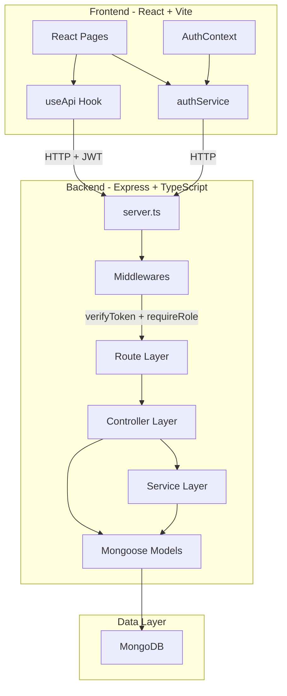
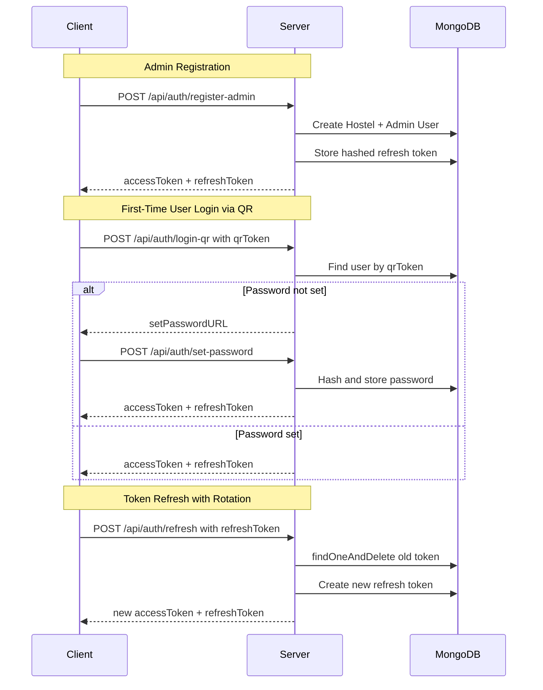
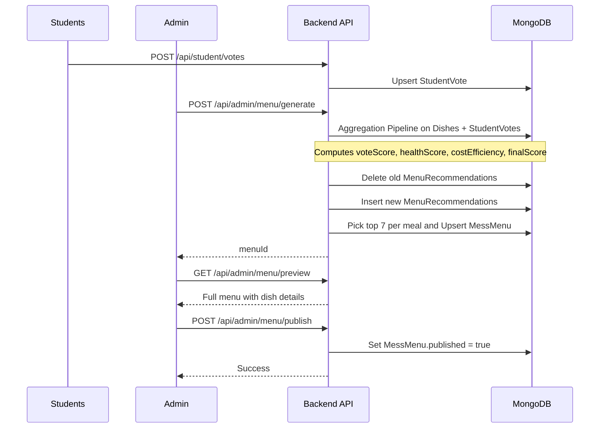
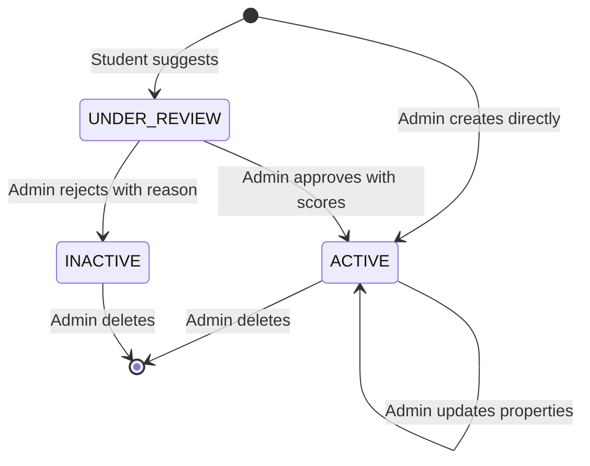
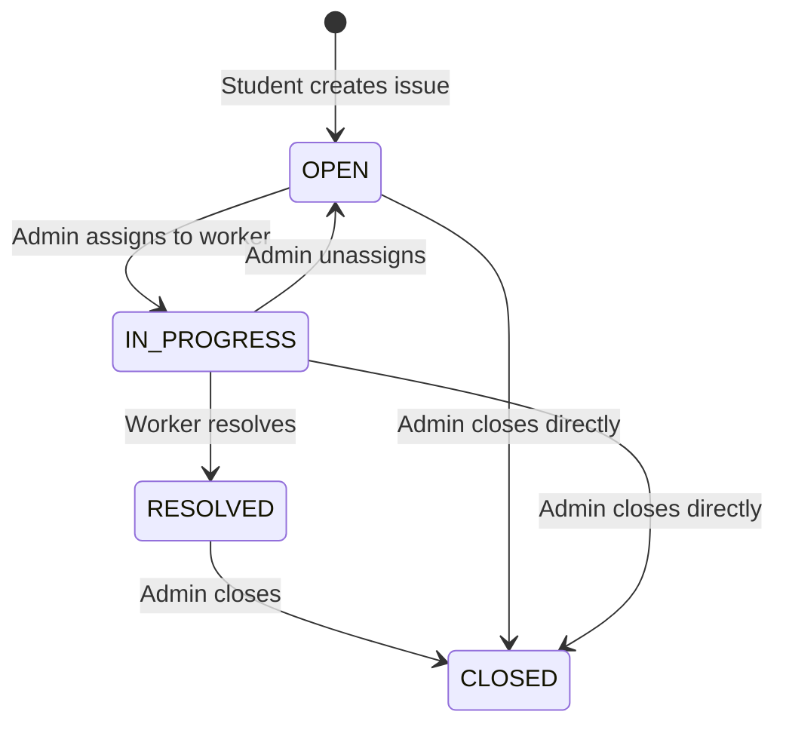
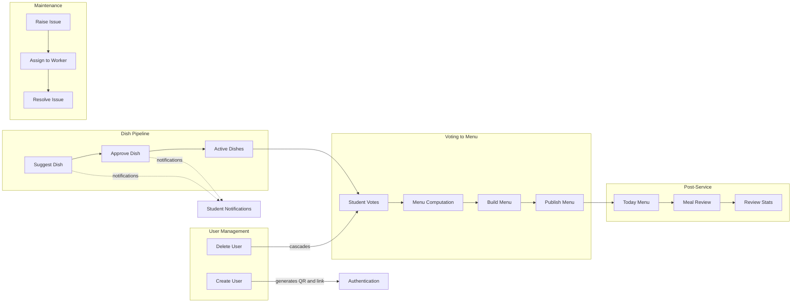

# HostelHub — Complete Codebase Knowledge Document

> **Generated**: 2026-08-19  
> **Scope**: Every source file in the repository has been read and analyzed.  
> **Audience**: An LLM (or developer) who needs to implement features, fix bugs, or refactor safely without prior context.

---

## Table of Contents

1. [High-Level Overview](#1-high-level-overview)
2. [Tech Stack & Dependencies](#2-tech-stack--dependencies)
3. [Architecture & Directory Structure](#3-architecture--directory-structure)
4. [System Architecture Diagram](#4-system-architecture-diagram)
5. [Data Flow](#5-data-flow)
6. [Database Schema & Relationships](#6-database-schema--relationships)
7. [Authentication & Security Deep Dive](#7-authentication--security-deep-dive)
8. [Feature-by-Feature Analysis](#8-feature-by-feature-analysis)
   - 8.1 [Multi-Tenant Hostel Provisioning](#81-multi-tenant-hostel-provisioning)
   - 8.2 [Authentication System](#82-authentication-system)
   - 8.3 [User Lifecycle Management](#83-user-lifecycle-management)
   - 8.4 [Dish Management & Suggestion Pipeline](#84-dish-management--suggestion-pipeline)
   - 8.5 [Student Voting System](#85-student-voting-system)
   - 8.6 [Menu Computation & Recommendation Engine](#86-menu-computation--recommendation-engine)
   - 8.7 [Menu Publishing & Retrieval](#87-menu-publishing--retrieval)
   - 8.8 [Meal Review & Rating System](#88-meal-review--rating-system)
   - 8.9 [Issue Tracking & Maintenance](#89-issue-tracking--maintenance)
   - 8.10 [Admin Dashboard & Analytics](#810-admin-dashboard--analytics)
   - 8.11 [Student Notifications](#811-student-notifications)
9. [Cross-Feature Interaction Map](#9-cross-feature-interaction-map)
10. [Frontend Architecture](#10-frontend-architecture)
11. [API Reference](#11-api-reference)
12. [Nuances, Subtleties & Gotchas](#12-nuances-subtleties--gotchas)
13. [Technical Reference & Glossary](#13-technical-reference--glossary)

---

## 1. High-Level Overview

### What It Is

**HostelHub** is a multi-tenant hostel management platform that digitizes the administrative and operational workflows of student housing facilities. It connects three user roles—**Admins**, **Students**, and **Workers**—into a unified ecosystem.

### What It Does

| Capability | Business Purpose |
|---|---|
| **Multi-tenant isolation** | Multiple hostels share one backend; each hostel's data is completely siloed via `hostelId` foreign keys on every document. |
| **Passwordless onboarding** | Admin creates student/worker → system generates QR code + magic link → user scans/clicks to set password on first login. |
| **Mess menu voting** | Students vote on preferred dishes (7 per meal × 3 meals). An algorithm generates an optimal weekly menu based on votes, health scores, and cost efficiency. |
| **Issue tracking** | Students report maintenance issues; admins assign to workers; workers resolve and close. Full lifecycle management. |
| **Meal reviews & analytics** | Students rate dishes after they are served. Admins see per-dish satisfaction aggregates and daily trend charts. |

### Target Users

- **Hostel Administrators**: Provision hostels, manage users, curate menus, track issues.
- **Students**: Vote on meals, suggest dishes, review food, report maintenance issues.
- **Maintenance Workers**: View assigned tickets, update status, add resolution notes.

---

## 2. Tech Stack & Dependencies

### Backend

| Category | Technology | Version | Purpose |
|---|---|---|---|
| Runtime | Node.js | 18+ | Server runtime |
| Framework | Express.js | 5.2.1 | REST API framework |
| Language | TypeScript | 5.9.3 | Type safety |
| Database | MongoDB + Mongoose | 9.0.1 | Document store + ODM |
| Auth | jsonwebtoken + bcrypt | 9.0.3 / 6.0.0 | JWT signing + password hashing |
| QR Codes | qrcode | 1.5.4 | Generate QR code data URLs |
| Security | helmet + cors | 8.1.0 / 2.8.5 | HTTP headers + CORS policy |
| Realtime | socket.io | 4.8.3 | WebSocket (imported but not actively wired in server.ts) |
| Email | nodemailer | 9.0.3 | Email sending (imported but not actively used in controllers) |
| Caching | redis | 5.10.0 | Redis client (dependency present, not actively used in controllers) |
| Dev | nodemon + ts-node | 3.1.11 / 10.9.2 | Hot reload + TS execution |

### Frontend

| Category | Technology | Version | Purpose |
|---|---|---|---|
| Framework | React | 19.2.3 | UI library |
| Build | Vite | 7.2.4 | Bundler + dev server |
| Styling | Tailwind CSS | 4.1.18 | Utility-first CSS |
| Routing | react-router-dom | 7.10.1 | Client-side routing |
| Charts | recharts | 3.10.1 | Data visualization |
| Icons | lucide-react | 0.562.0 | Icon library |
| Realtime | socket.io-client | 4.8.3 | WebSocket client |
| Notifications | react-hot-toast | 2.6.0 | Toast notifications |
| Utilities | date-fns, clsx, tailwind-merge | Various | Date formatting, class merging |

### Environment Variables

**Backend** (`backend/.env`):
```
MONGODB_URI=mongodb://...
JWT_SECRET=<secret>
PORT=8000
NODE_ENV=development
FRONTEND_URL=http://localhost:5173
```

**Frontend** (`frontend/.env`):
```
VITE_API_URL=http://localhost:8000/api
VITE_WS_URL=http://localhost:5000
```

---

## 3. Architecture & Directory Structure

The application follows a **classic monorepo** with separate `backend/` and `frontend/` packages. The backend uses the **MVC-S** (Model-View-Controller-Service) pattern.

```
hostelHub/
├── backend/
│   ├── src/
│   │   ├── config/
│   │   │   └── db.ts                         # MongoDB connection
│   │   ├── controllers/
│   │   │   ├── auth.controller.ts            # Admin/user login, QR, magic link, password set
│   │   │   ├── adminUser.controller.ts       # CRUD users, QR/token regen, cascading deletes
│   │   │   ├── adminDish.controller.ts       # Approve/reject/update/delete dishes
│   │   │   ├── adminMenu.controller.ts       # Generate menu, publish, voting stats
│   │   │   ├── adminDashboard.controller.ts  # Aggregate dashboard stats
│   │   │   ├── adminReview.controller.ts     # Paginated reviews, aggregate stats
│   │   │   ├── dish.controller.ts            # Admin-create and student-suggest dishes
│   │   │   ├── issue.controller.ts           # Full issue lifecycle
│   │   │   ├── mealReview.controller.ts      # Student submits meal review
│   │   │   ├── studentDish.controller.ts     # List active dishes grouped by meal
│   │   │   ├── studentMenu.controller.ts     # Current menu + today's menu
│   │   │   ├── studentNotification.controller.ts  # Dish approval/rejection notifications
│   │   │   ├── studentVote.controller.ts     # Get/save student vote preferences
│   │   │   └── user.controller.ts            # GET /me (returns decoded JWT data)
│   │   ├── middlewares/
│   │   │   ├── verifyToken.middleware.ts      # JWT verification, attaches req.user
│   │   │   ├── requireRole.middleware.ts      # Role-based access gate
│   │   │   └── errorHandler.ts               # Global 500 handler
│   │   ├── models/
│   │   │   ├── ActivityLog.ts                # Audit log
│   │   │   ├── Dish.ts                       # Menu item catalog
│   │   │   ├── Hostel.ts                     # Tenant entity
│   │   │   ├── Issue.ts                      # Maintenance tickets
│   │   │   ├── MealReview.ts                 # Post-meal ratings
│   │   │   ├── MenuRecommendation.ts         # Computed dish scores
│   │   │   ├── MessMenu.ts                   # Published weekly menu
│   │   │   ├── RefreshToken.ts               # Hashed refresh tokens
│   │   │   ├── StudentVote.ts                # Student dish preferences
│   │   │   └── User.ts                       # Users (admin, student, worker)
│   │   ├── routes/                           # Express router files (11 files)
│   │   ├── services/
│   │   │   ├── menuComputation.service.ts    # MongoDB aggregation pipeline for scoring
│   │   │   ├── menuBuilder.service.ts        # Pick top-7 dishes per meal
│   │   │   └── menuRetrieve.service.ts       # Fetch published/today menu
│   │   ├── types/
│   │   │   └── express.d.ts                  # Augments Express.Request with user
│   │   ├── utils/
│   │   │   ├── jwt.ts                        # Token generation, refresh rotation, hashing
│   │   │   └── formatMeal.ts                 # Format populated menu recommendations
│   │   └── server.ts                         # Express app bootstrap & route mounting
│   ├── package.json
│   └── tsconfig.json
│
├── frontend/
│   ├── src/
│   │   ├── components/
│   │   │   ├── admin/                        # AdminSidebar, AdminTopbar
│   │   │   ├── student/                      # StudentSidebar, StudentTopbar
│   │   │   ├── worker/                       # WorkerTopbar
│   │   │   ├── common/                       # RaiseIssueForm
│   │   │   └── ui/                           # button, card, input, label, tabs
│   │   ├── contexts/
│   │   │   ├── AuthContext.tsx               # Auth provider with login/logout
│   │   │   └── AuthContextType.ts            # AuthContext type + createContext
│   │   ├── hooks/
│   │   │   ├── useApi.ts                     # Generic fetch wrapper with auto-refresh
│   │   │   ├── useAuth.ts                    # Convenience hook for AuthContext
│   │   │   └── useMessService.ts             # Menu admin operations
│   │   ├── lib/
│   │   │   └── utils.ts                      # cn() utility (clsx + tailwind-merge)
│   │   ├── pages/
│   │   │   ├── admin/                        # 10 admin pages
│   │   │   ├── student/                      # 8 student pages
│   │   │   ├── worker/                       # 2 worker pages
│   │   │   └── login/                        # 4 auth pages
│   │   ├── routes/
│   │   │   ├── router.tsx                    # Top-level route tree
│   │   │   ├── AdminRoutes.tsx               # Admin route group
│   │   │   └── StudentRoutes.tsx             # Student route group
│   │   ├── services/
│   │   │   └── authService.ts                # API calls for auth, token management
│   │   ├── types/
│   │   │   └── auth.ts                       # Type definitions for auth
│   │   ├── App.tsx                           # Router + Toaster wrapper
│   │   ├── main.tsx                          # React DOM entry + AuthProvider
│   │   └── index.css                         # Global styles
│   ├── package.json
│   ├── vite.config.ts
│   ├── tailwind.config.js
│   └── vercel.json                           # Vercel deployment config
│
└── README.md
```

---

## 4. System Architecture Diagram



---

## 5. Data Flow

### Authentication Flow



### Menu Generation Flow



---

## 6. Database Schema & Relationships

### Entity-Relationship Diagram

```mermaid
erDiagram
    Hostel {
        ObjectId _id
        String name
        String domain UK
        Date createdAt
    }

    User {
        ObjectId _id
        ObjectId hostelId FK
        String name
        String email UK
        String registrationNo
        String role "ADMIN or STUDENT or WORKER"
        String roomNo
        String jobType
        String qrToken UK
        String passwordHash
        Boolean isPasswordSet
        String loginURL UK
        Date loginURLExpires
        Boolean isActive
        Date createdAt
    }

    Dish {
        ObjectId _id
        ObjectId hostelId FK
        String name
        String mealType "Breakfast or Lunch or Dinner"
        String category
        Number priceScore "1 to 5"
        Number healthScore "1 to 5"
        String status "UNDER_REVIEW or ACTIVE or INACTIVE"
        ObjectId suggestedBy FK
        ObjectId approvedBy FK
        String rejectionReason
    }

    StudentVote {
        ObjectId _id
        ObjectId hostelId FK
        ObjectId userId FK_UK
        ObjectIdArray breakfast
        ObjectIdArray lunch
        ObjectIdArray dinner
    }

    MenuRecommendation {
        ObjectId _id
        ObjectId hostelId FK
        String mealType
        ObjectId dishId FK
        Number voteScore
        Number healthScore
        Number costEfficiency
        Number finalScore
        Date computedAt
    }

    MessMenu {
        ObjectId _id
        ObjectId hostelId FK_UK
        ObjectIdArray breakfast "7 MenuRecommendation refs"
        ObjectIdArray lunch "7 MenuRecommendation refs"
        ObjectIdArray dinner "7 MenuRecommendation refs"
        Date generatedAt
        Boolean published
    }

    Issue {
        ObjectId _id
        ObjectId hostelId FK
        ObjectId raisedBy FK
        ObjectId assignedTo FK
        String category
        String priority "LOW or MEDIUM or HIGH or URGENT"
        String status "OPEN or IN_PROGRESS or RESOLVED or CLOSED"
        String description
        String resolverNote
    }

    MealReview {
        ObjectId _id
        ObjectId hostelId FK
        ObjectId studentId FK
        ObjectId dishId FK
        String mealType
        Date servedOn
        Number rating "1 to 5"
        String comment
    }

    RefreshToken {
        ObjectId _id
        ObjectId userId FK
        String token "SHA-256 hash"
        Date expiresAt
        Date createdAt "TTL 7 days"
    }

    ActivityLog {
        ObjectId _id
        ObjectId userId FK
        String action
        String ip
        Date timestamp
    }

    Hostel ||--o{ User : "hostelId"
    Hostel ||--o{ Dish : "hostelId"
    Hostel ||--o{ Issue : "hostelId"
    Hostel ||--o| MessMenu : "hostelId unique"
    Hostel ||--o{ StudentVote : "hostelId"
    Hostel ||--o{ MenuRecommendation : "hostelId"
    Hostel ||--o{ MealReview : "hostelId"
    User ||--o{ Issue : "raisedBy"
    User ||--o{ MealReview : "studentId"
    User ||--o| StudentVote : "userId unique"
    User ||--o{ RefreshToken : "userId"
    User ||--o{ ActivityLog : "userId"
    Dish ||--o{ MenuRecommendation : "dishId"
    Dish ||--o{ MealReview : "dishId"
```

### Key Indexes & Constraints

| Model | Index | Type | Notes |
|---|---|---|---|
| `User` | `email` | Unique | Global email uniqueness |
| `User` | `qrToken` | Unique, sparse | Only for students/workers |
| `User` | `loginURL` | Unique, sparse | Only during onboarding |
| `StudentVote` | `userId` | Unique | One vote record per user |
| `MessMenu` | `hostelId` | Unique | One menu per hostel at a time |
| `MealReview` | `(hostelId, studentId, dishId, servedOn)` | Compound unique | One review per student per dish per day |
| `RefreshToken` | `token` | Unique | Hashed JWT |
| `RefreshToken` | `createdAt` | TTL (604800s) | Auto-delete after 7 days |
| `Hostel` | `domain` | Unique | Prevents collision |

---

## 7. Authentication & Security Deep Dive

### Authentication Mechanisms

The system supports **four** login methods:

1. **Admin email + password**: Traditional bcrypt-verified login. Admin creates their password during registration.
2. **Student/Worker email + password**: Only works after the user has set their password via the onboarding flow.
3. **QR Code login**: Admin generates a QR code containing a 32-byte hex token. Scanning it either logs the user in (if password is set) or redirects to the set-password page.
4. **Magic Link login**: A tokenized URL (24h expiry) that logs the user in directly.

### JWT Strategy

| Token | Lifetime | Storage Client | Storage Server |
|---|---|---|---|
| Access Token | 15 minutes | localStorage | Not stored |
| Refresh Token | 7 days | localStorage | SHA-256 hash in MongoDB |

**Refresh Token Rotation**: The `verifyRefreshToken()` function uses `findOneAndDelete()` — consuming the old token atomically and requiring a new one to be issued. This is a one-time-use pattern that mitigates token replay attacks.

### RBAC Implementation

- **Middleware chain**: `verifyToken` then `requireRole('ADMIN')` (or `'STUDENT'`, `'WORKER'`).
- Roles are embedded in the JWT payload (`role` field) and also checked against the database in controllers.
- **IDOR protection**: Controllers verify that the resource's `hostelId` matches `req.user.hostelId` before performing operations.

### Security Headers & Policies

- **Helmet.js**: Adds `X-Content-Type-Options`, `X-Frame-Options`, CSP headers, etc.
- **CORS**: Restricted to `FRONTEND_URL` with credentials support.
- **JSON body limit**: 10MB (`express.json({ limit: '10mb' })`).
- **Password hashing**: bcrypt with 10 salt rounds.

### Credential Management API

The frontend integrates with the browser's Credential Management API (`navigator.credentials.store/get`) to offer autofill on supported browsers.

---

## 8. Feature-by-Feature Analysis

### 8.1 Multi-Tenant Hostel Provisioning

**Business purpose**: Allow independent hostels to share a single deployment while maintaining strict data isolation.

**How it works**:

| Aspect | Detail |
|---|---|
| Entry point | `POST /api/auth/register-admin` |
| Controller | `auth.controller.ts` → `registerAdmin()` |
| Domain generation | First 10 chars of hostel name (lowercased, spaces removed) + `.com` |
| Email constraint | Admin email **must** end with `@<generated-domain>` |
| Collision handling | Checks both exact name match and domain collision |
| Side effects | Creates `Hostel` doc + `User` doc (role=ADMIN) + issues JWT pair |

**Data isolation mechanism**: Every model that holds tenant-specific data has a `hostelId` field. Controllers always filter by `req.user.hostelId`.

**Gotcha**: The domain is derived from the first 10 characters. Two hostels named "University" and "University2" would produce the same domain `university.com` — collision error.

---

### 8.2 Authentication System

**Business purpose**: Secure access with minimal friction for first-time users (QR/magic link) and strong security (JWT rotation, bcrypt).

**Files involved**:
- `backend/src/controllers/auth.controller.ts` — All 8 auth handlers
- `backend/src/utils/jwt.ts` — Token generation, verification, rotation
- `backend/src/routes/auth.routes.ts` — Route definitions
- `frontend/src/services/authService.ts` — Client-side auth operations
- `frontend/src/contexts/AuthContext.tsx` — React state management
- `frontend/src/hooks/useApi.ts` — Auto-refresh on 401

**Login flow matrix**:

| Method | Endpoint | Pre-conditions | Returns |
|---|---|---|---|
| Admin login | `POST /login-admin` | Password set at registration | `accessToken + refreshToken` |
| User login | `POST /login-user` | Password set + active account | `accessToken + refreshToken` |
| QR login | `POST /login-qr` | Valid `qrToken` in DB | If password set: tokens. If not: `setPasswordURL` |
| Magic link | `POST /login-url` | Valid `loginURL` + not expired (24h) | `accessToken + refreshToken` |
| Set password | `POST /set-password` | Valid `loginURL` + password >= 8 chars | `accessToken + refreshToken` |

**Auto-refresh**: `useApi.ts` intercepts 401 responses, calls `authService.refreshToken()`, retries the original request with the new token. If refresh fails, clears tokens and redirects to `/login`.

---

### 8.3 User Lifecycle Management

**Business purpose**: Admins create, manage, deactivate, and delete student/worker accounts within their hostel.

**Files**:
- `backend/src/controllers/adminUser.controller.ts` — 7 handler functions
- `backend/src/routes/adminUser.routes.ts`
- `frontend/src/pages/admin/AdminUsers.tsx`, `AdminCreateUser.tsx`

**Operations**:

| Operation | Endpoint | Key Behavior |
|---|---|---|
| Create user | `POST /api/admin/users` | Auto-generates email from `name_roomNo@domain`. Generates QR token + login URL. Logs to ActivityLog. |
| List users | `GET /api/admin/users` | Filters by hostelId, excludes ADMIN accounts. Supports `role` and `status` query params. |
| Get user | `GET /api/admin/users/:userId` | IDOR-safe: checks `hostelId` match |
| Deactivate | `PATCH /api/admin/users/:userId/deactivate` | Sets `isActive=false`. Deactivated users cannot login. |
| Reactivate | `PATCH /api/admin/users/:userId/reactivate` | Sets `isActive=true` |
| Delete | `DELETE /api/admin/users/:userId` | **Cascading delete**: removes `StudentVote` + `RefreshToken` records, then the User |
| Regen QR | `POST /api/admin/users/:userId/qr-code` | Generates new 32-byte hex token, overwrites old one |
| Regen login URL | `POST /api/admin/users/:userId/login-token` | Generates new token + 24h expiry |

**Gotcha**: The cascading delete does **not** remove `MealReview`, `Issue`, `Dish` (suggestedBy), or `ActivityLog` records. Orphaned references may exist.

---

### 8.4 Dish Management & Suggestion Pipeline

**Business purpose**: Build a curated catalog of menu items. Students can suggest new dishes; admins curate.

**Files**:
- `backend/src/controllers/dish.controller.ts` — `createAdminDish()`, `suggestDish()`
- `backend/src/controllers/adminDish.controller.ts` — `fetchDishes()`, `approveDish()`, `rejectDish()`, `updateDish()`, `deleteDish()`
- `backend/src/models/Dish.ts`

**Dish lifecycle**:



**Key rules**:
- Dish names are unique per hostel (case-insensitive regex check).
- Student-suggested dishes start as `UNDER_REVIEW` and have no price/health scores until approved.
- Admin-created dishes are immediately `ACTIVE` with default scores of 3 if not provided.
- Only `ACTIVE` dishes are eligible for voting and menu generation.

---

### 8.5 Student Voting System

**Business purpose**: Democratically determine meal preferences. Each student selects exactly 7 dishes per meal type (Breakfast, Lunch, Dinner).

**Files**:
- `backend/src/controllers/studentVote.controller.ts` — `getStudentVotes()`, `saveStudentVotes()`
- `backend/src/models/StudentVote.ts`
- `frontend/src/pages/student/StudentVoting.tsx`

**How it works**:
1. Student fetches all `ACTIVE` dishes for their hostel + their current vote record.
2. Student selects exactly **7 dishes per meal** (Breakfast, Lunch, Dinner = 21 total selections).
3. Backend validates: exactly 7 per meal, all valid ObjectIds, all dishes ACTIVE and in the correct hostel.
4. Uses `findOneAndUpdate` with `upsert: true` — students can re-vote anytime.

**Constraint**: `StudentVote` has `userId` as unique — each student has exactly one vote document.

**Gotcha**: The voting system is **continuous** — there's no voting window concept enforced in the backend. Students can update preferences anytime. The `useMessService.ts` hook references `openVoting` and `getVotingStatus` endpoints, but these are **not implemented** in the backend routes/controllers.

---

### 8.6 Menu Computation & Recommendation Engine

**Business purpose**: Algorithmically generate the optimal weekly menu by combining student preferences, nutritional value, and cost efficiency.

**Files**:
- `backend/src/services/menuComputation.service.ts` — MongoDB aggregation pipeline
- `backend/src/services/menuBuilder.service.ts` — Top-7 selection
- `backend/src/models/MenuRecommendation.ts`

**The Algorithm** (inside `computeMenuRecommendations()`):

The entire computation is a **single MongoDB aggregation pipeline**:

1. **Filter**: Only `ACTIVE` dishes in the target hostel
2. **$lookup StudentVotes**: For each dish, count how many times it appears across all students' vote arrays (breakfast + lunch + dinner)
3. **Normalize votes**: `voteScore = weeklyVoteCount / maxVotes` (0-1 range)
4. **Cost efficiency**: `costEfficiency = 1 / priceScore` (inversely proportional — cheaper = more efficient)
5. **Final weighted score**:
   ```
   finalScore = (0.5 * voteScore) + (0.3 * healthScore) + (0.2 * costEfficiency)
   ```

6. **Persist**: Delete all old `MenuRecommendation` docs for this hostel, insert new ones.

**Menu Builder** (`buildMessMenu()`):
- For each meal type, sort `MenuRecommendation` by `finalScore` descending, take top 7.
- **Hard requirement**: Must have at least 7 dishes per meal type or throws an error.
- Upserts the `MessMenu` document (one per hostel, unique index).
- Sets `published: false` (draft state).

**Gotcha**: The scoring weights (0.5, 0.3, 0.2) are **hardcoded** in the aggregation pipeline. Changing them requires modifying `menuComputation.service.ts`.

---

### 8.7 Menu Publishing & Retrieval

**Business purpose**: Admin reviews the generated menu and publishes it for students to see.

**Files**:
- `backend/src/controllers/adminMenu.controller.ts` — `publishMenu()`, `getMenuPreview()`
- `backend/src/services/menuRetrieve.service.ts` — `getCurrentMenu()`, `getTodayMenu()`
- `backend/src/controllers/studentMenu.controller.ts` — `getCurrentMessMenu()`, `getServedDishesToday()`

**Menu structure**:
- The `MessMenu` holds 7 `MenuRecommendation` ObjectIds per meal (breakfast, lunch, dinner).
- Each `MenuRecommendation` references a `Dish` via `dishId`.
- The 7 entries represent the **7 days of the week** (index 0 = Monday, index 6 = Sunday).

**Today's menu**: `getTodayMenu()` maps `new Date().getDay()` (0=Sunday) to a 0-6 index where Monday=0 and Sunday=6 (`jsDay === 0 ? 6 : jsDay - 1`).

**Gotcha**: Only one menu exists per hostel (unique index on `hostelId`). Generating a new menu **overwrites** the previous one via `findOneAndUpdate` with `upsert: true`. There is no menu history.

---

### 8.8 Meal Review & Rating System

**Business purpose**: Post-meal quality feedback from students. Enables data-driven food quality improvement.

**Files**:
- `backend/src/controllers/mealReview.controller.ts` — `submitMealReview()`
- `backend/src/controllers/adminReview.controller.ts` — `getMealReviews()`, `getReviewStats()`
- `backend/src/models/MealReview.ts`

**Review submission rules**:
- Required fields: `dishId`, `mealType`, `rating` (1-5), `servedOn` (date)
- Optional: `comment` (max 500 chars), `images` (max 3 URL strings)
- The dish must be `ACTIVE` and the `mealType` must match the dish's `mealType`
- `servedOn` cannot be in the future
- **One review per student per dish per day** (compound unique index)

**Admin analytics** (two aggregation pipelines):
1. **Per-dish stats**: Average rating + total reviews per dish
2. **Date-wise trend**: Average rating + review count grouped by `servedOn` date

**Admin reviews listing**: Supports filtering by `mealType`, `date`, `dishId` with pagination (page/limit, capped at 50).

---

### 8.9 Issue Tracking & Maintenance

**Business purpose**: End-to-end maintenance request lifecycle — from student report to worker resolution.

**Files**:
- `backend/src/controllers/issue.controller.ts` — 7 handler functions
- `backend/src/models/Issue.ts`
- `frontend/src/pages/student/StudentIssues.tsx`, `frontend/src/pages/admin/AdminIssues.tsx`, `frontend/src/pages/worker/Dashboard.tsx`

**Issue lifecycle**:



**Authorization matrix**:

| Action | Admin | Student creator | Assigned Worker |
|---|---|---|---|
| Create issue | No | Yes | No |
| View all issues | Yes | No | No |
| View own issues | No | Yes | No |
| View assigned issues | No | No | Yes |
| Assign issue | Yes | No | No |
| Update status | Yes | No | Yes (assigned only) |
| Delete issue | Yes | Yes (own only) | No |

**IDOR protection**: Admin can only assign workers and manage issues within their own hostel. The `issue.hostelId` is compared against `admin.hostelId`.

**Special behavior**: Sending `workerId: "UNASSIGN"` in the assign endpoint removes the worker and resets the issue to `OPEN`.

---

### 8.10 Admin Dashboard & Analytics

**Business purpose**: Central command view with key metrics and recent activity.

**File**: `backend/src/controllers/adminDashboard.controller.ts`

**Metrics returned**:

| Metric | Query |
|---|---|
| `totalStudents` | Active students in hostel |
| `activeDishes` | Dishes with status `ACTIVE` |
| `openIssues` | Issues with status `OPEN` or `IN_PROGRESS` |
| `totalVotes` | Count of `StudentVote` documents |
| `recentActivity` | Last 15 `ActivityLog` entries for users in this hostel |

**Performance note**: Uses `Promise.all()` for parallel DB queries but then makes a sequential query to find all user IDs in the hostel before filtering ActivityLogs — this two-step approach could be slow for large hostels.

---

### 8.11 Student Notifications

**Business purpose**: Inform students about the status of their suggested dishes.

**File**: `backend/src/controllers/studentNotification.controller.ts`

**How it works**: Queries `Dish` documents where `suggestedBy` = current user and `status` is `ACTIVE` (approved) or `INACTIVE` (rejected). Maps to notification objects with type `APPROVED` or `REJECTED`, including rejection reason.

**Note**: This is a poll-based system, not push notifications. The student frontend must fetch `/api/student/notifications` on page load.

---

## 9. Cross-Feature Interaction Map



**Critical chain**: `Dishes -> Votes -> Computation -> Menu -> Publish -> Today's Menu -> Reviews`. Breaking any link (e.g., deleting dishes that are in votes) can cascade failures.

---

## 10. Frontend Architecture

### Component Hierarchy

```
<StrictMode>
  <AuthProvider>          -- React Context for auth state
    <BrowserRouter>
      <Toaster />         -- Global toast notifications
      <AppRoutes>
        /login            -> Login (tab-based: Admin | Student | Worker)
        /qr-login         -> QRLogin
        /login-link       -> LoginLink
        /set-password/:id -> SetPassword
        /admin/register   -> AdminRegister

        /admin            -> AdminLayout (Sidebar + Topbar + Outlet)
          /dashboard      -> AdminDashboard
          /users          -> AdminUsers
          /create-user    -> AdminCreateUser
          /voting         -> AdminVoting
          /menu           -> AdminMessMenu
          /reviews        -> AdminReviews
          /issues         -> AdminIssues
          /dishes         -> AdminDishApprovals

        /student          -> StudentLayout (Sidebar + Topbar + Outlet)
          /dashboard      -> StudentDashboard
          /voting/status  -> StudentVoting
          /menu           -> StudentMessMenu
          /reviews        -> StudentReview
          /suggest-dishes -> StudentSuggestDish
          /issues         -> StudentIssues

        /worker           -> WorkerLayout (Outlet only)
          /dashboard      -> WorkerDashboard (issues management)

        /                 -> Redirect to /login
      </AppRoutes>
    </BrowserRouter>
  </AuthProvider>
</StrictMode>
```

### State Management

- **AuthContext**: Global auth state (`user`, `isLoading`, `error`, `login()`, `logout()`). Uses `useState` — no persistence across page refreshes (tokens are in localStorage, but user object is not rehydrated on mount).
- **Page-level state**: Each page manages its own data fetching via `useApi()` hook. No global store (Redux/Zustand).
- **API layer**: `useApi()` provides a `request()` function that handles JWT attachment, 401 auto-refresh, and error formatting.

### UI Component Library

Custom components in `frontend/src/components/ui/`:

| Component | File | Purpose |
|---|---|---|
| `Button` | `button.tsx` | Styled button with variant + size props, uses `clsx` + `tailwind-merge` |
| `Card` | `card.tsx` | Card, CardHeader, CardTitle, CardContent, CardFooter |
| `Input` | `input.tsx` | Styled input with `forwardRef` |
| `Label` | `label.tsx` | Styled label |
| `Tabs` | `tabs.tsx` | Tab navigation system (TabsList, TabsTrigger, TabsContent) |

---

## 11. API Reference

### Route Mount Summary (from server.ts)

| Mount Path | Auth | Role Gate | Route File | Controller File |
|---|---|---|---|---|
| `/api/auth` | Mixed | None | `auth.routes.ts` | `auth.controller.ts` |
| `/api/users` | `verifyToken` | Any | `user.routes.ts` | `user.controller.ts` |
| `/api/issues` | `verifyToken` | Any (internal checks) | `issue.routes.ts` | `issue.controller.ts` |
| `/api/dishes` | `verifyToken` | Any | `dish.routes.ts` | `dish.controller.ts` |
| `/api/reviews` | `verifyToken` | Any | `mealReview.routes.ts` | `mealReview.controller.ts` |
| `/api/student/*` | `verifyToken` | `STUDENT` | `student.routes.ts` | Multiple student controllers |
| `/api/admin/menu` | `verifyToken` | `ADMIN` | `adminMenu.routes.ts` | `adminMenu.controller.ts` |
| `/api/admin/users` | `verifyToken` | `ADMIN` | `adminUser.routes.ts` | `adminUser.controller.ts` |
| `/api/admin/dishes` | `verifyToken` | `ADMIN` | `adminDish.routes.ts` | `adminDish.controller.ts` |
| `/api/admin/reviews` | `verifyToken` | `ADMIN` | `adminReview.routes.ts` | `adminReview.controller.ts` |
| `/api/admin/dashboard` | `verifyToken` | `ADMIN` | `adminDashboard.routes.ts` | `adminDashboard.controller.ts` |

### Full Endpoint Catalog

#### Authentication (9 endpoints)

| Method | Path | Auth | Description |
|---|---|---|---|
| `POST` | `/api/auth/register-admin` | Public | Register hostel + admin |
| `POST` | `/api/auth/login-admin` | Public | Admin login |
| `POST` | `/api/auth/login-user` | Public | Student/worker login |
| `POST` | `/api/auth/login-qr` | Public | QR code login |
| `POST` | `/api/auth/login-url` | Public | Magic link login |
| `POST` | `/api/auth/set-password` | Public | Set password (first login) |
| `POST` | `/api/auth/refresh` | Public | Refresh access token |
| `POST` | `/api/auth/logout` | JWT | Revoke refresh token |
| `GET` | `/api/auth/qr/:userId` | JWT | Generate QR code image |

#### Admin User Management (8 endpoints)

| Method | Path | Auth | Description |
|---|---|---|---|
| `POST` | `/api/admin/users` | JWT+ADMIN | Create student/worker |
| `GET` | `/api/admin/users` | JWT+ADMIN | List users (filter by role/status) |
| `GET` | `/api/admin/users/:userId` | JWT+ADMIN | Get single user |
| `PATCH` | `/api/admin/users/:userId/deactivate` | JWT+ADMIN | Deactivate user |
| `PATCH` | `/api/admin/users/:userId/reactivate` | JWT+ADMIN | Reactivate user |
| `DELETE` | `/api/admin/users/:userId` | JWT+ADMIN | Delete user + cascade |
| `POST` | `/api/admin/users/:userId/qr-code` | JWT+ADMIN | Regenerate QR |
| `POST` | `/api/admin/users/:userId/login-token` | JWT+ADMIN | Regenerate login URL |

#### Dish Management (7 endpoints)

| Method | Path | Auth | Description |
|---|---|---|---|
| `POST` | `/api/dishes` | JWT | Suggest dish (student) or create dish (admin) |
| `GET` | `/api/admin/dishes` | JWT+ADMIN | List all dishes (filter by status) |
| `POST` | `/api/admin/dishes` | JWT+ADMIN | Create dish directly (bypasses review) |
| `POST` | `/api/admin/dishes/:id/approve` | JWT+ADMIN | Approve a suggested dish |
| `POST` | `/api/admin/dishes/:id/reject` | JWT+ADMIN | Reject a suggested dish |
| `PUT` | `/api/admin/dishes/:id` | JWT+ADMIN | Update dish properties |
| `DELETE` | `/api/admin/dishes/:id` | JWT+ADMIN | Delete dish |

#### Menu & Voting (9 endpoints)

| Method | Path | Auth | Description |
|---|---|---|---|
| `GET` | `/api/student/dishes/active` | JWT+STUDENT | Active dishes grouped by meal |
| `GET` | `/api/student/votes` | JWT+STUDENT | Get voting options + current votes |
| `POST` | `/api/student/votes` | JWT+STUDENT | Save/update votes (7 per meal) |
| `GET` | `/api/admin/menu/voting/stats` | JWT+ADMIN | Total voter count |
| `POST` | `/api/admin/menu/generate` | JWT+ADMIN | Run algorithm + build menu |
| `GET` | `/api/admin/menu/preview` | JWT+ADMIN | Preview generated menu |
| `POST` | `/api/admin/menu/publish` | JWT+ADMIN | Publish menu |
| `GET` | `/api/student/menu/current` | JWT+STUDENT | Get published weekly menu |
| `GET` | `/api/student/menu/today` | JWT+STUDENT | Get today's specific dishes |

#### Issues (7 endpoints)

| Method | Path | Auth | Description |
|---|---|---|---|
| `POST` | `/api/issues` | JWT | Create issue (student) |
| `GET` | `/api/issues/my-issues` | JWT | Student's own issues |
| `GET` | `/api/issues/assigned` | JWT | Worker's assigned issues |
| `GET` | `/api/issues/admin/all` | JWT+ADMIN | All issues in hostel |
| `PATCH` | `/api/issues/:issueId/assign` | JWT+ADMIN | Assign/unassign issue |
| `PATCH` | `/api/issues/:issueId/status` | JWT | Update issue status |
| `DELETE` | `/api/issues/:issueId` | JWT | Delete issue |

#### Reviews (3 endpoints)

| Method | Path | Auth | Description |
|---|---|---|---|
| `POST` | `/api/reviews/submit` | JWT | Submit meal review |
| `GET` | `/api/admin/reviews/stats` | JWT+ADMIN | Aggregate review statistics |
| `GET` | `/api/admin/reviews` | JWT+ADMIN | Paginated review list |

#### Other (3 endpoints)

| Method | Path | Auth | Description |
|---|---|---|---|
| `GET` | `/` | Public | Health check |
| `GET` | `/api/users/me` | JWT | Returns decoded JWT user info |
| `GET` | `/api/student/notifications` | JWT+STUDENT | Dish approval/rejection notifications |
| `GET` | `/api/admin/dashboard` | JWT+ADMIN | Dashboard aggregate stats |

---

## 12. Nuances, Subtleties & Gotchas

### Things You MUST Know Before Changing Code

#### 1. MessMenu Unique Index = One Menu Per Hostel

`MessMenu` has a **unique index on `hostelId`**. This means each hostel can only have ONE menu document at a time. Generating a new menu **replaces** the old one. There is no menu versioning or history.

**Impact**: If you need menu history, you must remove the unique index and add a `weekOf` or version field.

#### 2. MenuRecommendation: Full Wipe on Regenerate

`computeMenuRecommendations()` calls `deleteMany({ hostelId })` before inserting new recommendations. This means all previous computation data is lost on each generation cycle.

#### 3. Cascading Delete Gaps

When deleting a user via `deleteUser()`, only `StudentVote` and `RefreshToken` are cascade-deleted. The following are **NOT** cleaned up:
- `MealReview` (studentId will be orphaned)
- `Issue` (raisedBy/assignedTo will be orphaned)
- `Dish` (suggestedBy will be orphaned)
- `ActivityLog` (userId will be orphaned)

#### 4. Socket.io: Dependency Present, Not Wired

`socket.io` and `socket.io-client` are in the dependencies, and an `http.createServer(app)` is used instead of `app.listen()` (typical for Socket.io setups), but **no Socket.io server is actually initialized or used** in `server.ts`. The README mentions WebSocket for real-time menu broadcasting, but this is not implemented in the current codebase.

#### 5. Redis: Dependency Present, Not Used

The `redis` package is in backend dependencies, and `formatMeal.ts` has a comment about "Plain object from Redis", but no Redis client is initialized or used anywhere in the codebase.

#### 6. Nodemailer: Imported, Not Used

`nodemailer` is in dependencies but no controller or service actually sends emails. The email verification fields on the User model (`emailVerificationToken`, `emailVerificationExpires`, `emailVerified`) exist but are only set to `true` for admins during registration.

#### 7. user.controller.ts Returns JWT Payload, Not DB Data

The `getMe()` controller returns data from `req.user` (decoded JWT), not from the database. It will have stale data if the user's profile was modified after the token was issued. The `name` and `email` fields will always be `null` because they are not included in the JWT payload.

#### 8. Frontend AuthContext Does Not Rehydrate on Refresh

`AuthContext` stores user data in React `useState`. On page refresh, the user object is lost (set to `null`). Tokens persist in `localStorage`, but the user profile is not re-fetched. Individual pages work because they use `useApi()` which attaches the token from localStorage.

#### 9. Domain Collision from Hostel Name

The `generateDomain()` function takes only the first 10 characters. Hostel names that share the same first 10 characters will collide. Example: "Grand Hotel" and "Grand Hotel Deluxe" both produce `grandhotel.com`.

#### 10. Express v5 in Use

The backend uses **Express 5.2.1** (not the more common v4). Express 5 has breaking changes in error handling, path matching, and removed `app.del()`. Be aware when consulting v4-era documentation.

#### 11. verifyToken Does Not Check isActive

The `verifyToken` middleware only validates the JWT signature and expiry. It does **not** check if the user's `isActive` flag is `true` in the database. A deactivated user with a valid (unexpired) access token can still make API calls for up to 15 minutes until the token expires. The `loginUser` controller does check `isActive`, and `refreshAccessToken` checks it when issuing new tokens.

#### 12. Issue Routes Have Dual Auth Patterns

The issue routes file (`issue.routes.ts`) applies `verifyToken` individually per route, but the route is also mounted in `server.ts` with `app.use('/api/issues', verifyToken, issueRoutes)`. This results in **double verification** — not harmful but redundant.

#### 13. VITE_WS_URL Points to Port 5000

The frontend `.env.example` has `VITE_WS_URL=http://localhost:5000`, but the backend runs on port 8000. Since WebSockets are not implemented, this is a dead config — but could cause confusion when implementing Socket.io.

#### 14. Meal Array = 7 Days, Not Configurable

The `MessMenu` model validates that each meal array has exactly 7 entries (one per weekday). The `menuBuilder.service.ts` also requires exactly 7 dishes per meal type. This "7" is hardcoded in both the model validator and the service.

#### 15. No Input Sanitization for Regex

`dish.controller.ts` uses `name: { $regex: \`^${name}$\`, $options: 'i' }` for case-insensitive name matching. The `name` field is user input and is **not sanitized for regex special characters**. This is a potential **ReDoS** (Regular Expression Denial of Service) vulnerability.

---

## 13. Technical Reference & Glossary

### Domain Glossary

| Term | Definition |
|---|---|
| **Hostel** | A tenant entity representing a student housing facility. Each hostel is data-isolated. |
| **Domain** | Auto-generated email domain (e.g., `grandhotel.com`) derived from the first 10 characters of the hostel name. |
| **Dish** | A food item in the catalog. Has a meal type (Breakfast/Lunch/Dinner), scores, and a lifecycle status. |
| **MessMenu** | The published weekly meal schedule. Contains 7 dishes per meal type (one per day). |
| **MenuRecommendation** | An intermediate computation record storing a dish's score for a specific hostel and meal type. |
| **StudentVote** | A student's dish preferences — 7 dishes per meal type. One record per student (upsert). |
| **MealReview** | A post-meal rating (1-5) submitted by a student for a specific dish on a specific date. |
| **Issue** | A maintenance/facility ticket raised by a student, assigned to a worker, and resolved. |
| **QR Token** | A 32-byte hex string stored on the User model, embedded in a QR code for passwordless login. |
| **Login URL / Magic Link** | A 32-byte hex token with 24h expiry, used for first-time password setup. |
| **Refresh Token Rotation** | Security pattern where each refresh token is single-use (deleted on verification and a new one is issued). |
| **ActivityLog** | Audit trail recording admin actions (user creation, dish approval, etc.) with timestamps and IP addresses. |
| **VoteScore** | Normalized (0-1) popularity of a dish based on student votes. |
| **CostEfficiency** | Inverse of priceScore (cheaper = more efficient). Used in menu computation. |
| **FinalScore** | Weighted composite: `0.5*voteScore + 0.3*healthScore + 0.2*costEfficiency`. Determines menu ranking. |
| **IDOR** | Insecure Direct Object Reference — mitigated by checking `hostelId` match in controllers. |

### Key Classes & Functions

#### Backend

| File | Export | Type | Purpose |
|---|---|---|---|
| `server.ts` | `startServer()` | Function | App bootstrap: connects DB, starts HTTP server |
| `config/db.ts` | `connectDB()` | Function | Mongoose connection with 5s timeouts |
| `utils/jwt.ts` | `generateAccessToken()` | Function | Signs JWT with 15m expiry |
| `utils/jwt.ts` | `generateRefreshToken()` | Function | Signs JWT (7d), stores SHA-256 hash in DB |
| `utils/jwt.ts` | `verifyRefreshToken()` | Function | Verifies + deletes token (rotation) |
| `utils/jwt.ts` | `refreshAccessToken()` | Function | Looks up user, issues new token pair |
| `utils/jwt.ts` | `revokeRefreshToken()` | Function | Deletes hashed token from DB |
| `utils/formatMeal.ts` | `formatMeal()` | Function | Transforms populated MenuRecommendation arrays for API response |
| `services/menuComputation.service.ts` | `computeMenuRecommendations()` | Function | MongoDB aggregation pipeline for scoring |
| `services/menuBuilder.service.ts` | `buildMessMenu()` | Function | Picks top-7 per meal, upserts MessMenu |
| `services/menuRetrieve.service.ts` | `getCurrentMenu()` | Function | Fetches published menu with populated dishes |
| `services/menuRetrieve.service.ts` | `getTodayMenu()` | Function | Extracts today's dishes from the weekly menu |
| `middlewares/verifyToken.middleware.ts` | `verifyToken` | Middleware | Decodes JWT, attaches req.user |
| `middlewares/requireRole.middleware.ts` | `requireRole()` | Middleware factory | Checks req.user.role against allowed roles |
| `middlewares/errorHandler.ts` | `errorHandler` | Middleware | Global 500 catch-all |

#### Frontend

| File | Export | Type | Purpose |
|---|---|---|---|
| `main.tsx` | -- | Entry | React DOM render with AuthProvider |
| `App.tsx` | `App` | Component | Router + Toaster wrapper |
| `contexts/AuthContext.tsx` | `AuthProvider` | Component | Auth state management |
| `contexts/AuthContextType.ts` | `AuthContext` | Context | React context object |
| `hooks/useApi.ts` | `useApi()` | Hook | Generic API caller with auto-refresh |
| `hooks/useAuth.ts` | `useAuth()` | Hook | Shorthand for useContext(AuthContext) |
| `hooks/useMessService.ts` | `useMessService()` | Hook | Menu admin operations |
| `services/authService.ts` | `authService` | Singleton | All auth API calls + token management |
| `lib/utils.ts` | `cn()` | Utility | clsx() + twMerge() |

### Deployment Configuration

- **Frontend**: `vercel.json` with SPA rewrite rule (`"rewrites": [{"source": "/(.*)", "destination": "/index.html"}]`)
- **Backend**: Built via `tsc`, runs via `node dist/server.js`
- **Database**: MongoDB (local or Atlas)

---

> **Document completeness**: Every source file in the repository has been read and analyzed. This document covers all 10 data models, 14 backend controllers, 11 route files, 3 service files, 3 middleware files, 2 utility files, the complete frontend routing tree, auth system, hooks, services, and all component directories.
