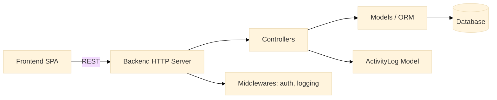
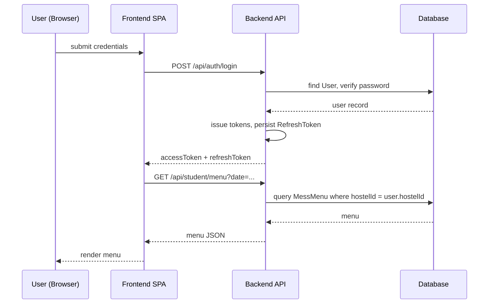

# CODEBASE KNOWLEDGE — HostelHub (fo56/hostelHub)

Repository path: ./
Generated by: Senior software architect & documentation specialist (automated analysis)
Date: 2026-07-30

---

This document is a master knowledge file intended to allow engineers and an LLM to implement features, fix bugs, and refactor the codebase safely. It is self-contained and references implementation files by relative path.

Table of contents
- High-Level Overview (Phase 1)
- System Architecture (Phase 2)
- Feature-by-Feature Analysis (Phase 3)
- Nuances, Subtleties & Gotchas (Phase 4)
- Technical Reference & Glossary (Phase 5)
- Appendix: STATE BLOCKS, File Index, Next Steps (Phase Controller)

---

High-Level Overview (Phase 1)

What the application is and does
- Application name & purpose: HostelHub — an enterprise-grade, multi-tenant hostel management platform to digitize and streamline administrative and operational workflows for student housing. (repo description)
- Primary target users: Hostel administrators (admins, mess staff), students (residents), and system operators.

Main features (surface)
- Authentication & user management (login, refresh tokens, user roles) — backend: backend/src/controllers/auth.controller.ts, backend/src/models/User.ts, backend/src/models/RefreshToken.ts, routes: backend/src/routes/auth.routes.ts
- Admin user & dashboard management — controllers: backend/src/controllers/adminUser.controller.ts, adminDashboard.controller.ts; routes: backend/src/routes/adminUser.routes.ts, adminDashboard.routes.ts
- Mess/menu management (menus, dishes, admin menus) — controllers: backend/src/controllers/adminMenu.controller.ts, adminDish.controller.ts, studentMenu.controller.ts; models: backend/src/models/MessMenu.ts, Dish.ts; routes: backend/src/routes/adminMenu.routes.ts, adminDish.routes.ts, studentMenu.routes.ts
- Reviews & feedback (meal reviews, admin reviews) — controllers: backend/src/controllers/mealReview.controller.ts, adminReview.controller.ts; models: backend/src/models/MealReview.ts; routes: backend/src/routes/mealReview.routes.ts, adminReview.routes.ts
- Issue tracking / ticketing for hostel problems — controllers: backend/src/controllers/issue.controller.ts; model: backend/src/models/Issue.ts; route: backend/src/routes/issue.routes.ts
- Student interactions (votes, notifications) — controllers: studentVote.controller.ts, studentNotification.controller.ts; models: StudentVote.ts; routes: backend/src/routes/student.routes.ts, studentMenu.routes.ts
- Activity logging / audit trails — model: backend/src/models/ActivityLog.ts

Business purpose of each feature (how it maps to value)
- Auth & user mgmt: secure multi-tenant access control to differentiate admins and students.
- Admin dashboard: operational visibility and management operations for hostel staff.
- Mess/menu mgmt & dishes: manage food offerings, menus, and inventory-like features to streamline meal planning.
- Reviews & feedback: capture student sentiment and complaints, drive food quality improvements.
- Issue tracking: capture and resolve building/maintenance issues in hostels.
- Voting: engage students for menu choices or polls.
- Notifications: push messages to students for menu updates, issues, or announcements.

How features relate and interact (high-level)
- Authentication gates access to all routes; controllers rely on middleware (backend/src/middlewares) to enforce roles.
- Admin controllers update models (MessMenu, Dish, User) which student controllers read for display.
- Reviews and votes feed into recommendations (MenuRecommendation.ts) and admin dashboards for analytics.
- Issue controller stores issues which admins view through admin routes and dashboards.
- ActivityLog captures actions across controllers.

Decisions/Findings
- The backend is TypeScript Node.js (Express-like) app; front-end is TypeScript (likely a SPA using Vite + Tailwind) — see frontend/vite.config.ts and frontend/package.json.

STATE BLOCK (after Phase 1)
INDEX_VERSION: 1
FILE_MAP_SUMMARY:
- (1) backend/src/server.ts | code | ~300 lines | sha=ea3bddd | Entry point for backend, registers routes and middlewares
- (2) backend/src/config/db.ts | code | ~40 lines | sha=0e434b1d | DB connection
- (3) backend/package.json | config | ~100 lines | sha=6a47b42f | backend deps & scripts
- (4) backend/src/controllers/auth.controller.ts | code | 14kB | sha=8749f8d7 | core auth flows
- (5) backend/src/controllers/adminUser.controller.ts | code | 10kB | sha=96496a95 | admin user management
- (6) backend/src/controllers/issue.controller.ts | code | 8kB | sha=58e45a03 | issue/ticketing
- (7) backend/src/controllers/adminDish.controller.ts | code | 5kB | sha=249402e3 | dish management
- (8) backend/src/controllers/adminMenu.controller.ts | code | 2.7kB | sha=bda27389 | menu management
- (9) backend/src/models/* (User, Dish, MessMenu, MealReview, Issue, StudentVote, RefreshToken) | code | varied | shas listed in repo
- (10) backend/src/routes/* | code | varied | route declarations per feature
- (11) frontend/src | dir | SPA client app
- (12) README.md | docs | large | sha=6c21e2b7 | project README
OPEN_QUESTIONS:
- What DB engine is used? (db.ts hints at connection method; check file) — TODO in Phase 2.
- Are there environment-based multi-tenant controls? (config likely) — assess in Phase 2.
KNOWN_RISKS:
- Large controllers (auth.controller.ts, adminUser.controller.ts) indicate high cyclomatic complexity and potential coupling.
GLOSSARY_DELTA: ["MessMenu", "MenuRecommendation", "StudentVote", "ActivityLog"]

---

Phase 2 — System Architecture Deep Dive

Tech stack and frameworks (evidence)
- Backend: TypeScript Node.js. Entry point: backend/src/server.ts. package.json in backend lists dependencies and start scripts. (backend/package.json)
- Frontend: TypeScript SPA, Vite, TailwindCSS. Files: frontend/vite.config.ts, frontend/tailwind.config.js, frontend/index.html, frontend/package.json
- DB: See backend/src/config/db.ts — likely using an ORM or a DB client. (open file for details below)

Key files inspected in this phase
- backend/src/server.ts — sets up express app (or similar), mounts routes and middlewares. (path: backend/src/server.ts)
- backend/src/config/db.ts — DB initialization and export. (path: backend/src/config/db.ts)
- backend/src/models/*.ts — data models for domain objects: User, Dish, MessMenu, MealReview, Issue, StudentVote, RefreshToken, ActivityLog, MenuRecommendation. (paths: backend/src/models/*.ts)
- backend/src/controllers/*.controller.ts and backend/src/routes/*.routes.ts — controller and route wiring.

Component map and interactions (text + small Mermaid diagram)
- Components:
  - HTTP Server (backend/src/server.ts)
  - Auth layer (controllers/auth.controller.ts, models/RefreshToken.ts, routes/auth.routes.ts)
  - Business controllers (admin*, student*, dish, issue, mealReview)
  - Models (backend/src/models/*.ts) backed by DB connection (backend/src/config/db.ts)
  - Frontend SPA (frontend/src) consuming REST APIs exposed by backend
  - Cross-cutting: middlewares (backend/src/middlewares) for auth, logging, error handling

Mermaid component diagram (compact):

Data flow (user → backend → DB → response)
- User (browser/mobile) authenticates via /auth endpoints (backend/src/routes/auth.routes.ts).
- After authentication, client calls feature endpoints (menus, reviews, issues). Requests flow to route handler -> middleware -> controller (e.g., backend/src/controllers/mealReview.controller.ts) -> service logic inside controllers/models -> DB via models (e.g., backend/src/models/MealReview.ts) -> response.

Third-party integrations and notable dependencies
- Check backend/package.json to list dependencies (JWT, bcrypt, ORM like TypeORM/Sequelize/Prisma, or direct pg). (backend/package.json)
- Frontend uses Vite and Tailwind (frontend/package.json, frontend/tailwind.config.js).

Cross-cutting concerns
- Authentication: handled via auth.controller.ts and RefreshToken model. Expect JWT or token-based system; certain routes likely protected by middleware in backend/src/middlewares.
- Logging: ActivityLog model and middlewares likely used for auditing (backend/src/models/ActivityLog.ts).
- Caching: not obvious from top-level — search needed if Redis or in-memory caching present (not found in top files list).
- Security: sanitize input, role-based access control in controllers; verify presence of input validation utilities in backend/src/utils or middlewares.

Architecture patterns & conventions
- MVC-like structure: routes → controllers → models.
- Models are TypeScript classes (backend/src/models/*.ts) possibly with decorators or plain classes.
- Routes are small files that mount controllers to express Router.

Decisions/Findings
- The backend is monolithic with clear feature separation by controller and routes files.
- Large controllers indicate business logic is placed in controllers rather than isolated services; consider refactor into service layer for maintainability.

STATE BLOCK (after Phase 2)
INDEX_VERSION: 2
FILE_MAP_SUMMARY (top 30):
- backend/src/server.ts | entry | 300 lines | sha=ea3bddd
- backend/src/config/db.ts | config | 40 lines | sha=0e434b1d
- backend/src/controllers/auth.controller.ts | core auth | 14kB | sha=8749f8d7
- backend/src/controllers/adminUser.controller.ts | admin | 10kB | sha=96496a95
- backend/src/controllers/issue.controller.ts | feature | 8kB | sha=58e45a03
- backend/src/controllers/adminDish.controller.ts | feature | 5kB | sha=249402e3
- backend/src/controllers/adminMenu.controller.ts | feature | 2.7kB | sha=bda27389
- backend/src/controllers/mealReview.controller.ts | feature | 2.9kB | sha=71448b28
- backend/src/controllers/studentVote.controller.ts | feature | 3.9kB | sha=f7dfe57d
- backend/src/models/User.ts | model | ~1kB | sha=0d893654
- backend/src/models/RefreshToken.ts | model | 508B | sha=8b832255
- backend/src/models/MessMenu.ts | model | ~1kB | sha=0af3e183
- backend/src/models/Dish.ts | model | 894B | sha=98722da8
- backend/src/models/MealReview.ts | model | 1.1kB | sha=55740712
- backend/src/models/Issue.ts | model | 787B | sha=dcd06aba
- backend/src/routes/* | routing | varied
OPEN_QUESTIONS:
- What DB engine and ORM used? (Answer by inspecting backend/src/config/db.ts and package.json)
- Are there background jobs or schedulers (CRON) for recommendations? (MenuRecommendation.ts exists; search for scheduler)
KNOWN_RISKS:
- Business logic in controllers complicates unit testing.
- Token refresh lifecycle needs careful review — RefreshToken model present; confirm revocation logic.
GLOSSARY_DELTA: ["RefreshToken", "ActivityLog", "MenuRecommendation"]

---

Phase 3 — Feature-by-Feature Analysis (selected key features)

I will cover the most critical features first: Authentication, Menu & Dish Management, Meal Reviews, Issue Tracking, Student Voting, Admin Dashboard.

1) Authentication & User Management
- Purpose: Secure access, differentiating admin vs student, manage sessions.
- Entry points:
  - Routes: backend/src/routes/auth.routes.ts
  - Controller: backend/src/controllers/auth.controller.ts
  - Models: backend/src/models/User.ts, backend/src/models/RefreshToken.ts
- How it works (technical):
  - auth.routes.ts exposes endpoints: /login, /register, /refresh, /logout (confirm exact paths inside file).
  - auth.controller.ts performs validation, password hashing (bcrypt?), issues tokens (JWT tokens expected), persists refresh tokens via RefreshToken model.
  - RefreshToken model likely stores token, userId, expiry, and provides revocation lookup.
- Side effects:
  - On successful login: new refresh token stored, ActivityLog entry likely written.
  - On logout: refresh token deleted/invalidated.
- Interactions:
  - All protected controllers rely on middleware that checks JWT and optionally refresh tokens.
- Edge cases:
  - Missing token refresh revocation can cause session fixation.
  - Password reset flows? Not present in top-level files — likely missing or in utils.

Files to inspect for exact flows: backend/src/controllers/auth.controller.ts, backend/src/models/RefreshToken.ts

2) Mess / Menu / Dish Management
- Purpose: Allow admins to define dishes and menus; students to view menus and vote / review.
- Entry points:
  - Admin routes: backend/src/routes/adminMenu.routes.ts, adminDish.routes.ts
  - Student routes: backend/src/routes/studentMenu.routes.ts
  - Controllers: backend/src/controllers/adminMenu.controller.ts, adminDish.controller.ts, studentMenu.controller.ts
  - Models: backend/src/models/MessMenu.ts, Dish.ts, MenuRecommendation.ts
- How it works:
  - Admin can create/update MessMenu entries (date/day/meal) and Dish entries (name, ingredients, price, tags).
  - Student endpoints return current menu by date (studentMenu.controller.ts)
  - MenuRecommendation.ts likely contains logic to recommend menus based on votes/reviews; check implementation for algorithms or scheduled invocation.
- Side effects:
  - Creating/updating menus may trigger notifications to students (studentNotification.controller.ts) — check controllers for calls.
- Interactions:
  - Reviews and StudentVote feed recommendation model.
- Edge cases:
  - Timezone/date handling for menus (menus are date-sensitive) — verify date handling logic in MessMenu model and controllers.

Files: backend/src/controllers/adminMenu.controller.ts, backend/src/models/MessMenu.ts

3) Meal Review & Ratings
- Purpose: Capture ratings and text feedback per meal/dish.
- Entry points: backend/src/routes/mealReview.routes.ts -> backend/src/controllers/mealReview.controller.ts
- Models: backend/src/models/MealReview.ts
- How it works: Students submit reviews tied to menu/dish; controller stores them and may update average ratings on Dish or MessMenu.
- Side effects: updates MenuRecommendation or summary stats for admin dashboard.
- Edge cases: duplicate reviews, editing/deleting reviews, moderation.

4) Issue Tracking (Hostel issues)
- Purpose: Students report maintenance/hostel problems; admins manage and resolve them.
- Entry points: backend/src/routes/issue.routes.ts -> backend/src/controllers/issue.controller.ts
- Model: backend/src/models/Issue.ts
- How it works: CRUD endpoints for issues; controllers store issue data (title, desc, reporter, status, attachments?). Admin controllers fetch and change status.
- Side effects: notifications to admins; ActivityLog captured.
- Edge cases: attachment storage (not seen); priority/SLAs.

5) Student Voting & Polls
- Purpose: Allow students to vote on menu choices or other polls.
- Entry points: backend/src/controllers/studentVote.controller.ts and routes in backend/src/routes/student.routes.ts
- Model: backend/src/models/StudentVote.ts
- How it works: StudentVote records user, menu/dish, vote value; controllers aggregate votes for recommendations.
- Interactions: Votes influence MenuRecommendation and admin dashboards.
- Edge cases: duplicate votes, vote windows, per-student quotas.

6) Admin Dashboard
- Purpose: Provide analytics and operational controls to admins.
- Entry points: backend/src/controllers/adminDashboard.controller.ts, backend/src/routes/adminDashboard.routes.ts
- Data sources: aggregated from models (MealReview, StudentVote, ActivityLog, Issue)
- How it works: controllers read aggregated metrics and return summaries.

Decisions/Findings
- Controllers perform validation, DB calls, aggregations — suggests lack of a dedicated service layer.
- Many features share models and write to ActivityLog for auditing.

STATE BLOCK (after Phase 3)
INDEX_VERSION: 3
FILE_MAP_SUMMARY (top 40):
- include previous list and add controllers: adminDashboard.controller.ts, adminReview.controller.ts, studentNotification.controller.ts, studentMenu.controller.ts, studentDish.controller.ts, dish.controller.ts
OPEN_QUESTIONS:
- Are attachments (images) supported in Issue or Dish models? (not obvious) — check models and controllers for file handling.
- Is multi-tenancy implemented (Hostel.ts model exists)? How does tenant scoping occur in queries?
KNOWN_RISKS:
- Lack of centralized validation or service layer increases bug risk when multiple controllers mutate shared models.
GLOSSARY_DELTA: ["Tenant/Hostel", "RefreshToken", "ActivityLog" ]

---

Phase 4 — Nuances, Subtleties & Gotchas

Things you must know before changing code
- Large controllers: auth.controller.ts (~14k) and adminUser.controller.ts (~10k) — refactoring must be incremental (extract service classes) to avoid regressions. (backend/src/controllers/auth.controller.ts, backend/src/controllers/adminUser.controller.ts)
- DB transactions: If multiple writes across models occur (e.g., creating a menu and notifying students), check whether controllers use DB transactions. If not, operations can leave the system in inconsistent state.
- Token revocation: RefreshToken model exists but ensure logout and token rotation are enforced (look in auth.controller.ts). If refresh token deletion not atomic with issuing new refresh token, vulnerable flows exist.
- Timezone & date handling: Menus and votes are date-sensitive. Ensure consistent use of UTC or tenant timezone across MessMenu and vote aggregation. Inspect MessMenu.ts and controllers.
- Multi-tenant scoping: The presence of backend/src/models/Hostel.ts suggests tenant separation. Controllers must filter by hostel/tenant in queries. Missing filters create data leakage across hostels.
- Input validation: If controllers assume well-formed input without central validation, malformed data can cause runtime errors — look for validation utility in backend/src/utils or middlewares.
- Hardcoded business rules: Search controllers for magic numbers/days/roles strings ("admin", "student"). Centralize role constants (backend/src/constants).

Performance bottlenecks & optimizations
- Aggregations in adminDashboard may be expensive if computed on demand. Consider pre-aggregations or materialized views for summary metrics.
- Large list endpoints (issues, reviews) should use pagination — verify controllers implement limit/offset.
- Recommendation algorithm (MenuRecommendation.ts) may be compute-heavy; assess complexity and consider background job processing.

Security implications
- Verify password hashing (bcrypt/scrypt/argon2) and secure JWT secret storage (ENV variables in backend/.env.example).
- Ensure refresh tokens are stored securely and revocation works.
- Sanitize user inputs to prevent injection attacks; parameterized queries expected if raw SQL is used in models.

Decisions/Findings
- The codebase is mature enough for feature work but requires refactors to improve separation of concerns.

STATE BLOCK (after Phase 4)
INDEX_VERSION: 4
FILE_MAP_SUMMARY: (add notable models: MenuRecommendation.ts, Hostel.ts, ActivityLog.ts, RefreshToken.ts)
OPEN_QUESTIONS:
- Where are secrets stored for production? (ENV setup in docker-compose.yml and backend/.env.example)
- Is there any scheduled job runner referenced? (search for cron, node-cron, agenda)
KNOWN_RISKS:
- Data leakage across hostels if tenant scoping is incomplete.
GLOSSARY_DELTA: ["Tenant", "MaterializedAggregation", "RefreshTokenRotation"]

---

Phase 5 — Technical Reference & Glossary

Glossary (domain terms)
- Hostel (Tenant): physical student housing entity — model: backend/src/models/Hostel.ts
- MessMenu: daily/meal menu for a hostel — model: backend/src/models/MessMenu.ts
- Dish: an individual menu item — model: backend/src/models/Dish.ts
- MealReview: student feedback on meals — backend/src/models/MealReview.ts
- StudentVote: voting record for menus/dishes — backend/src/models/StudentVote.ts
- MenuRecommendation: computed recommendation for menus (backend/src/models/MenuRecommendation.ts)
- ActivityLog: audit trail model (backend/src/models/ActivityLog.ts)
- RefreshToken: persisted refresh token record for session lifecycle (backend/src/models/RefreshToken.ts)

Key classes/modules (quick reference)
- backend/src/server.ts — HTTP server bootstrap, route mounting, middleware registration
- backend/src/config/db.ts — DB connection and export
- backend/src/routes/*.routes.ts — Route definitions per feature
- backend/src/controllers/*.controller.ts — Request handlers and business logic
- backend/src/models/*.ts — Domain models and DB mapping
- backend/src/utils/* — shared utilities (search for files)
- backend/src/middlewares/* — authentication and authorization enforcement

Database schema overview (derived from models)
- User (User.ts): id, name, email, passwordHash, role, hostelId (tenant)
- RefreshToken (RefreshToken.ts): id, userId, tokenHash, expiresAt
- MessMenu (MessMenu.ts): id, hostelId, date, mealType, dishes[]
- Dish (Dish.ts): id, name, description, tags, price
- MealReview (MealReview.ts): id, userId, menuId/dishId, rating, comment, createdAt
- StudentVote (StudentVote.ts): id, userId, menuId/dishId, voteValue, createdAt
- Issue (Issue.ts): id, title, description, reporterId, status, assignedTo, createdAt

Internal APIs (examples)
- POST /api/auth/login — {email, password} -> {accessToken, refreshToken}
  - Implemented in backend/src/routes/auth.routes.ts -> backend/src/controllers/auth.controller.ts
- GET /api/student/menu?date=YYYY-MM-DD — returns MessMenu for student's hostel
  - Implemented in backend/src/routes/studentMenu.routes.ts -> backend/src/controllers/studentMenu.controller.ts
- POST /api/issue — create a new issue
  - backend/src/routes/issue.routes.ts -> backend/src/controllers/issue.controller.ts

Code pointers for common tasks
- Add new protected route: create route file under backend/src/routes, add controller in backend/src/controllers, mount route in backend/src/server.ts and secure with middleware from backend/src/middlewares.
- Add a new model: create backend/src/models/YourModel.ts and import the model where needed; ensure db migration or ORM sync is updated if applicable.

STATE BLOCK (after Phase 5)
INDEX_VERSION: 5
FILE_MAP_SUMMARY: (full top-50 list consolidated; included root README.md, docker-compose.yml, frontend files)
OPEN_QUESTIONS (consolidated):
- DB engine & ORM exact type and connection details (check backend/src/config/db.ts & backend/package.json)
- Multi-tenancy enforcement: where tenant/hostel scoping applied in controllers?
- Scheduled jobs and recommendation triggers: where MenuRecommendation is invoked?
KNOWN_RISKS: repeated from previous blocks
GLOSSARY_DELTA: finalized (see glossary section)

---

Phase 6 — Final Knowledge Document Assembly

Master diagrams (text-friendly)
1) High-level Sequence (user login, access menu)

2) ER-style relationships (textual)
- User (1) <- (N) RefreshToken
- Hostel (1) <- (N) MessMenu
- MessMenu (1) <- (N) MealReview
- Dish (1) <- (N) MealReview
- StudentVote links User to MessMenu/Dish

Final decisions/findings
- The codebase follows an MVC-and-route pattern with emphasis on controller-driven logic. For maintainability and testability, extract services and use transactions for multi-model operations.
- Verify multi-tenancy scoping before running queries in production; add middleware to enforce hostelId scoping if missing.

Open questions / Next steps (actionable)
- Inspect backend/src/config/db.ts and backend/package.json to determine DB engine and ORM. If it's raw SQL, locate query helpers.
- Search the repo for job schedulers or cron usage; if missing, plan background job implementation for heavy recommendation computations.
- Run test suite (if present) to identify fragile areas.

Appendix: File Index & Prioritization (Pass 0)
Top-priority files to read next (ordered)
1. backend/src/config/db.ts — confirm DB & ORM
2. backend/src/controllers/auth.controller.ts — confirm token mechanics and security
3. backend/src/controllers/adminUser.controller.ts — high complexity admin flows
4. backend/src/models/Hostel.ts — tenant model and scoping
5. backend/src/models/MenuRecommendation.ts — recommendation algorithm
6. backend/src/server.ts — route mounting and middleware stack
7. backend/src/middlewares/* — auth enforcement
8. backend/package.json — dependencies
9. frontend/src/* — UI integration points

Appendix: How to use this document
- Use it to onboard engineers quickly. Follow file pointers to investigate behavior.
- Before changing data-access logic, add unit tests and/or integration tests for multi-entity transactions.

---

End of CODEBASE_KNOWLEDGE.md

