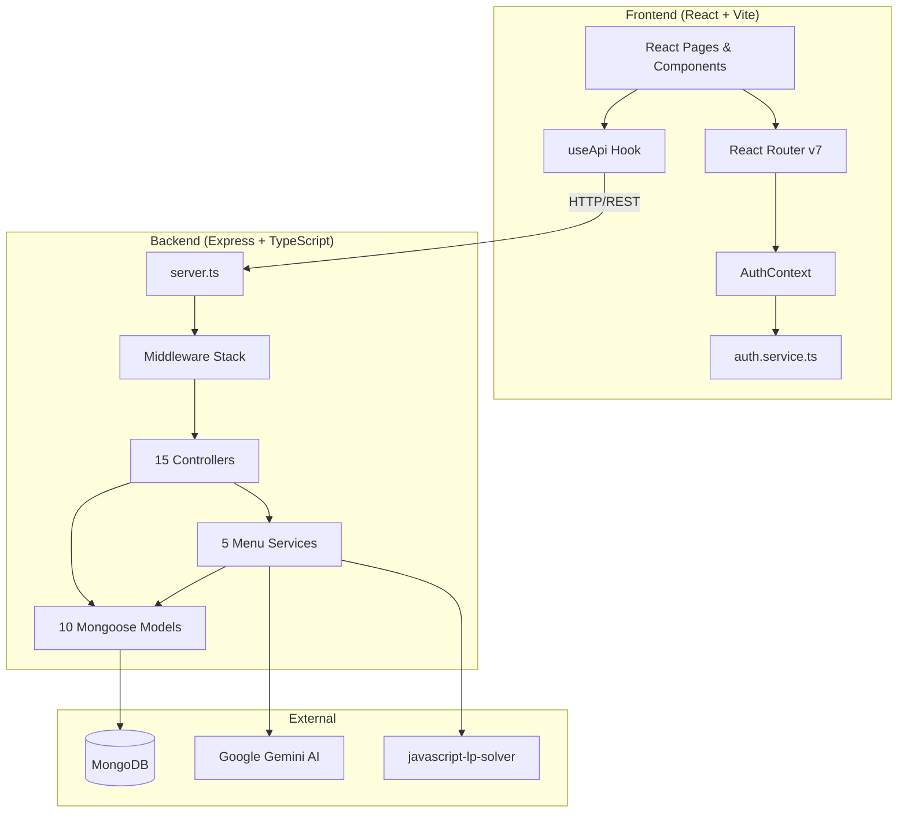
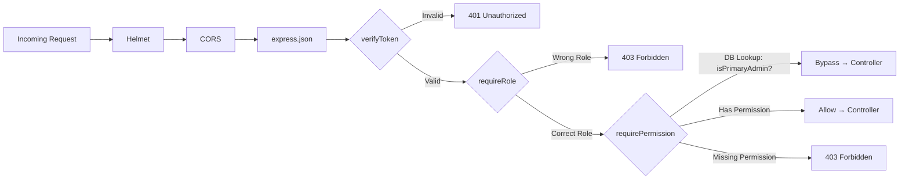
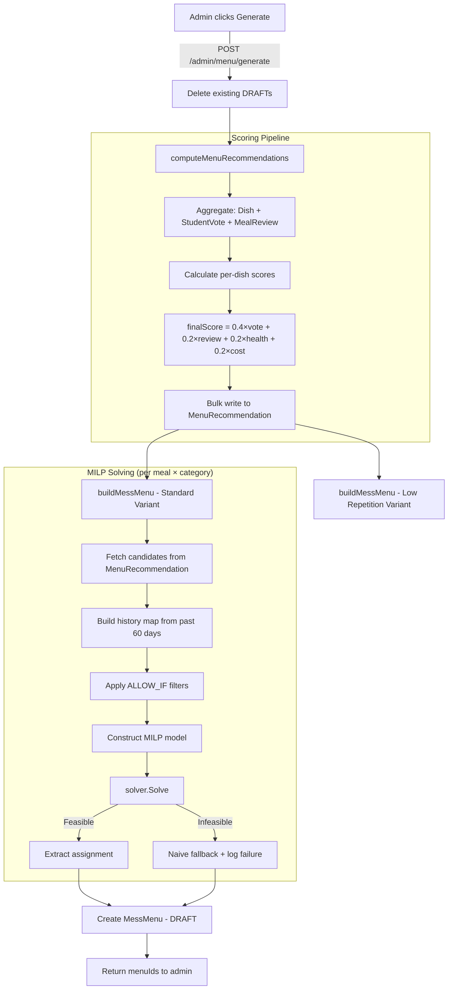
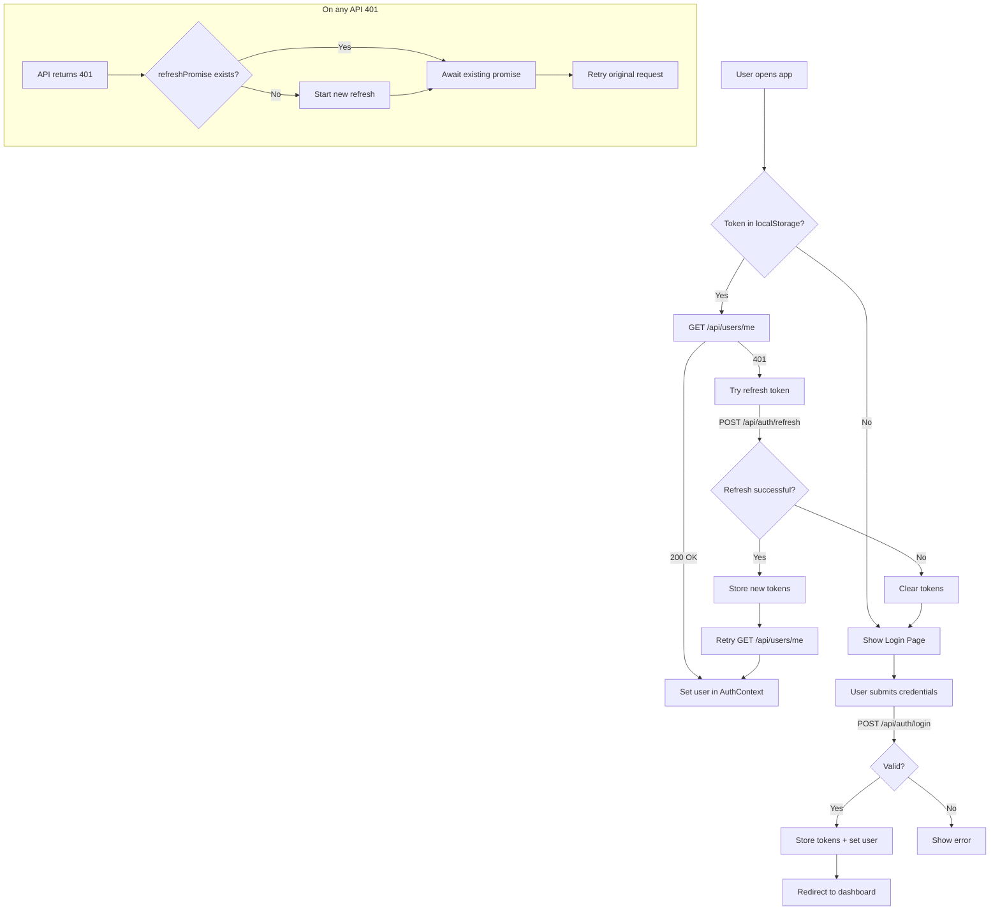
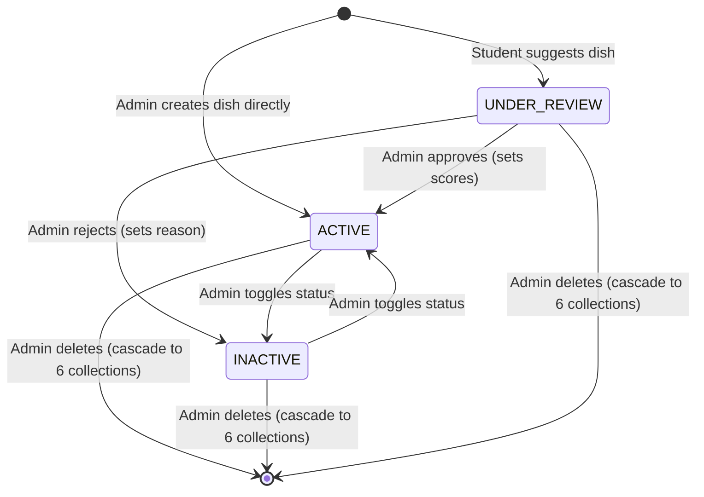
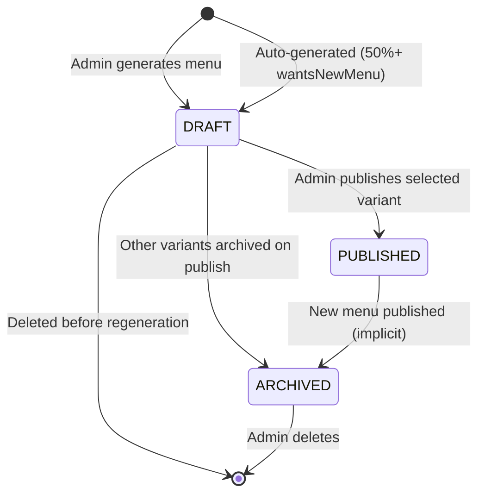
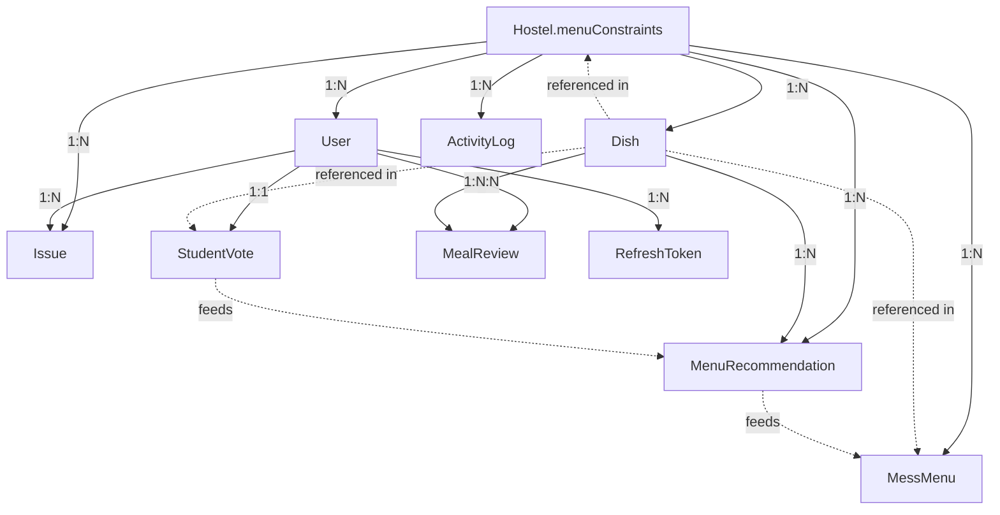

# HostelHub — Architecture Diagrams

> Supplemental diagrams for `CODEBASE_KNOWLEDGE.md`. All diagrams are in Mermaid format.

---

## 1. System Architecture Overview

---

## 2. Middleware Pipeline

---

## 3. Menu Generation Pipeline

---

## 4. Authentication Flow

---

## 5. Dish Lifecycle

---

## 6. Menu Lifecycle

---

## 7. Data Model Relationships

